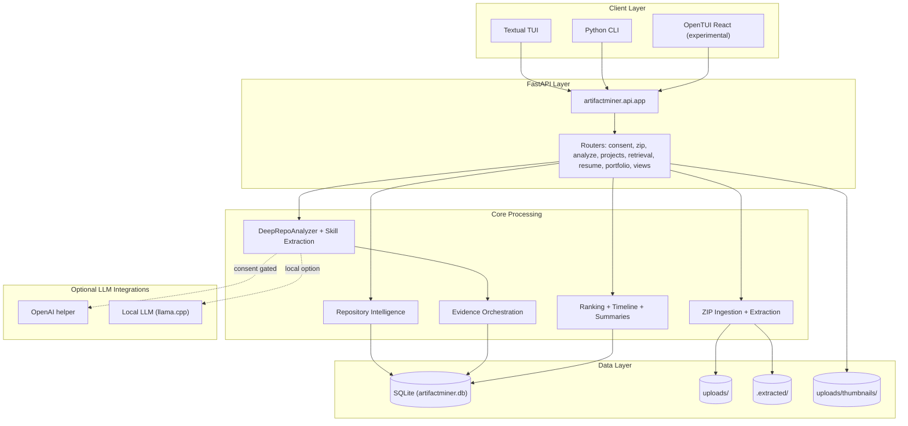
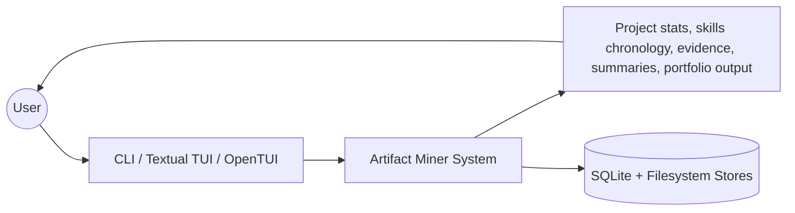
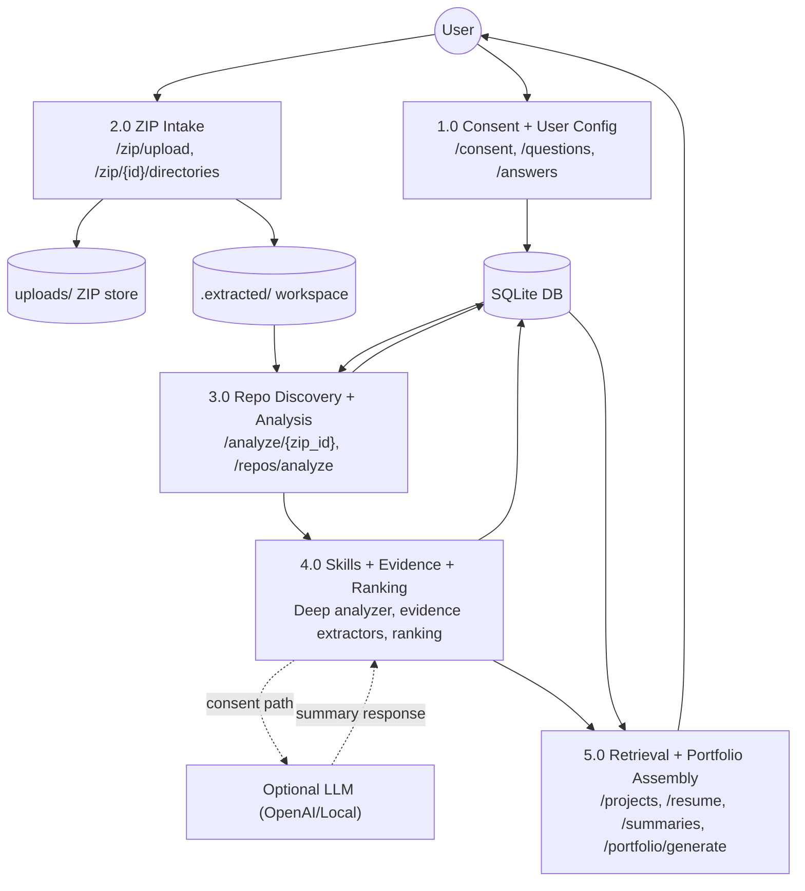

# Artifact Miner

## Team Number: 1

**Team Members**: Shlok Shah SN:50732213, Brendan James SN:31927486, Ahmad Memon SN:61846432, Stavan Shah SN:43960608, Evan Crowley SN:82710823, Nathan Helm SN:68837038

Artifact Miner analyzes one or more uploaded project ZIPs, discovers Git repositories, extracts repository + user contribution intelligence, derives skills/evidence, and builds resume/portfolio-ready outputs.

**Primary users:** CS students, TAs, and career advisors.

Team Contract link: **[Team Contract](https://docs.google.com/document/d/1arR_i6NhFLMh0BFLVMIacb_dQp-CcDTXX7lH2BcLZeI/edit?usp=sharing)**

## Milestone 2 Status

This README reflects the current Milestone 2 implementation in this repository (FastAPI backend, Textual TUI, CLI pipeline, and experimental OpenTUI React client).

## System Architecture Diagram


```mermaid
flowchart TB
    subgraph Clients["Client Layer"]
        TUI["Textual TUI"]
        CLI["Python CLI"]
        React["OpenTUI React (experimental)"]
    end

    subgraph API["FastAPI Layer"]
        Gateway["artifactminer.api.app"]
        Routers["Routers: consent, zip, analyze, projects, retrieval, resume, portfolio, views"]
    end

    subgraph Core["Core Processing"]
        Ingest["ZIP Ingestion + Extraction"]
        RepoIntel["Repository Intelligence"]
        Skills["DeepRepoAnalyzer + Skill Extraction"]
        Evidence["Evidence Orchestration"]
        Ranking["Ranking + Timeline + Summaries"]
    end

    subgraph Integrations["Optional LLM Integrations"]
        OpenAI["OpenAI helper"]
        LocalLLM["Local LLM (llama.cpp)"]
    end

    subgraph Data["Data Layer"]
        SQLite[("SQLite (artifactminer.db)")]
        Uploads[("uploads/")]
        Extracted[(".extracted/")]
        Thumbs[("uploads/thumbnails/")]
    end

    TUI --> Gateway
    CLI --> Gateway
    React --> Gateway
    Gateway --> Routers

    Routers --> Ingest
    Ingest --> Uploads
    Ingest --> Extracted

    Routers --> RepoIntel
    Routers --> Skills
    Skills --> Evidence
    Routers --> Ranking

    RepoIntel --> SQLite
    Evidence --> SQLite
    Ranking --> SQLite
    Routers --> Thumbs

    Skills -. consent gated .-> OpenAI
    Skills -. local option .-> LocalLLM
```

## Data Flow Diagram (Level 0)


```mermaid
flowchart LR
    User(("User")) --> Interfaces["CLI / Textual TUI / OpenTUI"]
    Interfaces --> System["Artifact Miner System"]
    System --> Outputs["Project stats, skills chronology, evidence, summaries, portfolio output"]
    Outputs --> User
    System --> DB[("SQLite + Filesystem Stores")]
```

## Data Flow Diagram (Level 1)


```mermaid
flowchart TB
    User(("User"))
    FSUploads[("uploads/ ZIP store")]
    FSExtracted[(".extracted/ workspace")]
    DB[("SQLite DB")]
    LLM["Optional LLM (OpenAI/Local)"]

    P1["1.0 Consent + User Config\n/consent, /questions, /answers"]
    P2["2.0 ZIP Intake\n/zip/upload, /zip/{id}/directories"]
    P3["3.0 Repo Discovery + Analysis\n/analyze/{zip_id}, /repos/analyze"]
    P4["4.0 Skills + Evidence + Ranking\nDeep analyzer, evidence extractors, ranking"]
    P5["5.0 Retrieval + Portfolio Assembly\n/projects, /resume, /summaries, /portfolio/generate"]

    User --> P1
    User --> P2
    P2 --> FSUploads
    P2 --> FSExtracted
    P1 --> DB

    FSExtracted --> P3
    DB --> P3
    P3 --> DB

    P3 --> P4
    P4 --> DB
    P4 -. consent path .-> LLM
    LLM -. summary response .-> P4

    P4 --> P5
    DB --> P5
    P5 --> User
```

## DFD Explanation

- `1.0 Consent + User Config` captures consent and analysis context (email, goals, file filters).
- `2.0 ZIP Intake` stores uploads and prepares extraction paths for analysis.
- `3.0 Repo Discovery + Analysis` finds Git repos and computes repository/user contribution stats.
- `4.0 Skills + Evidence + Ranking` derives skill signals, insights, repository quality evidence, and ranking scores.
- `5.0 Retrieval + Portfolio Assembly` serves timeline/skills/resume/summaries and builds portfolio-scoped outputs.

## Milestone 2 Capabilities

- Multi-ZIP portfolio flow using `portfolio_id` linkage.
- Directory-scoped analysis from uploaded ZIP contents.
- Repository intelligence: languages, frameworks, commit windows, collaboration, health score.
- User-level contribution intelligence and role metadata.
- Evidence model with CRUD endpoints for project evidence.
- Retrieval APIs for skills, skills chronology, resume items, summaries, and timeline.
- Portfolio generation endpoint with representation preferences per portfolio.
- Project management endpoints: role, thumbnail upload/URL, soft delete, ranking, timeline.
- Textual TUI flow for consent, user config, ZIP upload, directory selection, and resume views.
- CLI interactive and non-interactive export flow (`.txt` or `.json`).

## API Surface (Current)

**System + Setup**
- `GET /health`
- `GET /consent`, `PUT /consent`
- `GET /questions`, `POST /answers`
- `GET /useranswer`, `POST /postanswer/`

**ZIP + Analysis**
- `POST /zip/upload`
- `GET /zip/{zip_id}/directories`
- `GET /zip/portfolios/{portfolio_id}`
- `POST /analyze/{zip_id}`
- `POST /repos/analyze`
- `GET /crawler`
- `GET /fileintelligence`

**Projects + Evidence**
- `GET /projects`
- `GET /projects/{project_id}`
- `POST /projects/{project_id}/thumbnail`
- `PUT/POST /projects/{project_id}/role`
- `POST /projects/{project_id}/evidence`
- `GET /projects/{project_id}/evidence`
- `DELETE /projects/{project_id}/evidence/{evidence_id}`
- `GET /projects/timeline`
- `GET /projects/ranking`
- `DELETE /projects/{project_id}`

**Retrieval + Resume + Portfolio**
- `GET /skills`
- `GET /skills/chronology`
- `GET /resume`
- `GET /resume/{resume_id}`
- `POST /resume/generate`
- `POST /resume/{resume_id}/edit`
- `GET /summaries`
- `GET /AI_summaries`
- `POST /portfolio/generate`
- `GET /views/{portfolio_id}/prefs`
- `PUT /views/{portfolio_id}/prefs`
- `POST /openai`

## Project Structure

```text
src/artifactminer/
  api/                    FastAPI app + routers
  db/                     SQLAlchemy models, session, seeders
  RepositoryIntelligence/ Repo and user contribution analytics
  skills/                 Skill extraction, deep analysis, signals
  evidence/               Evidence models and extractors
  directorycrawler/       ZIP/directory crawl utilities
  tui/                    Textual app + screens
  cli/                    Interactive/non-interactive CLI pipeline
opentui-react-exp/        Experimental React/OpenTUI client
tests/                    API, DB, crawler, TUI, evidence, signals, repo intelligence
alembic/                  Database migrations
```

## Local Setup

### Prerequisites

- Python 3.11+
- [uv](https://github.com/astral-sh/uv)
- Git
- Optional: Bun (for `opentui-react-exp`)
- Optional: OpenAI API key (for OpenAI-backed paths)
- Optional: local LLM setup (llama.cpp with models) for enhanced analysis

### Install and Configure

```bash
uv sync
cp .env.example .env
uv run alembic upgrade head
```

### Run Backend API

```bash
uv run api
```

API docs: [http://127.0.0.1:8000/docs](http://127.0.0.1:8000/docs)

### Run Textual TUI

```bash
uv run artifactminer-tui
```

### Run CLI

```bash
uv run artifactminer --help
uv run artifactminer -i /path/to/projects.zip -o /path/to/report.txt -c no_llm -u you@example.com
```

CLI consent flags currently use `full | no_llm | none` in the CLI pipeline, and the API `/consent` contract also uses `full | no_llm | none`.

### Run Experimental OpenTUI React Client

```bash
cd opentui-react-exp
bun install
bun run src/index.tsx
```

## Tests

```bash
uv run pytest
```

This repository currently includes tests across API, database, crawler, evidence/signals, repo intelligence, CLI, and TUI layers.

## Database Migrations (Alembic)

Always apply migrations instead of manually recreating `artifactminer.db`.

### Keep DB Up to Date

```bash
uv run alembic upgrade head
```

### Create a New Migration

1. Update SQLAlchemy models in `src/artifactminer/db/models.py`.
2. Generate migration:
   ```bash
   uv run alembic revision --autogenerate -m "Describe your change"
   ```
3. Review generated file in `alembic/versions/`.
4. Apply:
   ```bash
   uv run alembic upgrade head
   ```
5. Commit model + migration together.

### Downgrade One Revision

```bash
uv run alembic downgrade -1
```

### Seed Behavior

On API startup, baseline question records are seeded when the questions table is empty.
