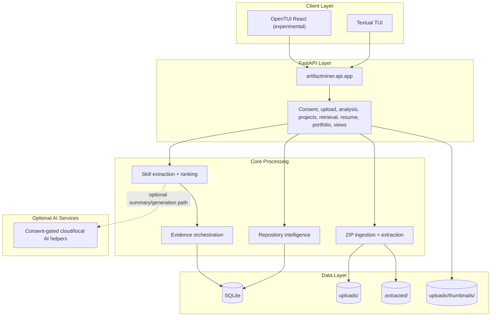
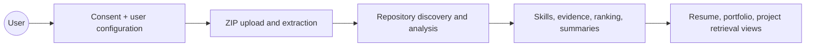

# Artifact Miner

## Team Number: 1

**Team Members**: Shlok Shah SN:50732213, Brendan James SN:31927486, Ahmad Memon SN:61846432, Stavan Shah SN:43960608, Evan Crowley SN:82710823, Nathan Helm SN:68837038

Artifact Miner helps students turn raw project repositories into portfolio-ready evidence. The system accepts uploaded ZIP archives, discovers Git repositories, analyzes repository and contributor activity, extracts skills and supporting evidence, and assembles outputs for resume and portfolio workflows.

**Primary users:** CS students, TAs, and career advisors.

**Project links**
- Team Contract: [Team Contract](https://docs.google.com/document/d/1arR_i6NhFLMh0BFLVMIacb_dQp-CcDTXX7lH2BcLZeI/edit?usp=sharing)
- Extended documentation: [Mintlify project docs](https://www.mintlify.com/COSC-499-W2025/capstone-project-team-1)

## Current Project Surfaces

- **FastAPI backend** for consent, upload, analysis, retrieval, resume, and portfolio services.
- **Textual TUI** for guided consent, ZIP upload, repository selection, and results review.
- **Experimental OpenTUI React client** for alternate terminal-style interaction.

## Architecture Overview


```mermaid
flowchart TB
    subgraph Clients["Client Layer"]
        TUI["Textual TUI"]
        React["OpenTUI React (experimental)"]
    end

    subgraph API["FastAPI Layer"]
        Gateway["artifactminer.api.app"]
        Routers["Consent, upload, analysis, projects, retrieval, resume, portfolio, views"]
    end

    subgraph Core["Core Processing"]
        Ingest["ZIP ingestion + extraction"]
        RepoIntel["Repository intelligence"]
        Skills["Skill extraction + ranking"]
        Evidence["Evidence orchestration"]
    end

    subgraph Integrations["Optional AI Services"]
        AI["Consent-gated cloud/local AI helpers"]
    end

    subgraph Data["Data Layer"]
        SQLite[("SQLite")]
        Uploads[("uploads/")]
        Extracted[(".extracted/")]
        Thumbs[("uploads/thumbnails/")]
    end

    TUI --> Gateway
    React --> Gateway
    Gateway --> Routers

    Routers --> Ingest
    Ingest --> Uploads
    Ingest --> Extracted

    Routers --> RepoIntel
    Routers --> Skills
    Skills --> Evidence

    RepoIntel --> SQLite
    Evidence --> SQLite
    Routers --> Thumbs
    Skills -. optional summary/generation path .-> AI
```

## Core Workflow


```mermaid
flowchart LR
    User(("User")) --> Consent["Consent + user configuration"]
    Consent --> Upload["ZIP upload and extraction"]
    Upload --> Discovery["Repository discovery and analysis"]
    Discovery --> Evidence["Skills, evidence, ranking, summaries"]
    Evidence --> Outputs["Resume, portfolio, project retrieval views"]
```

1. Capture consent and user context.
2. Upload one or more ZIP archives and inspect their contents.
3. Discover Git repositories and compute project and contributor metrics.
4. Derive skills, evidence, rankings, and summaries.
5. Retrieve resume- and portfolio-ready project outputs.

## Current Capabilities

- Multi-ZIP portfolio flow using `portfolio_id` linkage.
- Directory-scoped analysis from uploaded ZIP contents.
- Repository intelligence covering languages, frameworks, commit windows, collaboration, and repository health.
- User-level contribution intelligence and role metadata.
- Evidence CRUD flows for project artifacts and supporting details.
- Retrieval APIs for skills, chronology, resume items, summaries, and timelines.
- Portfolio generation and per-portfolio view preferences.
- Textual TUI flow for consent, user configuration, ZIP upload, directory selection, and resume views.
- Consent-gated AI-assisted generation paths for supported local or cloud providers.

## Quick Start

### Prerequisites

- Python 3.11+
- [uv](https://github.com/astral-sh/uv)
- Git
- Optional: Bun for `opentui-react-exp`
- Optional: environment variables for AI-assisted endpoints

### Install and Configure

```bash
uv sync
cp .env.example .env
uv run alembic upgrade head
```

## Run The Project

### Backend API

```bash
uv run api
```

Swagger UI: [http://127.0.0.1:8000/docs](http://127.0.0.1:8000/docs)

### Textual TUI

Start the backend first, then run:

```bash
uv run artifactminer-tui
```

### Experimental OpenTUI React Client

Start the backend first, then run:

```bash
cd opentui-react-exp
bun install
bun run src/index.tsx
```

## API Areas

**System and setup**
- `GET /health`
- `GET /consent`, `PUT /consent`
- `GET /questions`, `POST /answers`

**ZIP intake and analysis**
- `POST /zip/upload`
- `GET /zip/{zip_id}/directories`
- `GET /zip/portfolios/{portfolio_id}`
- `POST /analyze/{zip_id}`
- `POST /repos/analyze`
- `GET /crawler`
- `GET /fileintelligence`

**Projects, evidence, and views**
- `GET /projects`
- `GET /projects/{project_id}`
- `POST /projects/{project_id}/thumbnail`
- `PUT/POST /projects/{project_id}/role`
- `POST /projects/{project_id}/evidence`
- `GET /projects/{project_id}/evidence`
- `DELETE /projects/{project_id}/evidence/{evidence_id}`
- `GET /projects/timeline`
- `GET /projects/ranking`
- `DELETE /projects/{project_id}`
- `GET /views/{portfolio_id}/prefs`
- `PUT /views/{portfolio_id}/prefs`

**Retrieval and generation**
- `GET /skills`
- `GET /skills/chronology`
- `GET /resume`
- `GET /resume/{resume_id}`
- `POST /resume/generate`
- `POST /resume/{resume_id}/edit`
- `GET /summaries`
- `GET /AI_summaries`
- `POST /portfolio/generate`
- `POST /openai`
- `/local-llm/*` for local generation workflows

## Project Structure

```text
src/artifactminer/
  api/                    FastAPI app and routers
  db/                     SQLAlchemy models, sessions, and seeders
  RepositoryIntelligence/ Repository and contributor analytics
  skills/                 Skill extraction, signals, and ranking
  evidence/               Evidence models and extractors
  directorycrawler/       ZIP and directory crawl utilities
  local_llm/              Local-generation runtime support
  tui/                    Textual app and screens
opentui-react-exp/        Experimental React/OpenTUI client
tests/                    API, DB, crawler, evidence, repo intelligence, and TUI tests
alembic/                  Database migrations
```

## Tests

```bash
uv run pytest
```

The automated suite covers API, database, crawler, evidence/signals, repository intelligence, and TUI flows.

## Database Migrations (Alembic)

Always apply migrations instead of manually recreating `artifactminer.db`.

### Keep DB Up to Date

```bash
uv run alembic upgrade head
```

### Create a New Migration

1. Update SQLAlchemy models in `src/artifactminer/db/models.py`.
2. Generate migration:
   ```bash
   uv run alembic revision --autogenerate -m "Describe your change"
   ```
3. Review generated file in `alembic/versions/`.
4. Apply:
   ```bash
   uv run alembic upgrade head
   ```
5. Commit model + migration together.

### Downgrade One Revision

```bash
uv run alembic downgrade -1
```

### Seed Behavior

On API startup, baseline question records are seeded when the questions table is empty.
