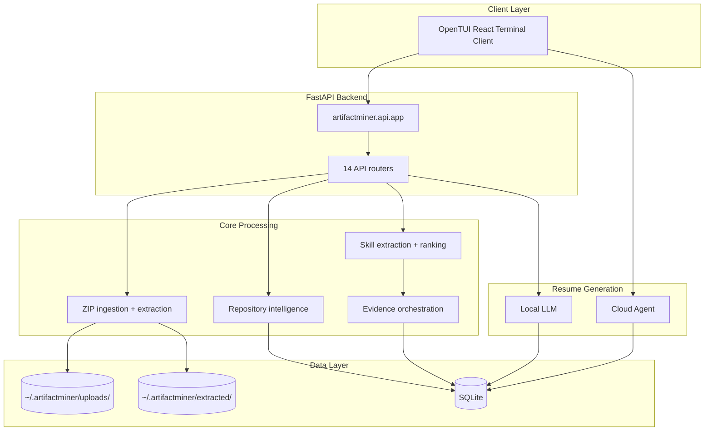
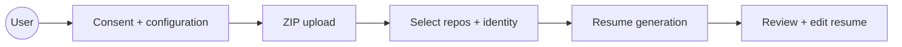

# Artifact Miner

## Team Number: 1

**Team Members**: Shlok Shah SN:50732213, Brendan James SN:31927486, Ahmad Memon SN:61846432, Stavan Shah SN:43960608, Evan Crowley SN:82710823, Nathan Helm SN:68837038

Artifact Miner helps students turn raw project repositories into portfolio-ready resumes. Upload a ZIP archive of your code, and the system discovers Git repositories, analyzes your contributions, extracts skills with supporting evidence, and generates a structured resume — either locally using a small language model or in the cloud via GitHub Copilot.

**Primary users:** CS students, TAs, and career advisors.

**Project links**
- Team Contract: [Team Contract](https://docs.google.com/document/d/1arR_i6NhFLMh0BFLVMIacb_dQp-CcDTXX7lH2BcLZeI/edit?usp=sharing)

## Architecture Overview


```mermaid
flowchart TB
    subgraph Client["Client Layer"]
        React["OpenTUI React Terminal Client"]
    end

    subgraph API["FastAPI Backend"]
        Gateway["artifactminer.api.app"]
        Routers["14 API routers"]
    end

    subgraph Core["Core Processing"]
        Ingest["ZIP ingestion + extraction"]
        RepoIntel["Repository intelligence"]
        Skills["Skill extraction + ranking"]
        Evidence["Evidence orchestration"]
    end

    subgraph Generation["Resume Generation"]
        LocalLLM["Local LLM"]
        CloudAgent["Cloud Agent"]
    end

    subgraph Data["Data Layer"]
        SQLite[("SQLite")]
        Uploads[("~/.artifactminer/uploads/")]
        Extracted[("~/.artifactminer/extracted/")]
    end

    React --> Gateway
    Gateway --> Routers

    Routers --> Ingest
    Ingest --> Uploads
    Ingest --> Extracted

    Routers --> RepoIntel
    Routers --> Skills
    Skills --> Evidence

    RepoIntel --> SQLite
    Evidence --> SQLite

    Routers --> LocalLLM
    React --> CloudAgent

    LocalLLM --> SQLite
    CloudAgent --> SQLite
```

## Core Workflow


```mermaid
flowchart LR
    User(("User")) --> Consent["Consent + configuration"]
    Consent --> Upload["ZIP upload"]
    Upload --> Configure["Select repos + identity"]
    Configure --> Generate["Resume generation"]
    Generate --> Review["Review + edit resume"]
```

1. **Consent and configuration** — choose your name, email, and consent level (local LLM, cloud AI, or heuristic-only).
2. **Upload** — select a ZIP archive containing one or more Git repositories.
3. **Configure** — pick which repositories and identity to use for analysis.
4. **Generate** — the system analyzes repositories, extracts skills, and generates a structured resume using local or cloud AI. The generated resume is saved to the SQLite database for future retrieval.
5. **Review** — view, edit, and export the generated resume in the terminal.

## Resume Generation Modes

Artifact Miner supports two AI-powered resume generation paths. Both are consent-gated — the user chooses which (if any) AI path to use.

### Local LLM Generation

Runs entirely on your machine using [llama.cpp](https://github.com/ggml-org/llama.cpp) and a small quantized model. No data leaves your computer.

**How it works:**
- The backend starts a `llama-server` process automatically when generation begins.
- The server loads a GGUF model from `~/.artifactminer/models/`.
- The pipeline extracts project facts from your repositories, generates a draft resume, and optionally polishes it — all via local inference.

**Default local model:** Qwen 2.5 Coder 3B Instruct (Q4_K_M quantization)

### Cloud Agent Generation (GitHub Copilot)

Uses GitHub Copilot models (Claude, GPT and Gemini) via the [Pi Agent SDK](https://github.com/badlogic/pi-mono/tree/main/packages/coding-agent). Free for students with [GitHub Education](https://education.github.com/).

**How it works:**
- The OpenTUI client authenticates you via GitHub's device flow (opens your browser).
- A Pi Agent session is created with read-only access to your extracted code.
- The agent explores your repositories, analyzes contributions using `git log` and `git blame`, and generates a structured developer profile as JSON.

---

## Setup Guide

This section walks through setting up Artifact Miner from scratch on **macOS**, **Linux**, and **Windows**.

### Step 1 — Install prerequisites

You need four tools installed before you begin. The table below shows how to install each one on every platform.

#### Python 3.11+

| Platform | Command |
|---|---|
| **macOS** | `brew install python@3.11` (or download from [python.org](https://www.python.org/downloads/)) |
| **Linux (Ubuntu/Debian)** | `sudo apt update && sudo apt install python3.11 python3.11-venv` |
| **Windows** | Download and run the installer from [python.org](https://www.python.org/downloads/). **Check "Add Python to PATH"** during installation. |

Verify: `python3 --version` (macOS/Linux) or `python --version` (Windows)

#### Git

| Platform | Command |
|---|---|
| **macOS** | `brew install git` (or install Xcode Command Line Tools: `xcode-select --install`) |
| **Linux (Ubuntu/Debian)** | `sudo apt install git` |
| **Windows** | Download and run the installer from [git-scm.com](https://git-scm.com/download/win). Use the default settings. |

Verify: `git --version`

#### uv (Python package manager)

| Platform | Command |
|---|---|
| **macOS / Linux** | `curl -LsSf https://astral.sh/uv/install.sh \| sh` |
| **Windows (PowerShell)** | `irm https://astral.sh/uv/install.ps1 \| iex` |

After installing, **restart your terminal** so that `uv` is on your PATH.

Verify: `uv --version`

#### Bun (JavaScript runtime for the terminal client)

| Platform | Command |
|---|---|
| **macOS / Linux** | `curl -fsSL https://bun.sh/install \| bash` |
| **Windows (PowerShell)** | `irm https://bun.sh/install.ps1 \| iex` |

After installing, **restart your terminal**.

Verify: `bun --version`

### Step 2 — Clone and install dependencies

Open a terminal (or PowerShell on Windows) and run:

```bash
git clone https://github.com/COSC-499-W2025/capstone-project-team-1.git
cd capstone-project-team-1
```

**Install the Python backend:**

```bash
uv sync
```

This creates a virtual environment and installs all Python dependencies automatically.

When the API starts, it now keeps all writable runtime data in `~/.artifactminer/` by default:

- `~/.artifactminer/artifactminer.db` — SQLite database
- `~/.artifactminer/uploads/` — uploaded ZIPs and thumbnails
- `~/.artifactminer/extracted/` — extracted repository contents
- `~/.artifactminer/models/` — local GGUF model files

**Install the frontend:**

```bash
cd opentui-react-exp
bun install
cd ..
```

### Step 3 — Set up local LLM (optional — skip if using cloud mode only)

If you want to use **local resume generation** (no internet required, all data stays on your machine), you need two things: the `llama-server` binary and the model file.

#### 3a. Install llama.cpp

`llama-server` is the inference server that runs the local model.

**macOS:**

```bash
brew install llama.cpp
```

**Linux (Ubuntu/Debian):**

```bash
sudo apt install cmake build-essential
git clone https://github.com/ggml-org/llama.cpp.git
cd llama.cpp
cmake -B build
cmake --build build --config Release
```

After building, add the binary to your PATH:

```bash
# Add this line to your ~/.bashrc or ~/.zshrc:
export PATH="$PATH:/path/to/llama.cpp/build/bin"
```

Then restart your terminal or run `source ~/.bashrc`.

**Windows:**

1. Go to the [llama.cpp Releases page](https://github.com/ggml-org/llama.cpp/releases).
2. Download the latest release ZIP for Windows (look for `llama-<version>-bin-win-cpu-x64.zip` or the CUDA variant if you have an NVIDIA GPU).
3. Extract the ZIP to a folder, e.g. `C:\llama-cpp\`.
4. Add that folder to your system PATH:
   - Open **Start** → search **"Environment Variables"** → click **"Edit the system environment variables"**.
   - Click **"Environment Variables…"** → under **"User variables"**, select **Path** → click **Edit** → click **New**.
   - Paste the path to the folder containing `llama-server.exe` (e.g. `C:\llama-cpp\`).
   - Click **OK** on all dialogs.
5. **Restart your terminal.**

Verify on all platforms: `llama-server --version`

#### 3b. Download the model

Download **qwen2.5-coder-3b-instruct-q4_k_m.gguf** from Hugging Face:

> [https://huggingface.co/Qwen/Qwen2.5-Coder-3B-Instruct-GGUF?show_file_info=qwen2.5-coder-3b-instruct-q4_k_m.gguf](https://huggingface.co/Qwen/Qwen2.5-Coder-3B-Instruct-GGUF?show_file_info=qwen2.5-coder-3b-instruct-q4_k_m.gguf)

On the Hugging Face page, click the **download** button next to `qwen2.5-coder-3b-instruct-q4_k_m.gguf`.

Then move the file into the Artifact Miner models directory:

**macOS / Linux:**

```bash
mkdir -p ~/.artifactminer/models
mv ~/Downloads/qwen2.5-coder-3b-instruct-q4_k_m.gguf ~/.artifactminer/models/
```

**Windows (PowerShell):**

```powershell
New-Item -ItemType Directory -Force -Path "$env:USERPROFILE\.artifactminer\models"
Move-Item "$env:USERPROFILE\Downloads\qwen2.5-coder-3b-instruct-q4_k_m.gguf" "$env:USERPROFILE\.artifactminer\models\"
```

The backend will automatically start and manage `llama-server` when you choose local generation. No manual server startup is needed, and if you omit model selection the API will automatically use the preferred installed supported model from `~/.artifactminer/models/`.

### Step 4 — Run the system

You need **two terminals** open — one for the backend API server and one for the terminal client.

#### Terminal 1 — Start the backend

```bash
# From the project root directory:
uv run api run
```

`uv run api run` will automatically create `~/.artifactminer/artifactminer.db` if it does not exist and apply the latest Alembic migrations before serving requests.

You should see output like:

```
INFO:     Uvicorn running on http://127.0.0.1:8000
```

Leave this terminal running. The API server is now ready.

You can verify it's working by opening [http://127.0.0.1:8000/docs](http://127.0.0.1:8000/docs) in your browser — this shows the interactive Swagger API documentation.

You can also verify the backend and local-model setup from the terminal:

```bash
curl http://127.0.0.1:8000/health
curl http://127.0.0.1:8000/local-llm/setup
```

#### Terminal 2 — Start the OpenTUI client

Open a **second** terminal window and run:

```bash
cd opentui-react-exp
bun install
bun run dev
```

The terminal client launches and connects to the backend automatically. You should see the Artifact Miner landing screen.

> **Windows note:** Use **PowerShell** or **Windows Terminal** for the best experience. The default `cmd.exe` may not render the terminal UI correctly.

### Step 5 — Use the application

Once both terminals are running:

1. **Landing screen** — press **Enter** to begin.
2. **Consent** — choose your AI preference:
   - **Local LLM** — uses the Qwen model on your machine (requires Step 3 above).
   - **Cloud (GitHub Copilot)** — uses GitHub Copilot models over the internet (free with GitHub Education).
   - **No AI** — heuristic-only analysis, no LLM generation.
3. **File upload** — browse your filesystem and select a ZIP archive containing your project(s). Use arrow keys to navigate, Enter to open folders, and Enter on a `.zip` file to select it.
4. **Configure** — select which repositories to analyze, enter your name and email, and choose your identity for collaborative projects.
5. **Generate** — the system analyzes your code and generates a resume.
   - **Local mode:** runs inference on your machine via llama-server. You'll see a progress indicator.
   - **Cloud mode:** authenticates via GitHub device flow (opens a browser window where you enter a code), then uses Copilot models to explore your code and build a profile.
6. **Review** — view the generated resume, edit sections, and copy to clipboard. The generated resume is persisted in the database so it can be retrieved across sessions.

### Troubleshooting

| Problem | Solution |
|---|---|
| `uv: command not found` | Restart your terminal after installing uv, or run the install command again. |
| `bun: command not found` | Restart your terminal after installing Bun. On Windows, make sure you used PowerShell for the install. |
| `llama-server: command not found` | Make sure llama-server is on your PATH (see Step 3a). Restart your terminal. |
| Backend fails to start | Make sure port 8000 is not in use. Try `lsof -i :8000` (macOS/Linux) or `netstat -ano \| findstr :8000` (Windows) to check. |
| TUI shows connection error | Make sure the backend is running in Terminal 1 before starting the TUI in Terminal 2. |
| Model not found error | Verify `qwen2.5-coder-3b-instruct-q4_k_m.gguf` is in `~/.artifactminer/models/` (or `%USERPROFILE%\.artifactminer\models\` on Windows). |
| Windows terminal renders incorrectly | Use **Windows Terminal** or **PowerShell** instead of `cmd.exe`. |
| GitHub Copilot login fails | Make sure you have an active GitHub account. Students can get free Copilot access via [GitHub Education](https://education.github.com/). |

---

## API Reference

Swagger UI: [http://127.0.0.1:8000/docs](http://127.0.0.1:8000/docs)

### System and setup

| Method | Endpoint | Description |
|---|---|---|
| `GET` | `/health` | Readiness probe |
| `GET` | `/consent` | Get current consent level |
| `PUT` | `/consent` | Update consent level and LLM model preference |
| `GET` | `/questions` | Fetch configuration questions |
| `POST` | `/answers` | Submit user answers (keyed format) |

### ZIP intake and analysis

| Method | Endpoint | Description |
|---|---|---|
| `POST` | `/zip/upload` | Upload a ZIP archive |
| `GET` | `/zip/{zip_id}/directories` | List directories in an uploaded ZIP |
| `GET` | `/zip/portfolios/{portfolio_id}` | List all ZIPs linked to a portfolio |
| `POST` | `/zip/extract-local` | Extract a local ZIP path (no upload) |
| `POST` | `/analyze/{zip_id}` | Run the full analysis pipeline on a ZIP |
| `POST` | `/repos/analyze` | Analyze a single repository by path |
| `GET` | `/crawler` | Discover files in an extracted ZIP |
| `GET` | `/fileintelligence` | File-level intelligence |

### Projects, evidence, and views

| Method | Endpoint | Description |
|---|---|---|
| `GET` | `/projects` | List all analyzed projects |
| `GET` | `/projects/{project_id}` | Get project details |
| `POST` | `/projects/{project_id}/thumbnail` | Upload project thumbnail |
| `PUT/POST` | `/projects/{project_id}/role` | Set user role for a project |
| `POST` | `/projects/{project_id}/evidence` | Add evidence to a project |
| `GET` | `/projects/{project_id}/evidence` | List project evidence |
| `DELETE` | `/projects/{project_id}/evidence/{evidence_id}` | Delete an evidence item |
| `GET` | `/projects/timeline` | Get project timeline |
| `GET` | `/projects/ranking` | Get project ranking scores |
| `DELETE` | `/projects/{project_id}` | Soft-delete a project |
| `GET` | `/views/{portfolio_id}/prefs` | Get portfolio display preferences |
| `PUT` | `/views/{portfolio_id}/prefs` | Update portfolio display preferences |

### Retrieval and generation

| Method | Endpoint | Description |
|---|---|---|
| `GET` | `/skills` | List extracted skills |
| `GET` | `/skills/chronology` | Skills with time context |
| `GET` | `/resume` | List all resume items |
| `GET` | `/resume/{resume_id}` | Get a single resume item |
| `POST` | `/resume/generate` | Generate resume items for a project |
| `POST` | `/resume/{resume_id}/edit` | Edit a resume item |
| `GET` | `/summaries` | Get project summaries |
| `GET` | `/AI_summaries` | Get AI-generated summaries |
| `GET` | `/activity/heatmap` | Daily commit activity heatmap |
| `POST` | `/portfolio/generate` | Generate a multi-project portfolio |
| `GET` | `/portfolio/{portfolio_id}` | Get portfolio display data |
| `POST` | `/portfolio/{portfolio_id}/edit` | Edit portfolio content |
| `POST` | `/openai` | Cloud AI endpoint |

### Local LLM generation

| Method | Endpoint | Description |
|---|---|---|
| `POST` | `/local-llm/context` | Create an intake context from a ZIP |
| `POST` | `/local-llm/context/contributors` | Discover contributors in repositories |
| `POST` | `/local-llm/generation/start` | Start local resume generation |
| `GET` | `/local-llm/generation/status` | Poll generation progress |
| `POST` | `/local-llm/generation/cancel` | Cancel an in-progress generation |
| `POST` | `/local-llm/generation/polish` | Polish a generated draft |

### Education and awards

| Method | Endpoint | Description |
|---|---|---|
| `GET` | `/education` | List education entries |
| `GET` | `/education/{education_id}` | Get an education entry |
| `POST` | `/education` | Create an education entry |
| `PUT` | `/education/{education_id}` | Update an education entry |
| `DELETE` | `/education/{education_id}` | Delete an education entry |
| `GET` | `/awards` | List award entries |
| `GET` | `/awards/{award_id}` | Get an award entry |
| `POST` | `/awards` | Create an award entry |
| `PUT` | `/awards/{award_id}` | Update an award entry |
| `DELETE` | `/awards/{award_id}` | Delete an award entry |

### User info

| Method | Endpoint | Description |
|---|---|---|
| `GET` | `/useranswer` | Get saved user answers |
| `POST` | `/useranswer/update` | Update user email |

---

## Project Structure

```text
src/artifactminer/
  api/                    FastAPI app, 14 routers, Pydantic schemas
  db/                     SQLAlchemy models (17 tables), sessions, seeders
  RepositoryIntelligence/ Repository and contributor analytics
  skills/                 Heuristic skill extraction, signals, ranking
  evidence/               Evidence models, extractors, orchestration
  directorycrawler/       ZIP and directory traversal utilities
  local_llm/              Local LLM runtime (llama-server process management,
                          model registry, generation service, prompt templates)
  FileIntelligence/       File-level analysis
  helpers/                Utility functions (project ranker, OpenAI client)
  cli/                    CLI entry point and interactive mode

~/.artifactminer/         Runtime data created automatically by the API
  artifactminer.db        SQLite database
  uploads/                Uploaded ZIPs and project thumbnails
  extracted/              Extracted repository contents
  models/                 Supported local GGUF model files

opentui-react-exp/        React terminal client (OpenTUI + Pi Agent SDK)
  src/
    api/                  API client and TypeScript interfaces
    agent/                Pi Agent session, prompts, profile normalization
    components/           30+ screens (Landing, Consent, FileUpload, Configure,
                          Analysis, ResumePreview, EducationAwards, cloud-ai/*)
    context/              Global React state (AppContext)
    hooks/                Clipboard and selection utilities
    utils/                ZIP scanning, error messages, path helpers

tests/                    50+ test files covering API, DB, crawler, evidence,
                          repo intelligence, signals, skills, local LLM, and TUI
alembic/                  Database migrations (18 versions)
```

## Tests

```bash
uv run pytest
```

The test suite covers API routes, database models, directory crawling, evidence extraction, repository intelligence, skill signals, local LLM runtime, and TUI flows.

## Database Migrations (Alembic)

The API server runs migrations automatically on startup. For manual control:

### Apply all migrations

```bash
uv run alembic upgrade head
```

### Create a new migration

1. Update SQLAlchemy models in `src/artifactminer/db/models.py`.
2. Generate migration:
   ```bash
   uv run alembic revision --autogenerate -m "Describe your change"
   ```
3. Review generated file in `alembic/versions/`.
4. Apply:
   ```bash
   uv run alembic upgrade head
   ```
5. Commit model + migration together.

### Downgrade one revision

```bash
uv run alembic downgrade -1
```

## Local Model

The default OpenTUI local-generation path uses **Qwen 2.5 Coder 3B Instruct** (Q4_K_M quantization). Download `qwen2.5-coder-3b-instruct-q4_k_m.gguf` from [Hugging Face](https://huggingface.co/Qwen/Qwen2.5-Coder-3B-Instruct-GGUF?show_file_info=qwen2.5-coder-3b-instruct-q4_k_m.gguf) and place it in `~/.artifactminer/models/`.
