# Read Me

## Team Number: 1

**Team Members**: Shlok Shah SN:50732213, Brendan James SN:31927486, Ahmad Memon SN: 61846432, Stavan Shah SN 43960608:, Evan Crowley SN:82710823, Nathan Helm SN: 68837038


 **The purpose of this project** is to have an automated process to create a work portfolio or resume with the user's past work. The process will be able to parse through the user's computer or specified folder and analyze any information deemed important or “resume-worthy”.

**Primary users: CS students, TAs or career advisors**

**Typical scenario:** The user launches the TUI then selects the folder/s they wish to parse. The user can set their preferences, then hit scan. The system will crawl the selected folder and once the process is complete it will bundle a summary resume or portfolio.


### System Architecture Diagram

```mermaid
flowchart TB
    subgraph User["👤 User Layer"]
        TUI["Terminal User Interface<br/>(Textual)"]
    end

    subgraph API["🔌 API Layer"]
        FastAPI["FastAPI Gateway<br/>/health, /consent, /zip, /analyze"]
    end

    subgraph Core["⚙️ Core Processing"]
        Crawler["Directory Crawler"]
        RepoIntel["Repository Intelligence"]
        Skills["Skills Extractor"]
        OpenAI["LLM Integration<br/>(Optional)"]
    end

    subgraph Data["💾 Data Layer"]
        SQLite[("SQLite Database")]
        FileSystem[("File System<br/>(ZIP uploads)")]
    end

    TUI <-->|HTTP| FastAPI
    FastAPI --> Crawler
    FastAPI --> RepoIntel
    FastAPI --> Skills
    FastAPI -.->|If consented| OpenAI
    Crawler --> FileSystem
    RepoIntel --> SQLite
    Skills --> SQLite
    FastAPI --> SQLite
```



**System Architecture diagram:**

This diagram outlines the proposed structure. It illustrates the core components and how it interacts to transform the users data into a resume.

**The user preferences:** The users preferences can be the types of files to scan for (pdfs, python, Java, word), or the exact folders the user wants scanned.

**File Crawler:** A backend system that is responsible for parsing the user specified file system and sending any important data to the LLM.

**Find and Identify Artifacts:** Artifacts are discovered, important files, that have been deemed useful for analysis to be used and sent to the rest of the process.

**Local DB:** The local DB is used to store past important artifacts, and past user results locally.

**Analyzing Artifacts:** The Artifacts are analyzed in order to find any useful information that can be used by the LLM to create a resume or portfolio.

**LLM Call:** A call to the LLM is made with any artifacts that are found for analysis to be turned into a resume.

**Generates and Export Resume:** Exports the generated resume produced from the LLM to be sent to the TUI for a user result. 

**Analysis Dashboard:**  Main part of the TUI that is where all progress and final information is sent, interacts with the analysis process to share the progress, and interacts with the end result in order to display the resume/portfolio.

### Data Flow Diagram (Level 0)

```mermaid
flowchart LR
    User(("👤 User")) -->|"1. Upload ZIP &<br/>Set Preferences"| System["Artifact Miner<br/>System"]
    System -->|"2. Analyze &<br/>Extract Skills"| System
    System -->|"3. Resume/<br/>Portfolio"| User
```



### Data Flow Diagram (Level 1)

```mermaid
flowchart TB
    User(("👤 User"))
    
    subgraph TUI["1.0 TUI"]
        Consent["Consent Dialog"]
        Upload["ZIP Upload"]
        Results["Results View"]
    end
    
    subgraph Processing["2.0 Processing"]
        Crawler["2.1 Crawler"]
        RepoIntel["2.2 Repo Intelligence"]
        Skills["2.3 Skills Extraction"]
    end
    
    subgraph Storage["3.0 Storage"]
        DB[("Database")]
        FS[("File System")]
    end
    
    LLM["4.0 LLM<br/>(Optional)"]
    
    User -->|"Preferences"| TUI
    TUI -->|"API Calls"| Processing
    Crawler -->|"Read Files"| FS
    Processing -->|"Store Stats"| DB
    Skills -.->|"If Consented"| LLM
    LLM -.->|"Summaries"| Skills
    Processing -->|"Results"| TUI
    TUI -->|"Display"| User
```




## DFD explanation:

The DFD diagram is a proposed solution to our project requirements and is subject to change, however in its current state it shows the flow between the user, the TUI (Terminal User Interface), the file system, the crawler, and the LLM (large language model)

**The user:** The user is the primary actor, the client that would be interacting with the system.

**The TUI:** The Terminal User Interface acts as the frontend for all user interaction and would be responsible for user preferences.

**The file system:** The file system is a user specified directory on their machine, this is configured in the TUI.

**The crawler:** A backend system that is responsible for parsing the user specified file system and sending any important data to the LLM.

**The LLM:** A large language model that takes all information discovered by the crawler such as code files, project names, descriptions and metadata, and turns it into a user-friendly format. 

 Data Interactions

1. User and TUI (Terminal User Interface): The user begins the process by adding the directories they wish to scan for and providing their preferences for the scanner, such as what types of files to scan for (pdfs, python, Java, word). The TUI is the central interaction point for the user and will be where the majority of user interaction will happen. The TUI will be where the user can get progress updates on the crawler progress, and the results from the LLM.  
     
2. TUI and Crawler: The TUI sends user preferences to the crawler. The crawler is responsible for using the user selected preferences to parse the indicated folder system, and the indicated file types. The parsed file data is then sent to the next component.  
     
3. Crawler and File system: The crawler accesses the user specified directories, reads file and sends the parsed file data to the next component.  
     
4. Crawler and LLM (Large Language Model):  Once the crawler gathers the data from the file system it sends parsed and formatted information to the LLM for analysis and summarization.  
5. LLM and TUI: The LLM returns all processed and formatted information to the TUI for the user to see the final product.  
     
6. TUI to File System: The TUI can save to the file system once all information from the LLM is returned in a formatted manner.

**Updated WBS**

---

### **1\) Textual TUI & UX — Owner: Ahmad**

| Requirement | Description | Who | H/M/E |
| ----- | ----- | ----- | ----- |
| Consent & LLM Dialogs | Capture data-access consent and optional LLM permission; show privacy note | Ahmad | Easy |
| Ingest Wizard | Select .zip, show validation errors, progress/cancel, status | Ahmad | Medium |
| Results Panels | Minimal views for projects, skills, reports (text/JSON preview) | Ahmad | Medium |
| Retrieve & Delete | Fetch prior report/résumé items; confirm safe delete | Ahmad | Easy |
| TUI Starter Kit | App frame, panel template, API helper, error/toast patterns | Ahmad | Medium |

---

### **2\) API Gateway, Config & Persistence — Owner: Stavan**

| Requirement | Description | Who | H/M/E |
| ----- | ----- | ----- | ----- |
| Contracts & Stubs | Publish FastAPI endpoints & Pydantic schemas for all rooms | Stavan | Medium |
| Consent Enforcement | Block processing until consent; expose /privacy/status | Stavan | Easy |
| Config Store | Persist user emails, target role, prefs (local, restart-safe) | Stavan | Medium |
| DB & Migrations | SQLite models, Alembic migrations, CRUD for projects/skills/reports | Stavan | Medium |
| Exports & Safe Delete | JSON/CSV exports; ref-counted deletes to protect shared files | Stavan | Medium |
| PyPI Package & CLI | PyPI-ready pyproject.toml, dwam CLI (api/tui/analyze) | Stavan | Easy |

---

### **3\) Ingestion, Classification & Dedupe — Owner: Nathan**

| Requirement | Description | Who | H/M/E |
| ----- | ----- | ----- | ----- |
| Zip Validation | Accept .zip or file directory; wrong-format error handling | Nathan | Easy |
| Secure Unzip | Safe extraction (no zip-slip), size/entry limits | Nathan | Medium |
| Traverse & Index | Walk files/dirs; capture paths, timestamps | Nathan | Medium |
| MIME & Buckets | Detect type; bucket into code/test/docs/design/devops | Nathan | Medium |
| SHA-256 Dedupe | Hash artifacts for identity & future duplicate detection | Nathan | Medium |
| Artifacts API | GET /ingest/{id}/artifacts returns ArtifactMeta\[\] & bucket stats | Nathan | Easy |

---

### **4\) Repository Intelligence — Owner: Evan**

| Requirement | Description | Who | H/M/E |
| ----- | ----- | ----- | ----- |
| Repo Discovery | Identify project boundaries (.git or manifest) | Evan | Medium |
| Duration & Timeline | First↔last commit timestamps per project | Evan | Medium |
| Lang & Framework | Primary language \+ framework via manifests/imports | Evan | Medium |
| Collab vs Solo | Flag collaborative projects (authors, remotes) | Evan | Medium |
| Contribution Estimation | Commits/LOC/ownership shares for the user | Evan | Hard |
| Repo Stats API | POST /repos/analyze → RepoStats, ContributionStats | Evan | Easy |

---

### **5\) Metrics, Ranking, Chronology & Reporting — Owner: Brendan**

| Requirement | Description | Who | H/M/E |
| ----- | ----- | ----- | ----- |
| Activity Ratios | Code/test/docs/design/devops proportions | Brendan | Medium |
| Role-Aware Ranking | Rank projects by contribution, role fit, recency, complexity | Brendan | Medium |
| Chronology (Projects) | Ordered list with durations | Brendan | Easy |
| Report Assembly | Compose text/JSON outputs for TUI & exports | Brendan | Medium |
| Retrieval APIs | GET /projects, /projects/chronology, /reports/{id} | Brendan | Easy |

---

### **6\) Skills Extraction & Summarization (Privacy-Gated) — Owner: Shlok**

| Requirement | Description | Who | H/M/E |
| ----- | ----- | ----- | ----- |
| Heuristic Skills | Extract from READMEs/commits/manifests (no LLM) | Shlok | Medium |
| Skills Chronology | First/last-seen timestamps; timeline output | Shlok | Medium |
| Offline Summaries | Template/TextRank summaries for top projects | Shlok | Medium |
| Optional LLM Summaries | Only if consented; metadata-only payloads | Shlok | Hard |
| Skills/Summary APIs | /skills/extract → SkillSignal\[\]; /summaries/generate | Shlok | Easy |

---

**Notes**

* **Parallelization:** API (Room 2\) publishes schemas/stubs first; Rooms 3–6 code behind them; TUI (Room 1\) targets mocks.

* **Local-first:** All rooms default to offline; LLM path is optional and consent-gated (Room 2+6). 

## Database Migrations (Alembic)

We now manage schema changes with Alembic so developers never have to delete `artifactminer.db`. Always apply migrations instead of rebuilding the file manually.

### First-time setup / keeping the DB up to date

```bash
uv run alembic upgrade head
```

Run this command after you clone the repo and whenever you pull schema changes. It applies every migration in `alembic/versions/` and creates `artifactminer.db` if it does not exist.

> **Already have a DB from before Alembic?** The initial migration represents the schema as of Milestone 1, so older copies of `artifactminer.db` will block `alembic upgrade` with "table already exists" errors. Before running the command above for the first time, either delete or move your existing file (make a backup if you care about the data) and let Alembic recreate it:

```bash
mv artifactminer.db artifactminer.db.bak  # optional backup
uv run alembic upgrade head
```

### Creating a new migration

1. Update the SQLAlchemy models in `src/artifactminer/db/models.py`.
2. Generate a migration script:
   ```bash
   uv run alembic revision --autogenerate -m "Describe your change"
   ```
3. Inspect the generated file under `alembic/versions/` (fix anything Alembic could not infer).
4. Apply it locally with `uv run alembic upgrade head`.
5. Commit both the model changes and the new migration file.

### Downgrading / testing migrations

Use `uv run alembic downgrade -1` to roll back the latest revision and verify reversibility. Re-run `uv run alembic upgrade head` afterward to return to the newest schema.

### Seeding default data

After migrations are applied, start the API (`uv run api`) to let the existing seeder populate the baseline questions. No manual DB deletion is required; Alembic upgrades keep everyone aligned.
