# 🏗️ ArtifactMiner

> Automated portfolio and resume generation from your coding projects

[](https://www.python.org/downloads/)
[](https://fastapi.tiangolo.com/)
[](https://opensource.org/licenses/MIT)

---

## 📋 Table of Contents

- [Team Information](#-team-information)
- [Project Overview](#-project-overview)
- [Features](#-features)
- [System Architecture](#-system-architecture)
- [Data Flow Diagrams](#-data-flow-diagrams)
- [Technology Stack](#-technology-stack)
- [Project Structure](#-project-structure)
- [API Reference](#-api-reference)
- [Database Schema](#-database-schema)
- [Analysis Pipeline](#-analysis-pipeline)
- [Getting Started](#-getting-started)
- [Usage](#-usage)
- [Work Breakdown Structure](#-work-breakdown-structure)
- [Contributing](#-contributing)
- [Database Migrations](#-database-migrations)

---

## 👥 Team Information

**Team Number:** 1

| Team Member | Student Number | Primary Responsibilities |
|-------------|----------------|--------------------------|
| Shlok Shah | 50732213 | TUI & UX, Skills Extraction |
| Brendan James | 31927486 | Metrics & Ranking |
| Ahmad Memon | 61846432 | TUI & UX, Demo Script |
| Stavan Shah | 43960608 | API Gateway, Database, Skills |
| Evan Crowley | 82710823 | Repository Intelligence |
| Nathan Helm | 68837038 | Ingestion & Crawler |

---

## 🎯 Project Overview

**ArtifactMiner** is an automated portfolio and resume generation system designed to help CS students, TAs, and career advisors create professional work portfolios from past coding projects.

### The Problem

Creating a comprehensive resume that accurately reflects your technical skills and project contributions is time-consuming and often incomplete. Developers have years of work scattered across various projects, but extracting and presenting this information effectively is challenging.

### Our Solution

ArtifactMiner automates the entire process:

1. **Upload** your projects as a ZIP file
2. **Analyze** Git history, code patterns, and dependencies
3. **Extract** skills from your actual code contributions
4. **Generate** a professional portfolio or resume

### Primary Users

- **CS Students** - Building resumes for internships and job applications
- **TAs and Career Advisors** - Helping students showcase their work
- **Developers** - Creating portfolios from existing projects

### Typical Workflow

1. User launches the TUI (Terminal User Interface)
2. Configures preferences and provides consent for data processing
3. Uploads a ZIP file containing their projects
4. System crawls and analyzes all Git repositories
5. Skills are extracted and ranked by contribution
6. A professional resume/portfolio is generated

---

## ✨ Features

### Core Features

- **🔒 Privacy-First Design**
  - Three consent levels: `full` (with LLM), `no_llm` (offline only), `none`
  - LLM features are gated behind explicit user consent
  - All data processing is local by default

- **📊 Offline-First Analysis**
  - Heuristic skill extraction from code patterns
  - Framework detection from manifest files (package.json, requirements.txt, etc.)
  - Template-based summaries when LLM is disabled

- **👤 User Attribution**
  - Skills attributed to specific users in collaborative repos
  - Contribution percentages calculated from Git history
  - Email-based author identification

- **🔍 Comprehensive Skill Detection**
  - Language patterns (Python, JavaScript, Java, Go)
  - Framework dependencies (FastAPI, React, Django, Spring Boot, etc.)
  - Code patterns (async programming, error handling, resource management)
  - Higher-order insights (architecture, robustness, complexity awareness)

- **📈 Project Ranking**
  - Projects ranked by user contribution percentage
  - Commit frequency analysis
  - Activity timeline generation

- **🤖 Optional LLM Integration**
  - Polished AI-generated contribution summaries
  - Resume bullet point generation
  - Consent-gated for privacy

---

## 🏛️ System Architecture

The system follows a layered architecture with clear separation of concerns:

```mermaid
flowchart TB
    subgraph TUI["🖥️ TUI - Terminal User Interface"]
        UP["User Preferences\n• Email/Profile\n• Consent Level\n• File Filters"]
        AD["Analysis Dashboard\n• Progress Updates\n• Results Display\n• Resume Preview"]
    end

    subgraph API["⚡ FastAPI Backend"]
        CR[Consent Router]
        ZR[ZIP Router]
        AR[Analyze Router]
        RR[Retrieval Router]
    end

    subgraph CORE["🔧 Core Processing Modules"]
        DC["Directory Crawler\n• ZIP Extract\n• File Walk\n• MIME Detect\n• Deduplication"]
        RI["Repository Intelligence\n• Git Analysis\n• Lang Detection\n• Framework Detect\n• Contribution Stats"]
        SE["Skills Extraction\n• Patterns\n• Dependencies\n• Insights\n• Profile"]
        PR["Project Ranker\n• Contribution\n• Timeline\n• Scoring"]
        LLM["LLM Integration\n• OpenAI API\n• Consent-Gated\n• Summary Gen"]
        RG["Resume Generator\n• Insights\n• Summaries\n• Export"]
    end

    subgraph DB["💾 SQLite Database - Alembic Managed"]
        Tables[("Questions • Answers • Consent<br/>RepoStats • Skills • ResumeItems")]
    end

    TUI --> API
    API --> CORE
    DC --> RI --> SE
    SE --> PR --> LLM --> RG
    CORE --> DB
```



### Component Descriptions

| Component | Description |
|-----------|-------------|
| **TUI** | Textual-based terminal interface for user interaction |
| **User Preferences** | Configuration screen for email, goals, and consent |
| **Analysis Dashboard** | Real-time progress and results display |
| **FastAPI Backend** | REST API exposing all backend services |
| **Directory Crawler** | ZIP extraction, file traversal, and indexing |
| **Repository Intelligence** | Git history analysis and contribution stats |
| **Skills Extraction** | Pattern-based and dependency-based skill detection |
| **Project Ranker** | Contribution-based project scoring |
| **LLM Integration** | Optional OpenAI-powered summary generation |
| **Resume Generator** | Final portfolio assembly and export |
| **SQLite Database** | Persistent storage with Alembic migrations |

---

## 📊 Data Flow Diagrams

### Level 0 - Context Diagram

```mermaid
flowchart LR
    User["👤 User"]
    TUI["🖥️ TUI\n(ArtifactMiner)"]
    
    User -->|"Add files/directories"| TUI
    User -->|"List interests/target jobs"| TUI
    TUI -->|"Return generated resume"| User
```



### Level 1 - System Diagram

```mermaid
flowchart TB
    User["👤 User"]
    
    subgraph TUI["🖥️ TUI"]
        Prefs["Preferences"]
        Dashboard["Dashboard"]
        Export["Export"]
    end
    
    FS[("📁 File System\n(ZIP/Dirs)")]
    
    subgraph Crawler["🔍 Crawler"]
        Extract["Extract ZIP"]
        Traverse["Traverse Files"]
        Discover["Repo Discovery"]
    end
    
    subgraph LLM["🤖 LLM (Optional)"]
        SummaryGen["Summary Generation"]
        ResumePolish["Resume Polish"]
        ConsentGated["Consent-Gated"]
    end
    
    DB[("💾 Local SQLite DB\n• RepoStats\n• Skills\n• Summaries\n• ResumeItems")]
    
    User -->|"Add files/dirs"| TUI
    TUI -->|"Return resume"| User
    User -->|"Save Formatted"| FS
    
    TUI -->|"User Preferences\nProgress Updates"| Crawler
    FS -->|"Files"| Crawler
    Crawler -->|"Request directory"| FS
    
    Crawler -->|"Parsed Files Data\nRepo Stats"| LLM
    TUI -->|"Formatted info"| LLM
    
    Crawler -->|"Saves Previous Runs"| DB
    DB -->|"Fetches Previous Runs"| Crawler
```



### Data Interactions

1. **User ↔ TUI**: User configures preferences (email, consent level, file filters) and receives the generated resume/portfolio.

2. **TUI ↔ Crawler**: TUI sends user preferences; Crawler returns progress updates and analysis results.

3. **File System ↔ Crawler**: Crawler extracts ZIP files and traverses directories to discover Git repositories.

4. **Crawler ↔ LLM**: When consent allows, parsed data is sent to OpenAI for polished summary generation.

5. **Crawler ↔ Database**: All analysis results are persisted for retrieval and future reference.

6. **Database ↔ TUI**: Previous analysis runs can be retrieved for comparison or export.

---

## 🛠️ Technology Stack

| Category | Technology | Purpose |
|----------|------------|---------|
| **Backend Framework** | FastAPI | REST API with async support |
| **ASGI Server** | Uvicorn | High-performance HTTP server |
| **Database** | SQLite | Lightweight local persistence |
| **ORM** | SQLAlchemy 2.0 | Database abstraction |
| **Migrations** | Alembic | Schema version control |
| **Data Validation** | Pydantic 2 | Request/response models |
| **TUI Framework** | Textual | Rich terminal interfaces |
| **HTTP Client** | httpx | Async HTTP requests |
| **Git Analysis** | GitPython | Repository traversal |
| **LLM Integration** | OpenAI API | Optional summary generation |
| **Testing** | pytest | Unit and integration tests |
| **Async Testing** | pytest-asyncio | Async test support |
| **Package Manager** | uv | Fast Python package installer |

---

## 📁 Project Structure

```
capstone-project-team-1/
├── src/artifactminer/              # Main source code
│   ├── api/                        # FastAPI endpoints
│   │   ├── app.py                  # Application factory
│   │   ├── analyze.py              # Master orchestration (⭐ main pipeline)
│   │   ├── consent.py              # Privacy consent management
│   │   ├── crawler.py              # Directory crawler endpoints
│   │   ├── openai.py               # LLM integration
│   │   ├── projects.py             # Project management
│   │   ├── retrieval.py            # Read-only data retrieval
│   │   ├── schemas.py              # Pydantic models (API contracts)
│   │   └── zip.py                  # ZIP upload handling
│   │
│   ├── db/                         # Database layer
│   │   ├── models.py               # SQLAlchemy ORM models
│   │   ├── database.py             # Connection management
│   │   └── seed.py                 # Default data seeding
│   │
│   ├── RepositoryIntelligence/     # Git repository analysis
│   │   ├── repo_intelligence_main.py    # Core repo statistics
│   │   ├── repo_intelligence_user.py    # User contribution analysis
│   │   ├── repo_intelligence_AI.py      # AI-powered insights
│   │   ├── framework_detector.py        # Framework detection
│   │   └── activity_classifier.py       # Activity classification
│   │
│   ├── skills/                     # Skill extraction module
│   │   ├── skill_extractor.py      # Main extraction logic
│   │   ├── skill_patterns.py       # Code pattern definitions
│   │   ├── deep_analysis.py        # Higher-order insights
│   │   ├── persistence.py          # Database helpers
│   │   ├── user_profile.py         # User skill profiles
│   │   └── signals/                # Detection signals
│   │       ├── code_signals.py     # Code pattern signals
│   │       ├── dependency_signals.py   # Dependency signals
│   │       ├── language_signals.py     # Language detection
│   │       └── file_signals.py         # File-based signals
│   │
│   ├── directorycrawler/           # File system crawler
│   │   ├── directory_walk.py       # Main crawler logic
│   │   ├── zip_file_handler.py     # ZIP extraction
│   │   ├── store_file_dict.py      # File storage
│   │   └── check_file_duplicate.py # SHA-256 deduplication
│   │
│   ├── tui/                        # Terminal User Interface
│   │   ├── app.py                  # Main TUI application
│   │   └── screens/                # UI screens
│   │       ├── welcome.py          # Welcome screen
│   │       ├── consent.py          # Consent configuration
│   │       ├── userconfig.py       # User preferences
│   │       ├── upload.py           # ZIP upload
│   │       ├── list_contents.py    # Directory listing
│   │       └── file_browser.py     # File browser
│   │
│   ├── helpers/                    # Shared utilities
│   │   ├── project_ranker.py       # Contribution-based ranking
│   │   └── openai.py               # OpenAI client wrapper
│   │
│   └── mappings.py                 # Skill/framework mappings
│
├── tests/                          # Test suite
│   ├── api/                        # API endpoint tests
│   ├── db/                         # Database tests
│   ├── directorycrawler/           # Crawler tests
│   ├── Repository-Intelligence-tests/  # Repo analysis tests
│   └── tui/                        # TUI tests
│
├── alembic/                        # Database migrations
│   ├── versions/                   # Migration scripts
│   └── env.py                      # Alembic configuration
│
├── demo.py                         # Rich-powered CLI demo
├── pyproject.toml                  # Package configuration
└── README.md                       # This file
```

---

## 🔌 API Reference

### System Endpoints

| Endpoint | Method | Description |
|----------|--------|-------------|
| `/health` | GET | Health check / readiness probe |

### Configuration Endpoints

| Endpoint | Method | Description |
|----------|--------|-------------|
| `/questions` | GET | Fetch configuration questions |
| `/answers` | POST | Submit user answers (email, goals) |
| `/consent` | GET | Get current consent level |
| `/consent` | PUT | Update consent level (full/no_llm/none) |

### Upload & Ingestion Endpoints

| Endpoint | Method | Description |
|----------|--------|-------------|
| `/zip/upload` | POST | Upload ZIP file for analysis |
| `/zip/{id}/directories` | GET | List directories in uploaded ZIP |
| `/crawler/files/{zip_id}` | GET | Get crawler file results |

### Analysis Endpoints

| Endpoint | Method | Description |
|----------|--------|-------------|
| `/analyze/{zip_id}` | POST | **Master orchestration** - full analysis pipeline |
| `/repos/analyze` | POST | Analyze single Git repository |
| `/openai/generate` | POST | Generate LLM summary (consent-gated) |

### Retrieval Endpoints

| Endpoint | Method | Description |
|----------|--------|-------------|
| `/skills/chronology` | GET | Skill timeline (oldest first) |
| `/resume` | GET | Resume items (newest first) |
| `/summaries` | GET | AI-generated contribution summaries |
| `/projects/timeline` | GET | Project timeline |
| `/projects/{id}` | DELETE | Soft-delete a project |

### Example Requests

```bash
# Health check
curl http://localhost:8000/health

# Upload ZIP file
curl -X POST "http://localhost:8000/zip/upload" \
  -F "file=@projects.zip"

# Run full analysis
curl -X POST "http://localhost:8000/analyze/1"

# Get skill chronology
curl http://localhost:8000/skills/chronology
```

---

## 💾 Database Schema

### Entity Relationship Diagram


### Key Models

| Model | Purpose |
|-------|---------|
| `Question` | Configuration questions (email, end goal, file filters) |
| `UserAnswer` | User responses to configuration questions |
| `Consent` | LLM consent level (full / no_llm / none) |
| `UploadedZip` | Tracked uploaded ZIP files |
| `RepoStat` | Repository-level statistics and metadata |
| `UserRepoStat` | User-specific contribution statistics |
| `Skill` | Master skill records (shared across projects) |
| `ProjectSkill` | Repo-level skill associations |
| `UserProjectSkill` | User-attributed skills (for collaborative repos) |
| `ResumeItem` | Generated resume bullet points and insights |
| `UserAIntelligenceSummary` | AI-generated contribution summaries |

---

## 🔄 Analysis Pipeline

The **`/analyze/{zip_id}`** endpoint orchestrates the complete artifact mining pipeline:

```mermaid
flowchart TD
    subgraph PIPELINE["🔄 Analysis Pipeline"]
        A["📦 1. EXTRACT ZIP<br/>Extract to ./extracted/zip_id/<br/>Validate file integrity"]
        B["🔍 2. DISCOVER GIT REPOS<br/>Recursively find .git directories<br/>Identify project boundaries"]
        
        subgraph FOREACH["3. FOR EACH REPOSITORY"]
            C["📊 a. Get Repo Stats<br/>• Languages & percentages<br/>• Framework detection<br/>• Commit timeline<br/>• Collaborative vs solo"]
            D["👤 b. Get User Stats<br/>• Contribution percentage<br/>• Commit frequency<br/>• Activity breakdown<br/>• User's added lines"]
            E["🛠️ c. Extract Skills<br/>• Code pattern matching<br/>• Dependency analysis<br/>• User-attributed skills"]
            F["🧠 d. Deep Analysis<br/>• Higher-order insights<br/>• Complexity awareness<br/>• API design patterns"]
            G["🤖 e. Generate Summaries<br/>if consent = 'full'<br/>• LLM-powered summaries<br/>• Resume bullet points"]
        end
        
        H["🏆 4. RANK PROJECTS<br/>Sort by contribution %<br/>Calculate engagement scores"]
        I["💾 5. PERSIST DATA<br/>Save to SQLite<br/>Create resume items"]
        J["✅ 6. RETURN RESULTS<br/>Comprehensive AnalyzeResponse<br/>Ready for display or export"]
    end
    
    A --> B --> FOREACH
    C --> D --> E --> F --> G
    FOREACH --> H --> I --> J
```



---

## 🚀 Getting Started

### Prerequisites

- Python 3.11 or higher
- [uv](https://github.com/astral-sh/uv) package manager (recommended)
- Git

### Installation

```bash
# Clone the repository
git clone https://github.com/COSC-499-W2025/capstone-project-team-1.git
cd capstone-project-team-1

# Install dependencies with uv
uv sync

# Apply database migrations
uv run alembic upgrade head
```

### Environment Setup (Optional)

Create a `.env` file for LLM integration:

```env
OPENAI_API_KEY=your_api_key_here
```

---

## 📖 Usage

### Option 1: Terminal User Interface (TUI)

```bash
# Start the API server (in terminal 1)
uv run api

# Launch the TUI (in terminal 2)
uv run artifactminer-tui
```

### Option 2: CLI Demo

The demo script provides a rich terminal experience showcasing all API features:

```bash
# Make sure the API is running
uv run api

# Run the demo (in another terminal)
uv run python demo.py
```

### Option 3: Direct API Usage

```bash
# Start the API server
uv run api

# API is available at http://localhost:8000
# Interactive docs at http://localhost:8000/docs
```

### Typical Workflow

1. **Configure** - Answer questions about your email and career goals
2. **Consent** - Select your privacy preference (full/no_llm/none)
3. **Upload** - Upload a ZIP file containing your projects
4. **Analyze** - Run the analysis pipeline
5. **Review** - View extracted skills, project rankings, and insights
6. **Export** - Download your generated portfolio/resume

---

## 📋 Work Breakdown Structure

### 1. TUI & UX — Owner: Ahmad

| Requirement | Description | Difficulty |
|-------------|-------------|------------|
| Consent & LLM Dialogs | Capture data-access consent and optional LLM permission | Easy |
| Ingest Wizard | Select .zip, show validation errors, progress/cancel | Medium |
| Results Panels | Views for projects, skills, reports | Medium |
| Retrieve & Delete | Fetch prior report/résumé items; confirm safe delete | Easy |
| TUI Starter Kit | App frame, panel template, API helper | Medium |

### 2. API Gateway, Config & Persistence — Owner: Stavan

| Requirement | Description | Difficulty |
|-------------|-------------|------------|
| Contracts & Stubs | FastAPI endpoints & Pydantic schemas | Medium |
| Consent Enforcement | Block processing until consent | Easy |
| Config Store | Persist user emails, target role, prefs | Medium |
| DB & Migrations | SQLite models, Alembic migrations, CRUD | Medium |
| Exports & Safe Delete | JSON/CSV exports; ref-counted deletes | Medium |
| PyPI Package & CLI | PyPI-ready pyproject.toml, CLI commands | Easy |

### 3. Ingestion, Classification & Dedupe — Owner: Nathan

| Requirement | Description | Difficulty |
|-------------|-------------|------------|
| Zip Validation | Accept .zip; wrong-format error handling | Easy |
| Secure Unzip | Safe extraction (no zip-slip), size limits | Medium |
| Traverse & Index | Walk files/dirs; capture paths, timestamps | Medium |
| MIME & Buckets | Detect type; bucket into code/test/docs | Medium |
| SHA-256 Dedupe | Hash artifacts for duplicate detection | Medium |
| Artifacts API | GET /ingest/{id}/artifacts returns metadata | Easy |

### 4. Repository Intelligence — Owner: Evan

| Requirement | Description | Difficulty |
|-------------|-------------|------------|
| Repo Discovery | Identify project boundaries (.git or manifest) | Medium |
| Duration & Timeline | First↔last commit timestamps per project | Medium |
| Lang & Framework | Primary language + framework via manifests | Medium |
| Collab vs Solo | Flag collaborative projects | Medium |
| Contribution Estimation | Commits/LOC/ownership shares for the user | Hard |
| Repo Stats API | POST /repos/analyze → RepoStats | Easy |

### 5. Metrics, Ranking & Reporting — Owner: Brendan

| Requirement | Description | Difficulty |
|-------------|-------------|------------|
| Activity Ratios | Code/test/docs/design proportions | Medium |
| Role-Aware Ranking | Rank by contribution, role fit, recency | Medium |
| Chronology | Ordered list with durations | Easy |
| Report Assembly | Compose text/JSON outputs | Medium |
| Retrieval APIs | GET /projects, /projects/chronology | Easy |

### 6. Skills Extraction & Summarization — Owner: Shlok

| Requirement | Description | Difficulty |
|-------------|-------------|------------|
| Heuristic Skills | Extract from READMEs/commits/manifests | Medium |
| Skills Chronology | First/last-seen timestamps; timeline | Medium |
| Offline Summaries | Template/TextRank summaries | Medium |
| Optional LLM Summaries | Only if consented; metadata-only payloads | Hard |
| Skills/Summary APIs | /skills/extract → SkillSignal[] | Easy |

---

## 🤝 Contributing

### Development Setup

```bash
# Install dev dependencies
uv sync --dev

# Run tests
uv run pytest

# Run linting
uv run ruff check src/

# Type checking
uv run mypy src/
```

### Pull Request Guidelines

Please use the PR template at `.github/PULL_REQUEST_TEMPLATE.md`:

1. Describe your changes and link to the issue
2. Select the type of change
3. Document how you tested
4. Complete the checklist

---

## 📦 Database Migrations

We use Alembic for schema version control. **Never manually edit `artifactminer.db`**.

### Keeping the Database Up to Date

```bash
# Apply all pending migrations
uv run alembic upgrade head
```

Run this after cloning and whenever you pull schema changes.

### Creating a New Migration

```bash
# 1. Update models in src/artifactminer/db/models.py

# 2. Generate migration script
uv run alembic revision --autogenerate -m "Describe your change"

# 3. Review generated file in alembic/versions/

# 4. Apply locally
uv run alembic upgrade head

# 5. Commit both model changes and migration file
```

### Downgrade / Testing

```bash
# Roll back one revision
uv run alembic downgrade -1

# Return to latest
uv run alembic upgrade head
```

### Starting Fresh

If you have an old database from before Alembic:

```bash
# Backup existing database (optional)
mv artifactminer.db artifactminer.db.bak

# Create fresh database with migrations
uv run alembic upgrade head
```

---

## 📄 License

This project is part of COSC 499 - Directed Studies at UBC Okanagan.

---

## 🙏 Acknowledgments

- COSC 499 Course Staff for guidance and support
- UBC Okanagan Computer Science Department
- Open source communities for the amazing tools we've built upon
