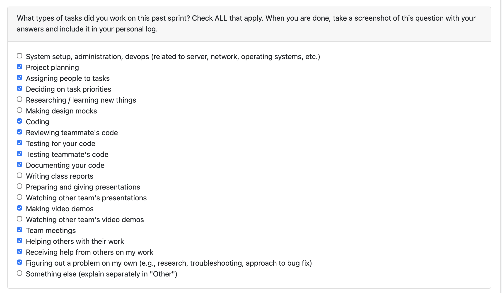

# Week Navigation

- [Term 2 Week 7-8 (Feb 16 - Mar 1)](#logs---term-2-week-7-8)
- [Term 2 Week 4-5 (Jan 26 - Feb 8)](#logs---term-2-week-4-5)
- [Term 2 Week 3 (Jan 19 - Jan 25)](Log-01-25-26.md)
- [Term 2 Week 2 (Jan 13 - Jan 19)](Log-01-19-26.md)
- [Term 1 Week 14 (Dec 1 - Dec 7)](Log-12-07-25.md)
- [Term 1 Week 13 (Nov 24 - Nov 30)](Log-11-30-25.md)
- [Term 1 Week 12 (Nov 17 - Nov 23)](Log-11-23-25.md)
- [Term 1 Week 11 (Nov 3 - Nov 9)](Log-11-09-25.md)
- [Term 1 Week 10 (Oct 27 - Nov 2)](Log-11-02-25.md)
- [Term 1 Week 9 (Oct 20 - Oct 26)](Log-10-26-25.md)
- [Term 1 Week 8 (Oct 13 - Oct 19)](Log-10-19-2025.md)
- [Term 1 Week 7 (Oct 6 - Oct 12)](Log-10-12-2025.md)
- [Term 1 Week 6 (Sep 29 - Oct 5)](Log-10-05-25.md)
- [Term 1 Week 5 (Sep 22 - Sep 28)](Log-9-28-25.md)
- [Term 1 Week 4 (Sep 15 - Sep 21)](Log-9-21-25.md)

---

# logs - Term 2 Week 7-8

## Connection to Previous Week

Last period I focused on OpenTUI API/client integration and milestone delivery tasks. This week I focused on post-presentation stabilization by fixing the repo-quality evidence flow and cleaning model boundaries to remove circular imports.

---

## Coding Tasks

* Restored the repo-quality evidence pipeline and extractor wiring so portfolio evidence flow works correctly again ([Issue #333](https://github.com/COSC-499-W2025/capstone-project-team-1/issues/333)).

* Refactored `RepoQualityResult` into shared models to remove circular import issues in the signals and extractors path.

* Moved analysis dataclasses into shared models and reused evidence utilities across bridge extractors to reduce duplication and keep model usage consistent.

* Updated README diagrams and milestone-2 scope notes for clearer architecture/project status documentation.

---

## Testing & Debugging Tasks

* Updated and validated `tests/evidence/test_repo_quality_bridge.py` after evidence pipeline restoration changes.

* Updated and validated `tests/signals/test_repo_quality_signals.py` for repo-quality signal path correctness.

* Debugged circular import and duplicated helper flow issues while refactoring model placement across evidence + skills modules.

---

## Reviewing & Collaboration Tasks

* Addressed review-related cleanup by consolidating model/dataclass placement and reducing repeated conversion utilities across modules.

* Synced with team on milestone presentation wrap-up and post-milestone integration priorities.

---

## Blockers & Issues

* Main issue this week was evidence pipeline regression + model import coupling; both were addressed through the refactor and test updates above.

---

## Plan for Next Week

* Continue evidence/portfolio endpoint cleanup and keep integration stable while local-LLM migration work is merged into development.

* Expand targeted test coverage around evidence extraction paths touched during this week.

* Start working on the milestone 3 issues 

---

| **Task** | **Status** | **Notes** |
| --- | --- | --- |
| Restore repo-quality evidence pipeline | Done | [Issue #333](https://github.com/COSC-499-W2025/capstone-project-team-1/issues/333) |
| Refactor `RepoQualityResult` to shared models | Done | Removed circular import path |
| Move analysis dataclasses into models + reuse evidence utils | Done | Implemented in `pr-405` branch commits |
| Update README diagrams/scope for milestone 2 | Done | Documentation refresh completed |
| Update repo-quality bridge/signal tests | Done | `tests/evidence/test_repo_quality_bridge.py`, `tests/signals/test_repo_quality_signals.py` |

---

# logs - Term 2 Week 4-5

## Connection to Previous Week

Last week I focused on interactive CLI improvements and stabilization. This week I shifted toward OpenTUI/frontend state work and backend data model updates, while continuing PR reviews during evidence and retrieval integration.

---

## Coding Tasks

* Added OpenTUI API client layer and centralized frontend state with AppContext for API-driven UI flow ([PR #345](https://github.com/COSC-499-W2025/capstone-project-team-1/pull/345)).

* Implemented mock UserConfig screen scaffolding to move the OpenTUI flow toward full user configuration support.

* Added project user-role support end to end (schema/model + API flow integration) in branch `336-Add-User-Feilds`.

---

## Testing & Debugging Tasks

* Added minimal API client tests and fixed API client environment + consent typing issues.

* Added `mock_projects_v2` fixture with reproducible generation script for stable and repeatable test data.

* Added v1 isolation assertion for incremental snapshot tests to preserve backward-compatible snapshot behavior.

---

## Reviewing & Collaboration Tasks

* Reviewed [PR #339](https://github.com/COSC-499-W2025/capstone-project-team-1/pull/339) (evidence of success) and requested changes; validated follow-up updates.

* Reviewed [PR #352](https://github.com/COSC-499-W2025/capstone-project-team-1/pull/352) for evidence/retrieval changes.

* Reviewed [PR #357](https://github.com/COSC-499-W2025/capstone-project-team-1/pull/357) for evidence foundation bridge updates.

* Reviewed [PR #358](https://github.com/COSC-499-W2025/capstone-project-team-1/pull/358) for evidence persistence migration coverage.

---

## Blockers & Issues

* No major blockers this week.

* Main challenge was overlapping evidence/retrieval changes across multiple PRs; addressed by leaving targeted review comments and validating follow-up commits before moving on.

---

## Plan for Next Week

* Move UserConfig from mock UI to wired functionality with real API calls.

* Expand API client test coverage for additional edge cases.

* Continue supporting milestone integration by reviewing active backend/frontend PRs.

---

| **Task** | **Status** | **Notes** |
| --- | --- | --- |
| OpenTUI API client + AppContext | Done | [PR #345](https://github.com/COSC-499-W2025/capstone-project-team-1/pull/345) |
| UserConfig mock screen | Done | Initial UI scaffolding completed |
| Project user-role end-to-end support | Done | Implemented in branch `336-Add-User-Feilds` |
| API client tests + typing/env fixes | Done | Added minimal tests and fixed consent/env typing |
| Reproducible fixture generation | Done | Added `mock_projects_v2` and generation script |
| Snapshot v1 isolation assertion | Done | Added compatibility guard in incremental snapshot tests |
| Review PR #339 | Done | Requested changes and validated updates |
| Review PR #352 | Done | Reviewed evidence/retrieval updates |
| Review PR #357 | Done | Reviewed evidence foundation bridge changes |
| Review PR #358 | Done | Reviewed migration persistence test coverage |

