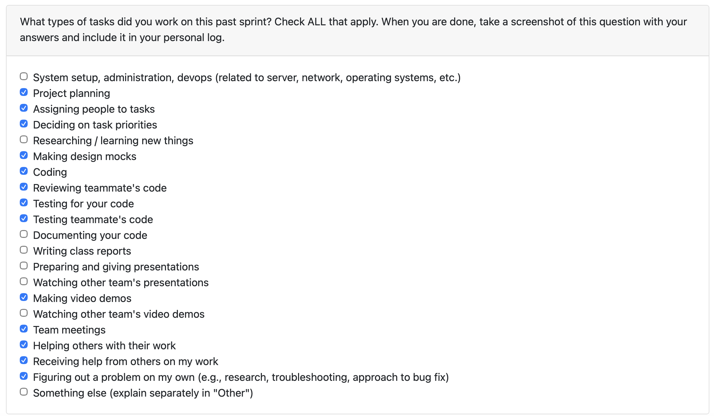
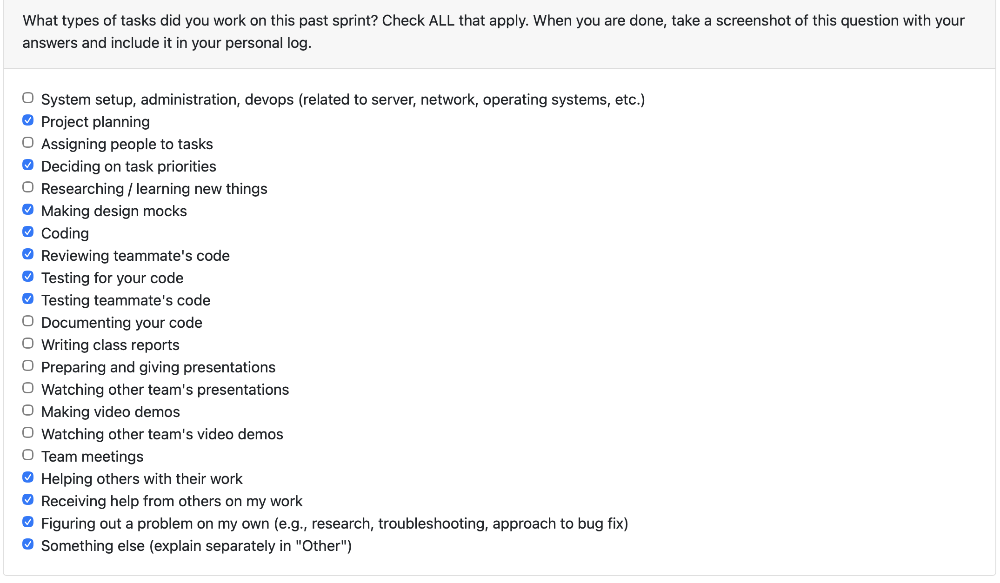
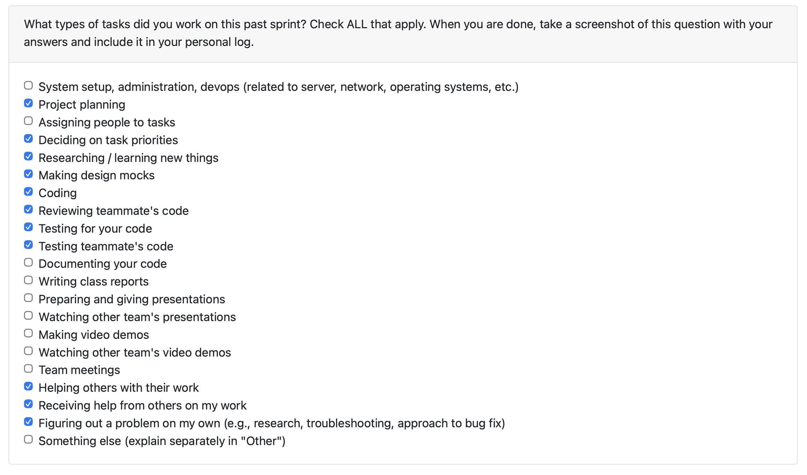
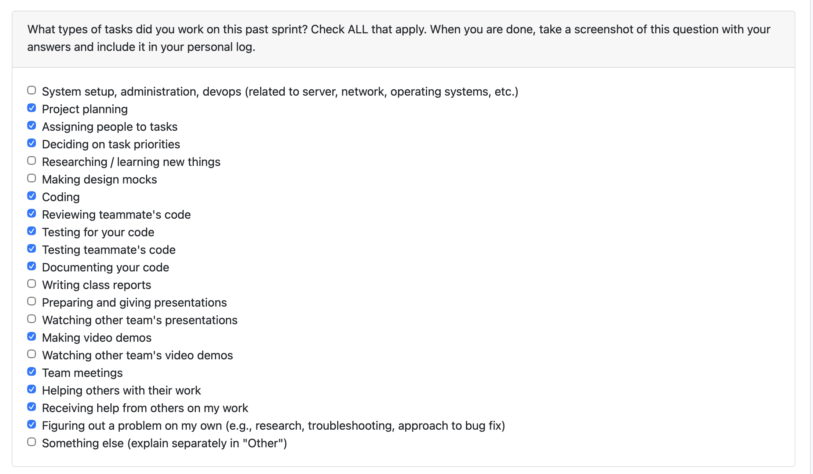

# Week Navigation

- [Term 2 Week 11-12 (Mar 16 - Mar 29)](#logs---term-2-week-11-12)
- [Term 2 Week 10 (Mar 9 - Mar 15)](#logs---term-2-week-10)
- [Term 2 Week 9 (Mar 2 - Mar 8)](#logs---term-2-week-9)
- [Term 2 Week 7-8 (Feb 16 - Mar 1)](#logs---term-2-week-7-8)
- [Term 2 Week 4-5 (Jan 26 - Feb 8)](#logs---term-2-week-4-5)
- [Term 2 Week 3 (Jan 19 - Jan 25)](Log-01-25-26.md)
- [Term 2 Week 2 (Jan 13 - Jan 19)](Log-01-19-26.md)
- [Term 1 Week 14 (Dec 1 - Dec 7)](Log-12-07-25.md)
- [Term 1 Week 13 (Nov 24 - Nov 30)](Log-11-30-25.md)
- [Term 1 Week 12 (Nov 17 - Nov 23)](Log-11-23-25.md)
- [Term 1 Week 11 (Nov 3 - Nov 9)](Log-11-09-25.md)
- [Term 1 Week 10 (Oct 27 - Nov 2)](Log-11-02-25.md)
- [Term 1 Week 9 (Oct 20 - Oct 26)](Log-10-26-25.md)
- [Term 1 Week 8 (Oct 13 - Oct 19)](Log-10-19-2025.md)
- [Term 1 Week 7 (Oct 6 - Oct 12)](Log-10-12-2025.md)
- [Term 1 Week 6 (Sep 29 - Oct 5)](Log-10-05-25.md)
- [Term 1 Week 5 (Sep 22 - Sep 28)](Log-9-28-25.md)
- [Term 1 Week 4 (Sep 15 - Sep 21)](Log-9-21-25.md)

---

# logs - Term 2 Week 11-12

## Connection to Previous Week

Last week I focused on finishing the IdentityScreen work and keeping the OpenTUI migration moving. Over this cumulative two-week period I pushed the migration further by wiring the live analysis flow, building the draft-review and preview experience, polishing the UI, and starting the shared HTML resume-generation foundation for milestone 3 while also helping with planning, prioritization, and team coordination.

---

## Coding Tasks

* Implemented real pipeline polling for the OpenTUI analysis flow in [PR #503](https://github.com/COSC-499-W2025/capstone-project-team-1/pull/503), replacing mock progress with live status polling, terminal-state routing, and cancel handling.

* Built the OpenTUI `DraftPauseScreen` in [PR #504](https://github.com/COSC-499-W2025/capstone-project-team-1/pull/504), including paused draft review, keyboard navigation, inline feedback controls, and pipeline cancel/submit behavior.

* Reworked `ResumePreview` for pipeline-based output in [PR #505](https://github.com/COSC-499-W2025/capstone-project-team-1/pull/505) and the follow-up reapply [PR #516](https://github.com/COSC-499-W2025/capstone-project-team-1/pull/516), adding draft/final/diff preview modes, section navigation, and save/polish/restart actions.

* Continued the OpenTUI navigation integration work in [PR #523](https://github.com/COSC-499-W2025/capstone-project-team-1/pull/523), wiring the consent, project-list, identity, pipeline-launch, draft-pause, and feedback flow together on top of current `development`.

* Ported UI polish and formatting updates in [PR #521](https://github.com/COSC-499-W2025/capstone-project-team-1/pull/521), refreshing `Landing`, `TopBar`, `BottomBar`, and `ConsentScreen` behavior and presentation.

* Started the milestone 3 HTML resume-generation foundation in [PR #536](https://github.com/COSC-499-W2025/capstone-project-team-1/pull/536) by adding the shared generator package, API router surface, schemas, and initial test coverage for the new generation flow.

---

## Testing & Debugging Tasks

* Added analysis-screen tests covering live polling, `draft_ready` / `complete` routing, and Escape-driven cancellation in [PR #503](https://github.com/COSC-499-W2025/capstone-project-team-1/pull/503).

* Added `DraftPauseScreen` coverage for layout, section navigation, and cancel behavior in [PR #504](https://github.com/COSC-499-W2025/capstone-project-team-1/pull/504).

* Added and updated `ResumePreview` tests while debugging flush timing and state issues during the pipeline-output rewrite in [PR #505](https://github.com/COSC-499-W2025/capstone-project-team-1/pull/505).

* Fixed merge-related frontend issues after syncing with `development`, including `CopilotLogin` text-prop fallout, test timing issues, and lockfile / compile cleanup needed to keep the migration branches usable.

* Added targeted coverage for migrated UI behavior in [PR #521](https://github.com/COSC-499-W2025/capstone-project-team-1/pull/521) and a focused proficiency-mapping test for the new generator foundation in [PR #536](https://github.com/COSC-499-W2025/capstone-project-team-1/pull/536).

---

## Reviewing & Collaboration Tasks

* Participated in sprint planning, task prioritization, and team meetings for the OpenTUI migration and milestone 3 HTML-generation work, helping break larger goals into reviewable slices and assign follow-up work.

* Reviewed active frontend / local-LLM migration work and coordinated merge sequencing so the OpenTUI branches stayed compatible with adjacent backend changes.

* Helped teammates unblock integration work by discussing review feedback, validating follow-up fixes, and sharing context on the newer pipeline-state flow.

* Worked on design-facing polish for the updated OpenTUI screens and helped prepare demo-ready flows / walkthrough material for the sprint work.

---

## Blockers & Issues

* No major blockers this period.

* Main challenge was branch churn across stacked OpenTUI PRs, including merge conflicts, repeated development syncs, and the accidental `ResumePreview` merge/revert cycle; these were handled with follow-up fixes and rebases.

---

## Plan for Next Week

* Finish the remaining HTML resume-generation pieces on top of the new shared foundation.

* Continue closing out OpenTUI integration and frontend cleanup work.

* Support final review, documentation, and submission follow-up tasks.

---

| **Task** | **Status** | **Notes** |
| --- | --- | --- |
| Analysis polling flow | Done | [PR #503](https://github.com/COSC-499-W2025/capstone-project-team-1/pull/503) |
| `DraftPauseScreen` implementation | Done | [PR #504](https://github.com/COSC-499-W2025/capstone-project-team-1/pull/504) |
| `ResumePreview` pipeline rewrite | Done | [PR #505](https://github.com/COSC-499-W2025/capstone-project-team-1/pull/505) and [PR #516](https://github.com/COSC-499-W2025/capstone-project-team-1/pull/516) |
| OpenTUI navigation integration | Done | [PR #523](https://github.com/COSC-499-W2025/capstone-project-team-1/pull/523) branch work completed this period |
| OpenTUI polish / formatting updates | Done | [PR #521](https://github.com/COSC-499-W2025/capstone-project-team-1/pull/521) |
| HTML resume-generation foundation | Done | [PR #536](https://github.com/COSC-499-W2025/capstone-project-team-1/pull/536) |
| Sprint planning / prioritization / meetings | Done | Included planning, assigning follow-up work, and coordination |
| Review and integration support | Done | Helped teammates through rebases, review follow-up, and merge sequencing |

---

# logs - Term 2 Week 10

## Connection to Previous Week

Last week I focused on the first OpenTUI migration foundations for resume rendering and shared pipeline state. This week I stayed on the frontend migration and finished the review/integration pass for the identity flow while also helping keep the local-LLM migration moving in parallel.

---

## Coding Tasks

* Finalized and merged the OpenTUI `IdentityScreen` work in [PR #477](https://github.com/COSC-499-W2025/capstone-project-team-1/pull/477), carrying the screen from initial implementation into a merge-ready state for the current migration sequence.

* Added the identity selection / manual entry flow needed before pipeline launch so the frontend can collect and confirm contributor identity in a cleaner way.

* Fixed the confirm interaction by switching the screen to the `Select` component's `onSelect` flow instead of a more brittle confirm path.

* Fixed a state bug where manually entered identity values could be lost while switching between typed input and suggested selections.

* Helped land the llama-server health-check work by merging [PR #474](https://github.com/COSC-499-W2025/capstone-project-team-1/pull/474), keeping the local-LLM runtime migration moving alongside the frontend work.

---

## Testing & Debugging Tasks

* Carried forward `IdentityScreen` component coverage and updated the related tests during review follow-up for the manual-input preservation fix.

* Debugged identity selection state transitions while the screen was being integrated with newer pipeline/client changes landing in development.

* Validated that the final identity confirmation path followed the component event model correctly after the `onSelect` interaction fix.

---

## Reviewing & Collaboration Tasks

* Synced with the team on how the identity flow fits into the broader OpenTUI migration alongside the pipeline launch and feedback screen work.

* Coordinated around active migration PRs so the frontend identity screen stayed compatible with adjacent pipeline and local-LLM changes.

* Closed out the week by making sure both the identity-screen work and the llama-server health-check work were merged cleanly into the ongoing milestone 3 migration effort.

---

## Blockers & Issues

* No major blockers this week.

* Main challenge was frontend interaction/state churn while adjacent migration PRs were landing; this was handled with small follow-up fixes rather than a larger rewrite.

---

## Plan for Next Week

* Continue wiring the remaining OpenTUI screens against the newer migration state flow.

* Expand frontend coverage around screen transitions and identity-to-pipeline handoff behavior.

* Keep supporting milestone 3 integration work as the frontend and local-LLM migration slices converge.

---

| **Task** | **Status** | **Notes** |
| --- | --- | --- |
| Finalize OpenTUI `IdentityScreen` | Done | [PR #477](https://github.com/COSC-499-W2025/capstone-project-team-1/pull/477) merged this week |
| Preserve manual identity input | Done | Follow-up fix during review/integration |
| Fix identity confirm interaction | Done | Switched to `Select` `onSelect` flow |
| Update `IdentityScreen` tests | Done | Adjusted coverage during follow-up fixes |
| Merge llama-server health check work | Done | [PR #474](https://github.com/COSC-499-W2025/capstone-project-team-1/pull/474) |

---

# logs - Term 2 Week 9

## Connection to Previous Week

Last period I focused on evidence pipeline stabilization and post-milestone cleanup. This week I shifted back into the OpenTUI migration and worked on the core frontend foundations needed for resume preview rendering and pipeline-driven application state.

---

## Coding Tasks

* Implemented the OpenTUI `Resume Utils` slice by adding helpers to convert `ResumeV3` data into preview sections, readable text output, compact stats, keyed lines, and unified diffs in branch `codex/422-resume-rendering-utils-helpers`.

* Added reusable error normalization helpers so frontend screens can surface API/client failures consistently.

* Rewrote `AppContext` around pipeline-oriented state in branch `codex/424-appcontext-rewrite`, covering intake tracking, detected repos, contributor selection, pipeline job status/stage/telemetry, messages, resume draft/final output, and pipeline notices.

* Added follow-up cleanup to align resume utilities with the current source types and kept helper formatting consistent after rebasing onto newer OpenTUI changes.

---

## Testing & Debugging Tasks

* Added tests for resume rendering helpers covering ordered section generation, text rendering, sidebar stats, diff generation, repeated-line keying, and error normalization.

* Added `AppContext` tests covering initial state, setter behavior, `resetRunState`, and full reset behavior.

* Fixed type mismatches between the new resume utilities and the latest `api/types.ts` source models during follow-up integration.

---

## Reviewing & Collaboration Tasks

* Reviewed [PR #404](https://github.com/COSC-499-W2025/capstone-project-team-1/pull/404) (local LLM endpoint testing + API rename by Shlok) and approved after the `_active_job_id` / context-switching teardown concern was addressed.

* Reviewed [PR #420](https://github.com/COSC-499-W2025/capstone-project-team-1/pull/420) (OpenTUI frontend migration plan by Stavan) and approved the migration direction.

* Reviewed [PR #447](https://github.com/COSC-499-W2025/capstone-project-team-1/pull/447) (Local LLM API migration plan by Shlok) and approved the proposed integration plan.

* Reviewed [PR #461](https://github.com/COSC-499-W2025/capstone-project-team-1/pull/461) (local intake endpoint + router registration by Evan), requested changes on ZIP directory behavior / error handling, then approved after fixes were made.

* Kept the OpenTUI implementation aligned with the migration plan by scoping my own work to the planned `PR1b` (`Resume Utils`) and `PR3` (`AppContext Rewrite`) slices for easier review and merge sequencing.

---

## Blockers & Issues

* No major blockers this week.

* Main challenge was keeping the new resume helper layer aligned with changing OpenTUI source types while the application state model was being rewritten in parallel; this was resolved with targeted follow-up fixes and added tests.

---

## Plan for Next Week

* Continue the OpenTUI migration with screens that consume the new pipeline state and resume helper utilities.

* Expand frontend test coverage as more OpenTUI components are wired to the rewritten `AppContext`.

* Keep the OpenTUI branches synchronized with development to reduce integration churn.

---

| **Task** | **Status** | **Notes** |
| --- | --- | --- |
| Implement resume rendering helpers | Done | `codex/422-resume-rendering-utils-helpers` |
| Add resume helper tests | Done | Covered sections, text, stats, diff, and error handling |
| Rewrite AppContext for pipeline state | Done | `codex/424-appcontext-rewrite` |
| Add AppContext state tests | Done | Initial state, setters, `resetRunState`, and `reset` |
| Align resume utils with source types | Done | Follow-up fix after syncing with newer OpenTUI types |
| Path helper cleanup | Done | Formatting consistency cleanup |
| Review PRs #404, #407, #420, #447, #461 | Done | Requested changes where needed, then approved after fixes |

---

# logs - Term 2 Week 7-8

## Connection to Previous Week

Last period I focused on OpenTUI API/client integration and milestone delivery tasks. This week I focused on post-presentation stabilization by fixing the repo-quality evidence flow and cleaning model boundaries to remove circular imports.

---

## Coding Tasks

* Restored the repo-quality evidence pipeline and extractor wiring so portfolio evidence flow works correctly again ([Issue #333](https://github.com/COSC-499-W2025/capstone-project-team-1/issues/333)).

* Refactored `RepoQualityResult` into shared models to remove circular import issues in the signals and extractors path.

* Moved analysis dataclasses into shared models and reused evidence utilities across bridge extractors to reduce duplication and keep model usage consistent.

* Updated README diagrams and milestone-2 scope notes for clearer architecture/project status documentation.

---

## Testing & Debugging Tasks

* Updated and validated `tests/evidence/test_repo_quality_bridge.py` after evidence pipeline restoration changes.

* Updated and validated `tests/signals/test_repo_quality_signals.py` for repo-quality signal path correctness.

* Debugged circular import and duplicated helper flow issues while refactoring model placement across evidence + skills modules.

---

## Reviewing & Collaboration Tasks

* Addressed review-related cleanup by consolidating model/dataclass placement and reducing repeated conversion utilities across modules.

* Synced with team on milestone presentation wrap-up and post-milestone integration priorities.

---

## Blockers & Issues

* Main issue this week was evidence pipeline regression + model import coupling; both were addressed through the refactor and test updates above.

---

## Plan for Next Week

* Continue evidence/portfolio endpoint cleanup and keep integration stable while local-LLM migration work is merged into development.

* Expand targeted test coverage around evidence extraction paths touched during this week.

* Start working on the milestone 3 issues 

---

| **Task** | **Status** | **Notes** |
| --- | --- | --- |
| Restore repo-quality evidence pipeline | Done | [Issue #333](https://github.com/COSC-499-W2025/capstone-project-team-1/issues/333) |
| Refactor `RepoQualityResult` to shared models | Done | Removed circular import path |
| Move analysis dataclasses into models + reuse evidence utils | Done | Implemented in `pr-405` branch commits |
| Update README diagrams/scope for milestone 2 | Done | Documentation refresh completed |
| Update repo-quality bridge/signal tests | Done | `tests/evidence/test_repo_quality_bridge.py`, `tests/signals/test_repo_quality_signals.py` |

---

# logs - Term 2 Week 4-5

## Connection to Previous Week

Last week I focused on interactive CLI improvements and stabilization. This week I shifted toward OpenTUI/frontend state work and backend data model updates, while continuing PR reviews during evidence and retrieval integration.

---

## Coding Tasks

* Added OpenTUI API client layer and centralized frontend state with AppContext for API-driven UI flow ([PR #345](https://github.com/COSC-499-W2025/capstone-project-team-1/pull/345)).

* Implemented mock UserConfig screen scaffolding to move the OpenTUI flow toward full user configuration support.

* Added project user-role support end to end (schema/model + API flow integration) in branch `336-Add-User-Feilds`.

---

## Testing & Debugging Tasks

* Added minimal API client tests and fixed API client environment + consent typing issues.

* Added `mock_projects_v2` fixture with reproducible generation script for stable and repeatable test data.

* Added v1 isolation assertion for incremental snapshot tests to preserve backward-compatible snapshot behavior.

---

## Reviewing & Collaboration Tasks

* Reviewed [PR #339](https://github.com/COSC-499-W2025/capstone-project-team-1/pull/339) (evidence of success) and requested changes; validated follow-up updates.

* Reviewed [PR #352](https://github.com/COSC-499-W2025/capstone-project-team-1/pull/352) for evidence/retrieval changes.

* Reviewed [PR #357](https://github.com/COSC-499-W2025/capstone-project-team-1/pull/357) for evidence foundation bridge updates.

* Reviewed [PR #358](https://github.com/COSC-499-W2025/capstone-project-team-1/pull/358) for evidence persistence migration coverage.

---

## Blockers & Issues

* No major blockers this week.

* Main challenge was overlapping evidence/retrieval changes across multiple PRs; addressed by leaving targeted review comments and validating follow-up commits before moving on.

---

## Plan for Next Week

* Move UserConfig from mock UI to wired functionality with real API calls.

* Expand API client test coverage for additional edge cases.

* Continue supporting milestone integration by reviewing active backend/frontend PRs.

---

| **Task** | **Status** | **Notes** |
| --- | --- | --- |
| OpenTUI API client + AppContext | Done | [PR #345](https://github.com/COSC-499-W2025/capstone-project-team-1/pull/345) |
| UserConfig mock screen | Done | Initial UI scaffolding completed |
| Project user-role end-to-end support | Done | Implemented in branch `336-Add-User-Feilds` |
| API client tests + typing/env fixes | Done | Added minimal tests and fixed consent/env typing |
| Reproducible fixture generation | Done | Added `mock_projects_v2` and generation script |
| Snapshot v1 isolation assertion | Done | Added compatibility guard in incremental snapshot tests |
| Review PR #339 | Done | Requested changes and validated updates |
| Review PR #352 | Done | Reviewed evidence/retrieval updates |
| Review PR #357 | Done | Reviewed evidence foundation bridge changes |
| Review PR #358 | Done | Reviewed migration persistence test coverage |

