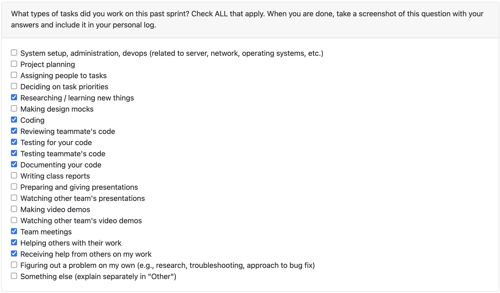

Term 2 Week 1: [Week 15 (Jan 5 - Jan 11)](Week_15.md) 
Term 2 Week 2: [Week 16 (Jan 12 - Jan 18)](Week_16.md)

---

## Term 2 Week 3: Jan 19- 25:

#### Previous Week:
The previous week was focused on creating a test bench to experiment with adding local LLMs through Ollama.

#### Brief:

**Task 1**
Picking up from last week I created an internal tool (not a part of the repo) to see if I can serve a local LLM (LiquidAI's LFM2.5-1.2B-Instruct) research on the feasibility of this feature. Turns out, it is notoriously difficult to actually generated a reliable JSON Schema from small LLMs. It is looking increasingly unlikely that I can serve a local LLM for on-device analysis of the user's zip file

**Task 2**
Next order of business was to look at possible options at revamping the TUI that we have from Textual to OpenTUI. Every group that is creating a TUI like us is likely to use Textual and thus we risk our project to not be visually appealing. Thankfully, OpenTUI solves that. It is a much better library of TUI components and animations which can be coded through React. So my focus was on researching on what OpenTUI is and how do we use it and is it even feasible to migrate to it. PR #297: Experimented with OpenTUI and have a mock ready is my work on OpenTUI for the team to have a look and provide feedback. 

https://github.com/COSC-499-W2025/capstone-project-team-1/pull/297

**Task 3**
As a part of my maintenance of the codebase, I found that we were using a deprecated datetime utility that was causing issues across the API.  Rather than just patching the email bug, I took the opportunity to refactor the entire codebase's datetime handling. The fix involved removing the deprecated `utcnow()` helper function and standardizing all datetime assignments to use `datetime.now(UTC).replace(tzinfo=None)` directly. Look at PR: #304: API Cleanup: Fix Broken Timestamp Assignment and Standardize Naive UTC Datetimes

https://github.com/COSC-499-W2025/capstone-project-team-1/pull/304

**Task 4**
There was a race condition for the PR: 295 Implement Intiailization on OpenAI wherein 2 requests could create the same OpenAI client, there was no thread lock in place which I flagged and helped work on the fix with Evan

https://github.com/COSC-499-W2025/capstone-project-team-1/pull/295

#### Plan for Next Week
The team will be implementing any and all feedback that is given to us in the Peer Testing. Ill be researching more into OpenTUI and will be working with the team to prioritize tasks. We might put OpenTUI on the backfoot and prioritize Milestone 2.

I need to work more on the code maintenance and looking at the APIs in detail as I believe that there is a lot of scope for optimization and refactoring. 

