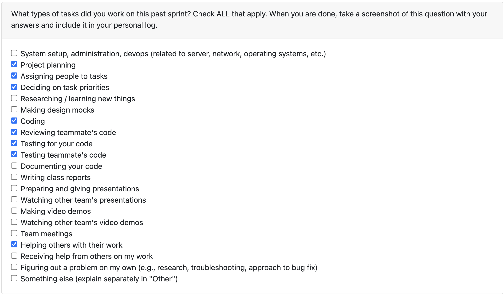
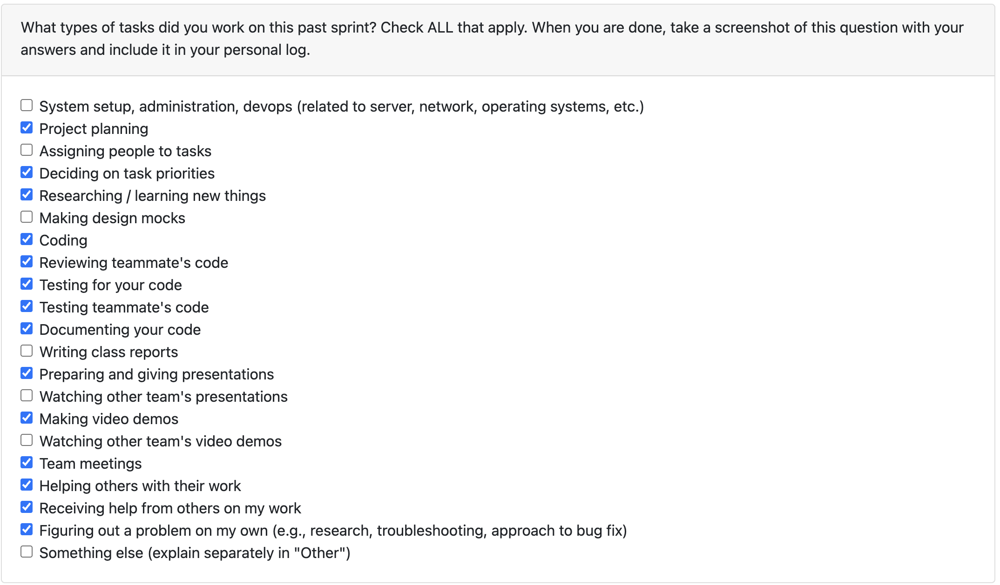
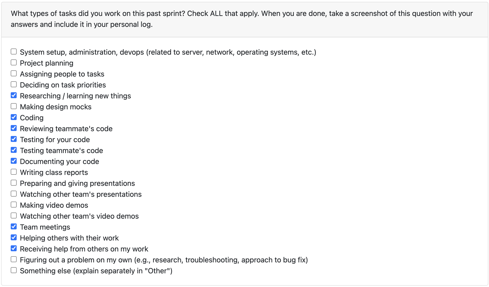

Term 2 Week 1: [Week 15 (Jan 5 - Jan 11)](Week_15.md)
Term 2 Week 2: [Week 16 (Jan 12 - Jan 18)](Week_16.md)

---
## Term 2 Week 9: Mar 2- Mar 8
**My Code Contributions For Week 9**:
This week was about laying the groundwork for porting local LLM generation from `experimental-llamacpp-v3` into `development`.

I worked on [Issue 450](https://github.com/COSC-499-W2025/capstone-project-team-1/issues/450) which establishes the core runtime primitives for the `local_llm` module. [PR #462](https://github.com/COSC-499-W2025/capstone-project-team-1/pull/462) adds Pydantic data models (`InferenceOptions`, `ModelDescriptor`, `RuntimeStatus`), platform-aware GPU layer detection (Apple Silicon vs others), context window resolution, sampling defaults for our target model families, and a typed exception hierarchy for llama-server failures. Wrote a 14-case test suite covering all of the above.

I also created the migration plan for how we bring local LLM generation into `development` in [PR #447](https://github.com/COSC-499-W2025/capstone-project-team-1/pull/447). It covers the API diff between the two branches, the target `/local-llm/*` route family, what stays unchanged, and the recommended sequencing for the team. Also planned out how to bring llama-server into dev and what the new directory structure should look like.

**Reviewing Team's PRs- Week 9**:

1. Reviewed [Stavan's PR](https://github.com/COSC-499-W2025/capstone-project-team-1/pull/420) as he added a migration plan doc for the OpenTUI frontend. Documentation only, no changes were required. The plan will make sure anyone who works on the migration has relevant context
2. Reviewed [Stavan's PR](https://github.com/COSC-499-W2025/capstone-project-team-1/pull/436) as he ported the pipeline API types and updated screen/theme types for the OpenTUI migration. Requested changes which Stavan addressed promptly.
3. Reviewed [Evan's PR](https://github.com/COSC-499-W2025/capstone-project-team-1/pull/448) as he replaced Ollama with a llama-cpp wrapper and updated the consent levels. Decided that I will take up the llama-cpp server migration and thus closed this PR with an appropriate comment.
4. Reviewed [Nathan's PR](https://github.com/COSC-499-W2025/capstone-project-team-1/pull/449) as he migrated 13 transport schemas from `experimental-llamacpp-v3` into `development`. Requested changes which Nathan addressed promptly.
5. Reviewed [Nathan's PR](https://github.com/COSC-499-W2025/capstone-project-team-1/pull/460) as he added a 41-case test suite for the transport schemas. Requested changes which Nathan addressed promptly.

**Plan for Next Week**:

We have started working on bringing our local LLM generation to dev. The work is going on smoothly. Next week will see more of the same- bringing more features into dev and deciding what to keep and what to deprecate. 

## Term 2 Week 7-8: Feb 16- Mar 1

**My Code Contributions For Week 8 (Feb 23- March 1)**:
My main focus was to write proper API endpoint tests for the local LLM generation and cleaning up old stale tests so that our eventual port to dev works smoothly.

I worked on [Issue 402](https://github.com/COSC-499-W2025/capstone-project-team-1/issues/402) and [Issue 403](https://github.com/COSC-499-W2025/capstone-project-team-1/issues/403) which involved refactoring the local LLM API endpoints to be more semantically correct (renaming from `/resume/pipelines` to `/local-llm/*`) and writing comprehensive smoke and integration tests for the local LLM resume generation flow. The [PR #404](https://github.com/COSC-499-W2025/capstone-project-team-1/pull/404) covers both issues and includes end-to-end integration tests that validate the full generation lifecycle — happy path, cancel, missing model error handling, resource guard, and cleanup verification of both the worker subprocess and `llama-server` process. Also deleted a large amount of older stale tests that were messy and non-comprehensive.

The team had a meeting to decide on how do we plan to integrate this local llm pipeline into the existing codebase. We currently have 3 options:

a. Keep everything as is and bolt a local llm on top
b. Scrap the current one and take local LLM as the source of truth, ported into dev using multiple small PRs distributed among the team
c. Something else entirely depending on how the previous options pan out

**Reviewing Team's PRs- Week 8 (Feb 23- March 1)**:

1. Reviewed [Evan's PR](https://github.com/COSC-499-W2025/capstone-project-team-1/pull/393) as he added a `GET /portfolio/{id}` endpoint. All tests passed, nothing to flag. Approved.
2. Reviewed [Ahmad's PR](https://github.com/COSC-499-W2025/capstone-project-team-1/pull/406) as he also added a `GET /portfolio/{id}` endpoint. Requested changes which Ahmad promptly addressed.
3. Reviewed [Stavan's PR](https://github.com/COSC-499-W2025/capstone-project-team-1/pull/407) as he added running Alembic migrations on API startup. The change made sense and was approved.

**My Code Contributions For Week 7 (Reading Break)**:
The reading break was where I worked on finally setting up a pipeline that we can use to use Local LLMs in our TUI. I am quite proud of what I built over the span of a week. There is no issue attached to it as I was experimenting with local LLMs. The PR for is open [here](https://github.com/COSC-499-W2025/capstone-project-team-1/pull/383) .We wont close it as we plan on using smaller PRs to merge the pipeline as significant amount of work is needed by the team.

I also worked to create the TUI screens for the local LLM generation so that I can get feedback from the team and have a design mock ready which the team can iterate upon.

The team liked the Local LLM generation and thus I started planning on how to merge this big change into our dev branch. The first step, and the lowest hanging fruit, was to update the consent form to include the option to use local llm. The PR for which can be found [here](https://github.com/COSC-499-W2025/capstone-project-team-1/pull/385)

**Reviewing Team's PRs- Week 7 (Reading Break)**:

1. Reviewed [Evan's PR](https://github.com/COSC-499-W2025/capstone-project-team-1/pull/379) where he added a local LLM benchmark summary with evaluation metrics. Left some comments on the PR.
2. Reviewed [Ahmad's PR](https://github.com/COSC-499-W2025/capstone-project-team-1/pull/377) as he added a `POST /portfolio/generate` endpoint. Requested changes which Ahmad promptly addressed.
3. Reviewed [Stavan's PR](https://github.com/COSC-499-W2025/capstone-project-team-1/pull/376) as he added testing, docs, and code-quality heuristic extractors. Requested changes which Stavan addressed.
4. Reviewed [Stavan's PR](https://github.com/COSC-499-W2025/capstone-project-team-1/pull/378) as he added a `POST /resume/{id}/edit` endpoint. Requested changes, all tests passed after fixes and was approved.
5. Merged [Stavan's PR](https://github.com/COSC-499-W2025/capstone-project-team-1/pull/371) as he added git/infra extractors and PR-2 alignment fixes. Requested changes which were addressed. **Note: this PR was merged in Week 7 (Feb 16) but I reviewed it in Week 6 (Feb 13).**

**Plan for Next Week**:
With milestone 2 wrapped up, we will start working on bringing local LLM generation into the dev branch. Hope the transition is smooth.

---

## Term 2 Week 4-5: Jan 26- Feb 8

**My Code Contributions For Week 4**
I worked on [Issue 321](https://github.com/COSC-499-W2025/capstone-project-team-1/issues/321) which was about being able to actually view the user's file system instead of the mock data that was shown. The [PR](https://github.com/COSC-499-W2025/capstone-project-team-1/pull/347) for that issue created 2 utilities: a file crawler using `fdir` and then fuzzy searching over that crawled list of files using `fuse.js`.

Note: we are finally switching to OpenTUI which is so much better than Textual and glad that development on the TUI has started

**My Code Contributions for Week 5**:

1. Worked on [Issue 330](https://github.com/COSC-499-W2025/capstone-project-team-1/issues/330) which creates the `GET /resume/{id}` endpoint as required by Milestone 2. The PR for the new endpoint be found [here](https://github.com/COSC-499-W2025/capstone-project-team-1/pull/351).

2. Worked on [Issue 339](https://github.com/COSC-499-W2025/capstone-project-team-1/issues/339) which incorporates allows the user to add evidences of their sucess in a particular project such as metrics and awards which is again a requirement for Milestone 2. Created a new `ProjectEvidence` model. The PR for this issue is [here](https://github.com/COSC-499-W2025/capstone-project-team-1/pull/352).

3. I made progress on incorporating a local LLM as a part of our analysis using a prebuilt llama.cpp server binary which exposes OpenAI compatible endpoints which simplifies API calls to the local LLM. This is NOT a code contribution but rather surfacing my research over the past week and showing it to the team. Everyone is excited to use it and we are planning on improving our analysis pipeline to use the local LLM efficiently. The PR can be found [here](https://github.com/COSC-499-W2025/capstone-project-team-1/pull/360)

**Reviewing Team's PRs- Week 4**:

1. Reviewed [Evan's PR](https://github.com/COSC-499-W2025/capstone-project-team-1/pull/317) on a file path issue. Requested changes which were promptly fixed by him
2. Reviewd [Stavan's PR](https://github.com/COSC-499-W2025/capstone-project-team-1/pull/342) as he added a `GET /projects` endpoint. Requested changes which were promptly fixed.
3. Reviewed [Stavan's PR](https://github.com/COSC-499-W2025/capstone-project-team-1/pull/343) as he added a `GET /projects/{id}` endpoint. No changes were required.
4. Reviewed [Ahmad's PR](https://github.com/COSC-499-W2025/capstone-project-team-1/pull/344) as he added an API client layer for the TUI. Requested some changes which were promptly addressed.
5. Reviewed [Ahmad's PR](https://github.com/COSC-499-W2025/capstone-project-team-1/pull/344) as he added a global state layer for the TUI. I didnt have much to say as Stavan had already requested changes which Ahmad had applied.

**Reviewing Team's PR- Week 5**:

1. Reviewed [Stavan's PR](https://github.com/COSC-499-W2025/capstone-project-team-1/pull/350) as he added a new `GET /skills` endpoint. I requested some changes that Stavan addressed.
2. Reviewed [Stavan's PR](https://github.com/COSC-499-W2025/capstone-project-team-1/pull/357). Nothing to note.
3. Reviewd [Ahmad's PR](https://github.com/COSC-499-W2025/capstone-project-team-1/pull/361) as he added some test cases and a `mock_projects_v2.zip` file for everyone to have a user simulated zip file to test their work.
4. Reviewed [Evan's PR](https://github.com/COSC-499-W2025/capstone-project-team-1/pull/362) as he added a `POST /resume/generate` endpoint. Requested some changes which Evan fixed in the PR.

**Plan for Next Week**:
We wish to complete all Milestone 2 objectives soon. I plan to work with Evan on the local LLM side to figure out the context that we give to the LLM.

---

## Term 2 Week 3: Jan 19- 25:

#### Previous Week:

The previous week was focused on creating a test bench to experiment with adding local LLMs through Ollama.

#### Brief:

**Task 1**
Picking up from last week I created an internal tool (not a part of the repo) to see if I can serve a local LLM (LiquidAI's LFM2.5-1.2B-Instruct) research on the feasibility of this feature. Turns out, it is notoriously difficult to actually generated a reliable JSON Schema from small LLMs. It is looking increasingly unlikely that I can serve a local LLM for on-device analysis of the user's zip file

**Task 2**
Next order of business was to look at possible options at revamping the TUI that we have from Textual to OpenTUI. Every group that is creating a TUI like us is likely to use Textual and thus we risk our project to not be visually appealing. Thankfully, OpenTUI solves that. It is a much better library of TUI components and animations which can be coded through React. So my focus was on researching on what OpenTUI is and how do we use it and is it even feasible to migrate to it. PR #297: Experimented with OpenTUI and have a mock ready is my work on OpenTUI for the team to have a look and provide feedback.

https://github.com/COSC-499-W2025/capstone-project-team-1/pull/297

**Task 3**
As a part of my maintenance of the codebase, I found that we were using a deprecated datetime utility that was causing issues across the API. Rather than just patching the email bug, I took the opportunity to refactor the entire codebase's datetime handling. The fix involved removing the deprecated `utcnow()` helper function and standardizing all datetime assignments to use `datetime.now(UTC).replace(tzinfo=None)` directly. Look at PR: #304: API Cleanup: Fix Broken Timestamp Assignment and Standardize Naive UTC Datetimes

https://github.com/COSC-499-W2025/capstone-project-team-1/pull/304

**Task 4**
There was a race condition for the PR: 295 Implement Intiailization on OpenAI wherein 2 requests could create the same OpenAI client, there was no thread lock in place which I flagged and helped work on the fix with Evan

https://github.com/COSC-499-W2025/capstone-project-team-1/pull/295

#### Plan for Next Week

The team will be implementing any and all feedback that is given to us in the Peer Testing. Ill be researching more into OpenTUI and will be working with the team to prioritize tasks. We might put OpenTUI on the backfoot and prioritize Milestone 2.

I need to work more on the code maintenance and looking at the APIs in detail as I believe that there is a lot of scope for optimization and refactoring.

