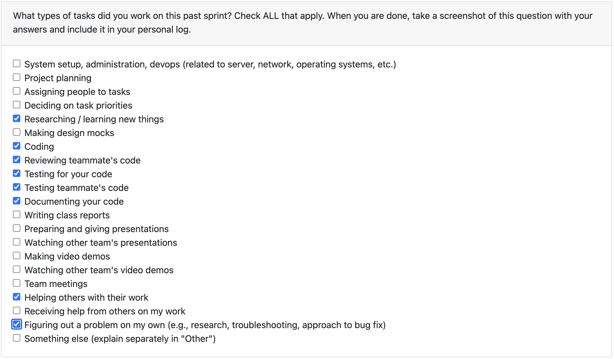

# Nov 5 - Nov 9

### What I did this week:

- Created a FastAPI endpoint to query OpenAI GPT 5 nano using `/openai` (PR #134) to enable AI-powered features in the backend.
- Fixed TUI full screen display issue and merged PR #138 to ensure the terminal interface renders properly across all screen sizes.
- Reviewed and merged team member PRs
- Maintained code quality and ensured smooth integration of new features with the existing codebase.

### What's next:

- Implement additional improvements based on teammate PR reviews.
- Continue refining the TUI interface and AI integration based on user testing feedback.
- Start working on a Local LLM with Evan

### Reflection:

This week focused on expanding backend capabilities with AI integration and improving the user interface. The FastAPI endpoint provides a clean way to query OpenAI, while fixing the full-screen display ensures a polished user experience. Successfully merged critical UI fixes and collaborated with team members on PR reviews. Looking forward to experimenting with a Local LLM with Evan next week!
