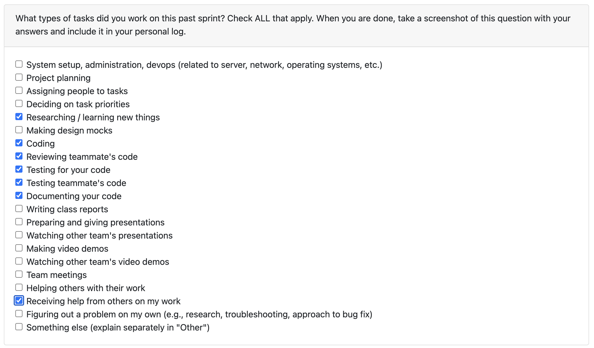

# Nov 10- Nov 23

### What I did this week:

- Implemented framework detection functionality (PR #152) with a new `framework_detector.py` module that automatically identifies project frameworks and technologies.
- Added comprehensive test suite for framework detection with 435 lines of test coverage.
- Enhanced project ranking feature (PR #157) by adding extensive test cases for edge cases including invalid/empty directories, missing `.git` folders, and zero-commit repositories.
- Integrated framework detection into the Repository Intelligence system to provide better project analysis capabilities.
- Reviewed and merged team member PRs to maintain code quality.

### What's next:

- Continue improving Repository Intelligence features based on team feedback.
- Work on additional helper functions for project analysis and ranking.
- Collaborate on backend integration of the new framework detection capabilities.
- Make some in roads on the local LLM with Evan after the first milestone.

### Reflection:

This week was highly productive, focusing on expanding the Repository Intelligence system with automatic framework detection and improving test coverage for the project ranking feature. The framework detector adds significant value by automatically identifying technologies used in projects. The additional test cases for project ranker ensure robustness against edge cases like empty directories and repositories without commits. These improvements will make the system more reliable and useful for analyzing student projects.
