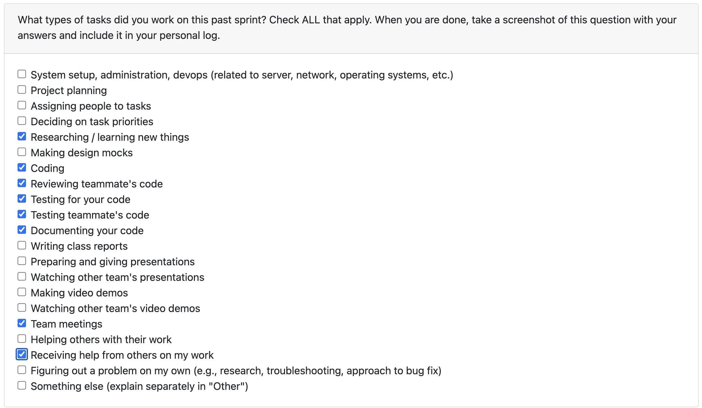

# Nov 24- Nov 30

### What I did this week:

- Implemented project soft-delete functionality with retrieval filtering (PR #207).
- Added API endpoint /ranking to allow ranking of projects (PR #210).
- Reviewed teammates' PRs to maintain code quality.
- Participated in Sunday team meeting to discuss and work on slides.

### What's next:

- Project work will resume next term.

### Reflection:

This week focused on implementing key backend features including soft-delete functionality for projects and a new ranking API endpoint. The soft-delete feature allows projects to be hidden without permanent deletion, improving data management flexibility. The ranking endpoint provides a way for users to rank projects through the API. Team collaboration continued with PR reviews and a productive Sunday meeting where we worked on presentation slides together.
