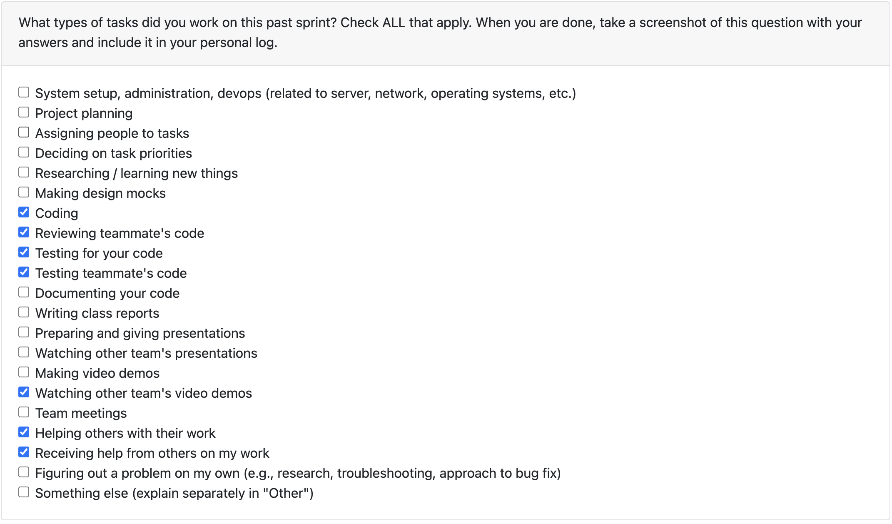

# Dec 1- Dec 7

### What I did this week:

- Implemented a few non-trivial tests on the `/answers` endpoint to handle edge cases
- Reviewed and provided feedback on PRs
- Took notes of other team's work and what we can borrow/ get inspired by during their demos
- I also drafted the team contract

### What's next:

- Project work will resume next term.

### Reflection:

A good end to the term. Lot of work has been done and happy overall.
