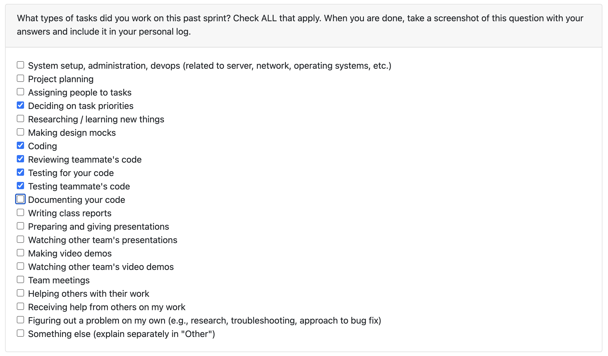

# Jan 5 - Jan 11

### What I did this week:

- Implemented portfolio ID functionality to enable multi-ZIP linking for incremental portfolio uploads (Issue #252)
- Created new API endpoint `GET /zip/portfolios/{portfolio_id}` and updated upload endpoint with optional portfolio_id parameter
- Resolved Alembic merge conflict and wrote comprehensive test suite covering multi-upload, retrieval, and backwards compatibility

### What's next:

- Research and explore local LLM options with Evan
- Investigate OpenTUI framework for frontend improvements

### Reflection:

This week was focused on building robust portfolio management infrastructure. The multi-ZIP linking feature provides a solid foundation for incremental portfolio uploads, which significantly improves UX for large portfolios. Learned about Alembic merge migrations when resolving the multiple heads issue. Looking forward to exploring local LLM deployment and researching OpenTUI with Evan next week to potentially enhance our frontend experience.