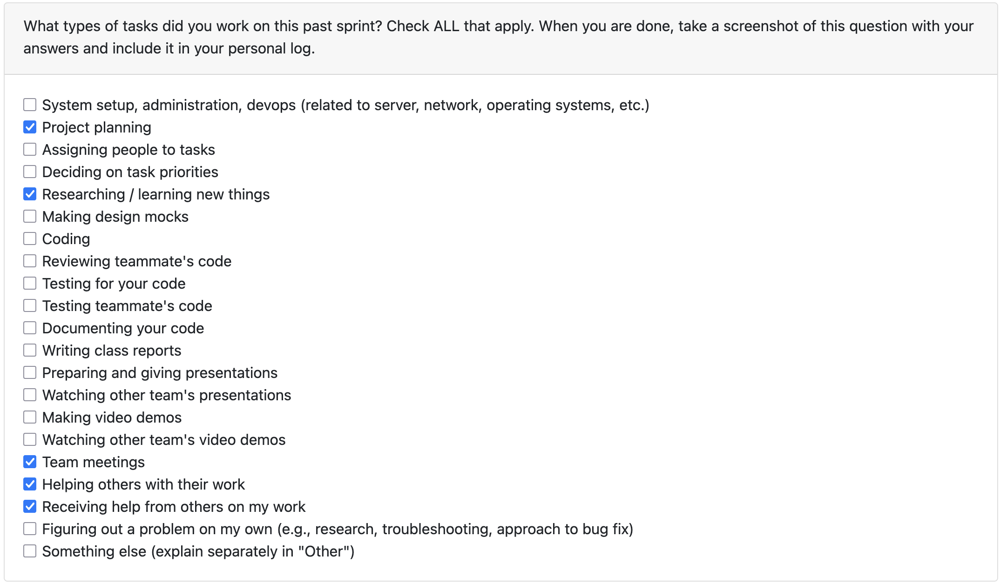

# Sept 22-28

Tasks that I worked on this week:

#### Monday
- Figured out a general system architecture for the project pre class
- Discussed with team members about the architecture and got their feedback to decide on a final architecture

#### Wednesday
- Received valuable feedback from the other Groups on our design
- Professor helped us identify points of improvement in our design and suggested us to expand on certain areas
- Discussed the feedback with the team and decided on changes to be made

#### Saturday
- Met with the team to finalize the system design and work on the project plan

### Reflection:
This week was productive as we were able to finalize our system architecture and project plan. The feedback from the other groups and professor was very helpful in identifying areas of improvement in our design. The team worked well together to discuss and implement the necessary changes. Overall, we are all on the same page.
