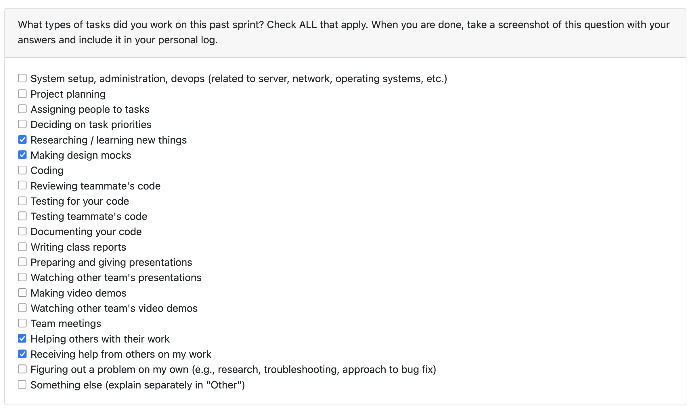

# Sept 29- Oct 5

Tasks that I worked on this week:

#### Monday
- Figured out a general DFD Level 1 and Level 0
- Discussed with team members about the diagrams and got their feedback to decide on a draft DFD Level 0 and 1

#### Wednesday
- Received valuable feedback from the other Groups on our diagram
- Realised that we made quite a few mistakes and overlooked key details which are necessary to show in a DFD.
- Discussed the feedback with the team and decided on changes to be made
- The team made the suggested improvements and everyone was happy with the, now, final DFD

### Reflection:
This week was productive as we were able to get a DFD that everyone was happy with. The feedback from the other groups was very helpful in identifying areas of improvement in our DFD. The team worked well together to discuss and implement the necessary changes. Overall, we are all on the same page.
