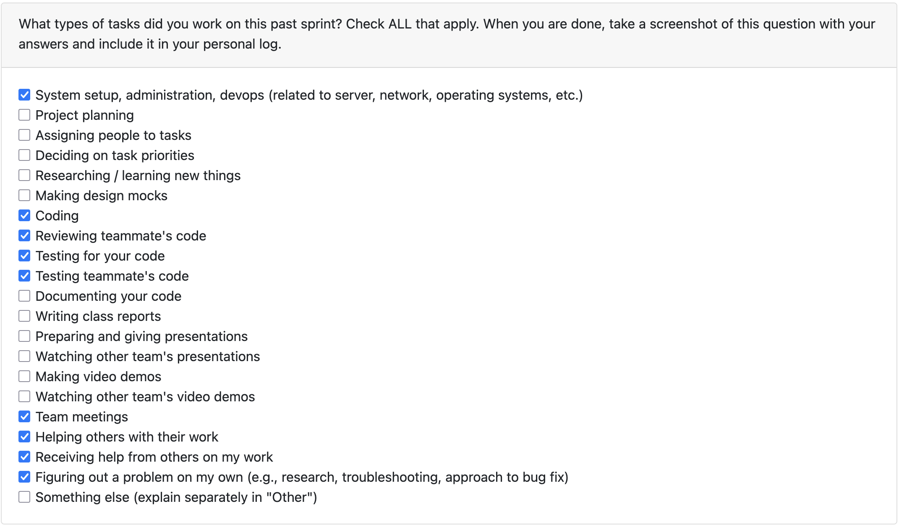

# Oct 6- Oct 12

### What I did this week:
1. Understand what uv (our package manager of choice) is and how is it different from pip
2. Understand and implemented the OpenAI Responses API and its Python SDK
3. Understand and implemented pytest to test the code that I write to call OpenAI and get a response from gpt 4o mini

I made around 5 commits this week. The goal of the openai helper function was to provide an abstraction to query an LLM for the entire app so that all the app has to do is call a 'getResponseFromOpenAI()' function and rest is handled by this helper

### Status of TODOs for this week:
- Create test cases for the openai helper function: Done
- Write the actual helper implementation: Done
- Test and verify that the helper works as expected: Done

### Next Week TODOs:
- Make sure that the code and test cases integrate seamlessly into any project structure changes
- Start building prompts as required by the core business logic
- Work with the backend "team" to figure out how they plan to call the LLM and what output format best works for them
- Start building more specialized functions if the team requires more granular control on the LLM input

### Reflection:
Overall, I am happy that we have started coding after all the planning. It was a good learning experience to figure out how to "use chatgpt programmatically" and be able to create a helper that makes the codebase more maintainable by having a single point of contact between the LLM and the business logic. 