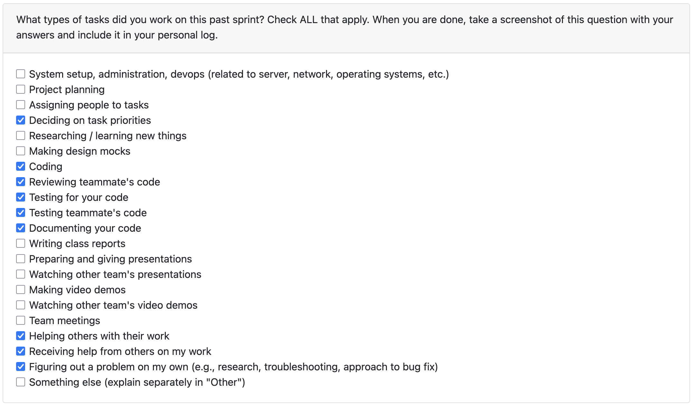

# Oct 13- Oct 19

### What I did this week:
1. We finalized our project structure and figured out how my code contributions fit into the bigger picture and thus had to make some changes to the implementation
2. Changed the model to GPT 5 nano instead of 4o-mini for better responses down the road
3. Created and tested test cases to make sure we query OpenAI and get the response, current as plain text (or markdown)
4. Had to rebase my branch as the dependencies kept changing as others' PRs were merged to the dev branch
5. Did a bunch of code reviews, gave feedback and requested some changes. 

I made around 8 commits this week. OpenAI helper now works as expected. This week was split pretty evenly between coding and reviewing PRs 

### Next Week TODOs:
- Make sure that the code and test cases integrate seamlessly as more stuff gets added and the project progresses
- Start building prompts as required by the core business logic (need more time on this as we need to decide the input-output schema for all LLM cals)
- Start building more specialized functions if the team requires more granular control on the LLM input (will have to work on these soon depending what the team decides on)
- Need to ask the prof and/or TAs if we can prune some branches. Having 20 branches isn't a pleasant experience.

### Reflection:
Overall, we are making good progress. Everyone is doing there job and we are helping each other out, resolving each merge conflict one at a time. Had to rebase the branch quite a bit, but thats a good learning experience (hope rebases stay to a minimum)