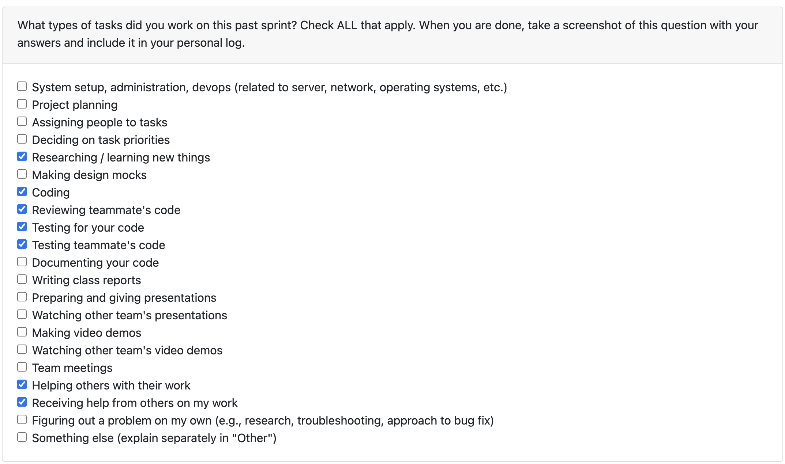

# Oct 20- Oct 26

### What I did this week:
- Built an over-engineered consent flow early in the week with abstractions on `push_screen()` and `pop_screen()` and scrapped it upon discussion with the team that a simpler flow would suffice.
- Had to rebase my branch on Evan's DB work so that I could integrate the consent storage.
- Rebuilt the consent flow with the simplified two-button consent screen tied to the consent-level enum.
- Updated the backend/API and Db to store `consent_level`, ran the database changes locally, and validated end-to-end reads/writes.
- Reviewed teammate PRs left change requests, and approved a few.

### Reflection:
The early overbuild was a good reminder to keep the flow simple. A simpler process is always easier to demo and to maintain over time. The team is making good progress, and everyone is contributing well.