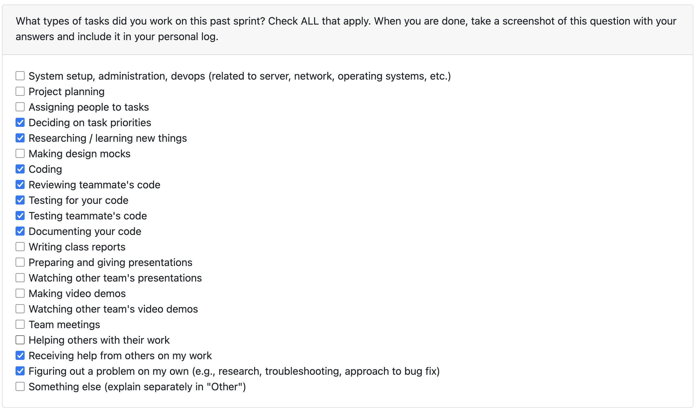

# Oct 27- Nov 2

### What I did this week:
- Built out a dedicated FileBrowserScreen modal so folks can browse for ZIPs instead of typing raw paths into the upload form.
- Add the new browse button on Upload screen, and created callbacks so that the upload screen only updates when the Select button is clicked in the file browser screen.
- Added guardrails so that we dont show hidden or dotfiles (such as .config on MacOS), with robust error logging on the screen.
- Walked the flow end-to-end—open, cancel, invalid, select—to shake out edge cases before pushing and merging PR #101.

### Reflection:
Building the modal was a good reminder that Textual wants explicit callbacks—only fire the upload update when the user actually clicks Select. Walking the browse flow myself (cancel, bad file, success) caught the odd edges ahead of review, which should keep the demo tight. Got feedback from teammates on the PR and will address those improvements in the next week's sprint
