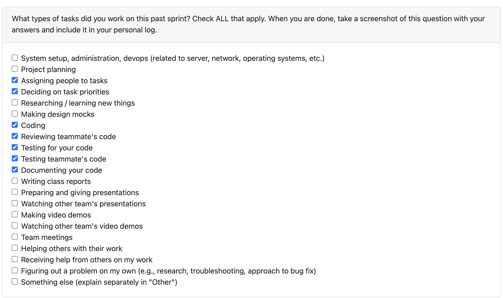

# Week Navigation

- [Term 2 Week 3 (Jan 19 - Jan 25)](#logs---term-2-week-3)
- [Term 2 Week 2 (Jan 12 - Jan 18)](#logs---term-2-week-2)
- [Term 2 Week 1 (Jan 5 - Jan 11)](Stavan_T2_Week1.md)
- [Term 1 Week 14 (Dec 1 - Dec 7)](Log%20Week14.md)
- [Term 1 Week 13 (Nov 24 - Nov 30)](Log%20Week13.md)
- [Term 1 Week 11-12 (Nov 10 - Nov 23)](Log%20Week11-12.md)
- [Term 1 Week 10 (Nov 3 - Nov 9)](Log%20Week10.md)

---

# logs - Term 2 Week 3

## Connection to Previous Week
Last week I focused on directory scoping for the analyze endpoint and fixing email validation. This week I continued by implementing interactive CLI mode (building on Evan's base CLI work), reviewing several team PRs, and helping merge development changes into main.

---

## Coding Tasks

* Created interactive CLI mode ([PR #301](https://github.com/COSC-499-W2025/capstone-project-team-1/pull/301)) - Added prompts for missing args, overwrite confirmation, quote trimming, and Ctrl+C exit handling. Built on top of Evan's #299 branch to make the CLI interactive.

* Added interactive CLI test to verify the prompt flow works correctly.

* Documented interactive CLI mode in CLI_USAGE.md.

* Merged all development changes into main ([PR #293](https://github.com/COSC-499-W2025/capstone-project-team-1/pull/293)) to sync the branches before milestone.

---

## Testing & Debugging Tasks

* Added test_interactive_cli test to verify the new interactive prompts work correctly.

* Tested interactive CLI flow manually - consent, email, input ZIP, output path, confirmation.

---

## Reviewing & Collaboration Tasks

* Reviewed [PR #304](https://github.com/COSC-499-W2025/capstone-project-team-1/pull/304) (API timestamp cleanup by Shlok) - Initially requested changes, then approved after fixes. Good catch on the broken `answered_at` assignment.

* Reviewed [PR #299](https://github.com/COSC-499-W2025/capstone-project-team-1/pull/299) (base CLI by Evan) - Approved initially, then requested changes, approved final version.

* Reviewed [PR #295](https://github.com/COSC-499-W2025/capstone-project-team-1/pull/295) (OpenAI initialization on use by Evan) - Approved. Good fix to prevent API calls on startup.

* Reviewed [PR #308](https://github.com/COSC-499-W2025/capstone-project-team-1/pull/308) (CLI repo selection and timeline view by Ahmad) - Big PR with refactoring of CLI helpers and new features.

---

## Blockers & Issues

* No major blockers this week.

---

## Plan for Next Week

* Work on the experimental OpenTUI React implementation and see how we could use it. 
* Review remaining PRs and help with milestone 2 push

---

| **Task** | **Status** | **Notes** |
| --- | --- | --- |
| Interactive CLI mode | Done | [PR #301](https://github.com/COSC-499-W2025/capstone-project-team-1/pull/301) - Prompts, confirm, Ctrl+C |
| Merge dev to main | Done | [PR #293](https://github.com/COSC-499-W2025/capstone-project-team-1/pull/293) |
| Add interactive CLI test | Done | test_interactive_cli added |
| Document CLI usage | Done | Updated CLI_USAGE.md |
| Review PR #304 (timestamp fix) | Done | Requested changes → Approved |
| Review PR #299 (base CLI) | Done | Approved after changes |
| Review PR #295 (OpenAI init) | Done | Approved |
| Review PR #308 (CLI refactor) | Done | Big refactor with repo selection and timeline |

---

# logs - Term 2 Week 2

## Connection to Previous Week
Last week I focused on multi-directory crawling and reviewing PRs for the local LLM option and duplicate filechecker. This week I continued building on that work by adding directory scoping to the analyze endpoint (so users can select which directories to analyze from the TUI) and fixing email validation issues that were blocking the API.

---

## Coding Tasks

* Built optional directory scoping for the `/analyze/{zip_id}` endpoint ([PR #275](https://github.com/COSC-499-W2025/capstone-project-team-1/pull/275)) - allows TUI to pass specific directories for analysis instead of processing all extracted content. Added `AnalyzeRequest` schema with optional `directories` field.

* Added `count_base_path_repos()` helper function in analyze.py to count repositories found at specified base paths, enabling scoped analysis to work correctly.

* Created Alembic migration script (`merge_all_heads.py`) to merge multiple migration heads that had diverged across branches ([PR #279](https://github.com/COSC-499-W2025/capstone-project-team-1/pull/279)).

* Fixed email validation in `collect_user_additions()` by disabling the deliverability check that was causing failures for valid email addresses. Refactored to use `validated.normalized` instead of manual email normalization.

* Added `.extracted` folder to `.gitignore` and renamed the extracted folder for cleaner project structure.

---

## Testing & Debugging Tasks

* Added comprehensive test for scoped analyze endpoint (`test_analyze_scoped_dirs`) verifying that directory filtering works correctly.

* Tested and debugged an issue reported by Nathan on PR #275 where analyze was returning a 400 error - traced it to stale database state and provided debugging steps.

---

## Reviewing & Collaboration Tasks

* Reviewed [PR #253](https://github.com/COSC-499-W2025/capstone-project-team-1/pull/253) (pluggable local LLM option by Evan) - provided 4 review comments:
  - Requested snake_case naming convention fix (`getUserLLMSelection` → `get_user_llm_selection`)
  - Flagged missing Alembic migration for new `LLM_model` column
  - Identified silent failure when exception returns None
  - Caught duplicate function definitions in the file

* Reviewed [PR #256](https://github.com/COSC-499-W2025/capstone-project-team-1/pull/256) (improved duplicate filechecker by Nathan) - provided 5 review comments:
  - Flagged unused import
  - Identified Windows compatibility issue with inode check
  - Caught indentation bug causing undefined variable
  - Flagged hardcoded local path
  - Requested meaningful test assertions

* Reviewed [PR #260](https://github.com/COSC-499-W2025/capstone-project-team-1/pull/260) (representation preferences API by Ahmad) - provided 3 review comments:
  - Flagged missing Alembic migration for new table
  - Noted PR description inconsistency with included tests
  - Requested `datetime.now(UTC)` usage

* Reviewed [PR #266](https://github.com/COSC-499-W2025/capstone-project-team-1/pull/266) (repo intelligence bug fix by Nathan) - approved with minor typo note ("has not commits" → "has no commits").

* Reviewed [PR #281](https://github.com/COSC-499-W2025/capstone-project-team-1/pull/281) (async OpenAI calls by Evan) - approved after requested change was made. Provided 5 review comments praising the singleton client pattern and asyncio.gather usage, with a suggestion for lazy initialization.

---

## Blockers & Issues

* Email validation was failing for valid emails due to deliverability check - resolved by disabling deliverability verification.

* Multiple Alembic heads had diverged across branches - resolved by creating a merge migration script.

---

## Plan for Next Week

* Help integrate the directory scoping with the TUI selection screen
* Continue reviewing PRs and supporting team members
* Address any remaining API issues before milestone deadline

---

| **Task** | **Status** | **Notes** |
| --- | --- | --- |
| Add directory scoping to analyze endpoint | ✅ Done | [PR #275](https://github.com/COSC-499-W2025/capstone-project-team-1/pull/275) - Optional dirs filter for TUI selection |
| Fix email validation | ✅ Done | [PR #279](https://github.com/COSC-499-W2025/capstone-project-team-1/pull/279) - Disabled deliverability check |
| Merge Alembic heads | ✅ Done | [PR #279](https://github.com/COSC-499-W2025/capstone-project-team-1/pull/279) - Created merge migration |
| Add scoped analyze test | ✅ Done | test_analyze_scoped_dirs added |
| Review PR #253 (local LLM) | ✅ Done | Requested changes - naming, migration, error handling |
| Review PR #256 (duplicate filechecker) | ✅ Done | Requested changes - Windows compat, indentation bug |
| Review PR #260 (representation prefs) | ✅ Done | Requested changes - missing migration |
| Review PR #266 (repo intelligence fix) | ✅ Done | Approved with minor typo note |
| Review PR #281 (async OpenAI) | ✅ Done | Approved after requested change |
