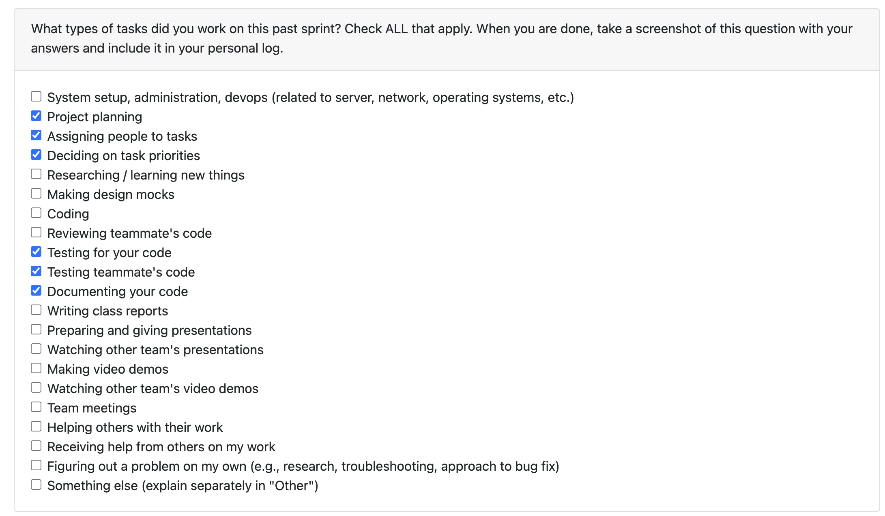
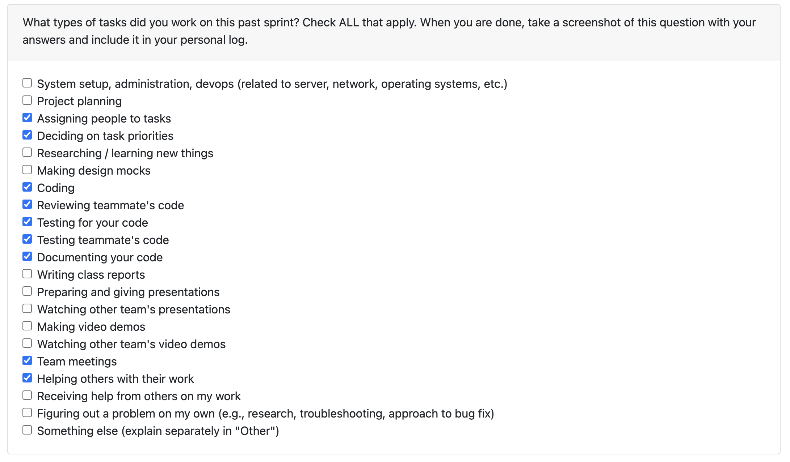
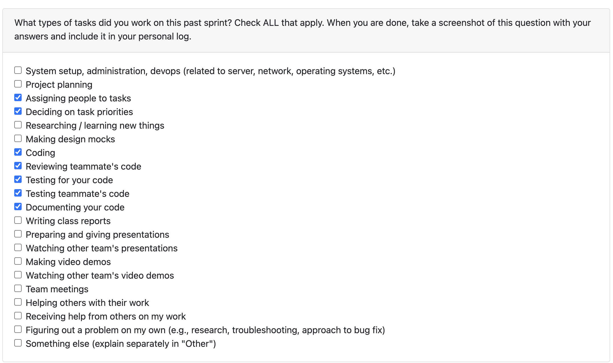

# Week Navigation

- [Term 2 Week 9 (Mar 2 - Mar 8)](#logs---term-2-week-9)
- [Term 2 Week 7-8 (Feb 16 - Mar 1)](#logs---term-2-week-7-8)
- [Term 2 Week 4-5 (Jan 26 - Feb 8)](#logs---term-2-week-4-5)
- [Term 2 Week 3 (Jan 19 - Jan 25)](#logs---term-2-week-3)
- [Term 2 Week 2 (Jan 12 - Jan 18)](#logs---term-2-week-2)
- [Term 2 Week 1 (Jan 5 - Jan 11)](Stavan_T2_Week1.md)
- [Term 1 Week 14 (Dec 1 - Dec 7)](Log%20Week14.md)
- [Term 1 Week 13 (Nov 24 - Nov 30)](Log%20Week13.md)
- [Term 1 Week 11-12 (Nov 10 - Nov 23)](Log%20Week11-12.md)
- [Term 1 Week 10 (Nov 3 - Nov 9)](Log%20Week10.md)

---

# logs - Term 2 Week 9

## Connection to Previous Week
Last period I merged the remaining evidence PRs (PR-3, PR-4), the resume edit endpoint, fixed Alembic startup migration drift, and started the portfolio edit endpoint. This week I merged the final outstanding PRs (#407, #410), synced development into main, authored the OpenTUI frontend migration plan with a 15-PR issue breakdown, kicked off the first migration PR, performed backlog grooming by closing 16 stale issues, and continued active code reviews across the team.

---

## Coding Tasks

* Merged Alembic startup migration fix — replaced direct `Base.metadata.create_all()` with Alembic `upgrade head` at startup so schema stays consistent across environments ([PR #407](https://github.com/COSC-499-W2025/capstone-project-team-1/pull/407)).

* Merged portfolio edit endpoint — `PortfolioEditRequest` inherits from `RepresentationPreferences` to avoid field duplication; preferences are persisted and affect subsequent `/portfolio/generate` calls. Added 14 integration tests and 18 schema unit tests ([PR #410](https://github.com/COSC-499-W2025/capstone-project-team-1/pull/410); closes [Issue #335](https://github.com/COSC-499-W2025/capstone-project-team-1/issues/335)).

* Merged development changes into main ([PR #418](https://github.com/COSC-499-W2025/capstone-project-team-1/pull/418)).

* Authored the OpenTUI frontend migration plan document (`.plans/opentui-migration.md`) covering architecture, target state model, API shape, screen flow, conventions, and a 15-PR dependency graph — merged after team approval ([PR #420](https://github.com/COSC-499-W2025/capstone-project-team-1/pull/420)).

* Created 15 GitHub issues ([Issue #421](https://github.com/COSC-499-W2025/capstone-project-team-1/issues/421) through [Issue #435](https://github.com/COSC-499-W2025/capstone-project-team-1/issues/435)) breaking down the OpenTUI migration into individually reviewable PRs — types, API client, AppContext rewrite, navigation, screens, and polish.

* Submitted first migration PR: added pipeline API types and consent flow alignment to `opentui-react-exp/` with backward-compatible type additions ([PR #436](https://github.com/COSC-499-W2025/capstone-project-team-1/pull/436); closes [Issue #421](https://github.com/COSC-499-W2025/capstone-project-team-1/issues/421)).

* Closed 16 stale issues from the backlog (#160, #161, #162, #164, #165, #248, #252, #267, #273, #302, #320, #321, #322, #323, #324, #325) as part of issue hygiene and project board cleanup.

---

## Testing & Debugging Tasks

* No new test files this week — testing effort was concentrated in previously merged PRs (#410 portfolio edit tests, #407 Alembic migration validation).

---

## Reviewing & Collaboration Tasks

* Reviewed [PR #406](https://github.com/COSC-499-W2025/capstone-project-team-1/pull/406) (GET /portfolio/{id} by Ahmad) — requested title/body alignment, flagged duplicated `_coerce_date` helper across `git_stats_bridge.py` and `insight_bridge.py`, suggested keeping dataclasses in `models.py` instead of `deep_analysis.py`. Approved after fixes.

* Reviewed [PR #411](https://github.com/COSC-499-W2025/capstone-project-team-1/pull/411) (cleanup directory_crawler by Nathan) — noted the key fix was tests now correctly asserting against the returned `files_dict` instead of a separate instance. Approved.

* Reviewed [PR #412](https://github.com/COSC-499-W2025/capstone-project-team-1/pull/412) (README updates by Ahmad) — approved; noted the Mermaid diagram addition.

* Reviewed [PR #414](https://github.com/COSC-499-W2025/capstone-project-team-1/pull/414) (weekly logs by Evan) — approved.

* Reviewed [PR #415](https://github.com/COSC-499-W2025/capstone-project-team-1/pull/415) (individual logs by Shlok) — approved.

* Reviewed [PR #417](https://github.com/COSC-499-W2025/capstone-project-team-1/pull/417) (Ahmad's logs) and [PR #419](https://github.com/COSC-499-W2025/capstone-project-team-1/pull/419) (team logs by Ahmad) — approved both.

---

## Blockers & Issues

* No major blockers this week.

---

## Plan for Next Week

* Continue OpenTUI migration PRs: [Issue #422](https://github.com/COSC-499-W2025/capstone-project-team-1/issues/422), [Issue #423](https://github.com/COSC-499-W2025/capstone-project-team-1/issues/423), [Issue #424](https://github.com/COSC-499-W2025/capstone-project-team-1/issues/424).
* Review teammate PRs as migration and backend work progresses.

---

| **Task** | **Status** | **Notes** |
| --- | --- | --- |
| Merge Alembic startup fix | ✅ Done | [PR #407](https://github.com/COSC-499-W2025/capstone-project-team-1/pull/407) — merged Mar 2 |
| Merge portfolio edit endpoint | ✅ Done | [PR #410](https://github.com/COSC-499-W2025/capstone-project-team-1/pull/410) — merged Mar 2 |
| Merge dev to main | ✅ Done | [PR #418](https://github.com/COSC-499-W2025/capstone-project-team-1/pull/418) — merged Mar 2 |
| Author OpenTUI migration plan | ✅ Done | [PR #420](https://github.com/COSC-499-W2025/capstone-project-team-1/pull/420) — merged Mar 8 |
| Create 15 migration issues (#421–#435) | ✅ Done | Full issue breakdown for OpenTUI migration |
| OpenTUI PR1a: pipeline API types | ✅ Done | [PR #436](https://github.com/COSC-499-W2025/capstone-project-team-1/pull/436) — merged Mar 8 |
| Close 16 stale backlog issues | ✅ Done | Backlog grooming (#160–#325) |
| Review PRs (#406, #411, #412, #414, #415, #417, #419) | ✅ Done | Reviewed + approved |

---

# logs - Term 2 Week 7-8

## Connection to Previous Week
Last period I focused on evidence foundation (PR-1, PR-2) and API retrieval endpoints. Over this two-week period, I merged the remaining evidence PRs (PR-3 and PR-4), added the resume edit endpoint, fixed Alembic startup migration drift, started the portfolio edit endpoint, and continued active code reviews across the team.

---

## Coding Tasks

* Merged evidence PR-3: git contribution metrics and infra signal extractors — commit window count, commit frequency, contribution %, CI/CD and Docker detection, wired into evidence persistence ([PR #371](https://github.com/COSC-499-W2025/capstone-project-team-1/pull/371); closes [Issue #356](https://github.com/COSC-499-W2025/capstone-project-team-1/issues/356)).

* Merged evidence PR-4: testing/docs/code-quality heuristic extractors — 3 detectors for test signals, docs signals, and code-quality tooling across 7 languages ([PR #376](https://github.com/COSC-499-W2025/capstone-project-team-1/pull/376); closes [Issue #354](https://github.com/COSC-499-W2025/capstone-project-team-1/issues/354)).

* Added `POST /resume/{id}/edit` endpoint with Pydantic validation requiring at least one field ([PR #378](https://github.com/COSC-499-W2025/capstone-project-team-1/pull/378); closes [Issue #332](https://github.com/COSC-499-W2025/capstone-project-team-1/issues/332)).

* Merged development changes into main ([PR #382](https://github.com/COSC-499-W2025/capstone-project-team-1/pull/382)).

* Fixed Alembic startup migration bug — replaced direct `Base.metadata.create_all()` with Alembic `upgrade head` at startup so schema stays consistent across environments ([PR #407](https://github.com/COSC-499-W2025/capstone-project-team-1/pull/407)).

* Added `POST /portfolio/{id}/edit` endpoint — `PortfolioEditRequest` inherits from `RepresentationPreferences` to avoid field duplication; preferences are persisted and affect subsequent `/portfolio/generate` calls ([PR #410](https://github.com/COSC-499-W2025/capstone-project-team-1/pull/410); closes [Issue #335](https://github.com/COSC-499-W2025/capstone-project-team-1/issues/335)).

* Pushed follow-up fixes on evidence PR-4 ([PR #376](https://github.com/COSC-499-W2025/capstone-project-team-1/pull/376)) and resume edit ([PR #378](https://github.com/COSC-499-W2025/capstone-project-team-1/pull/378)) addressing review feedback — clarified missing-tests evidence signal, populated role in resume edit response, added category validation, and added rollback on commit failures.

---

## Testing & Debugging Tasks

* Added 5 tests for resume edit endpoint covering full update, partial update, 404, empty request rejection, and soft-deleted item (`tests/api/test_resume_edit.py`).

* Added 14 integration tests for portfolio edit endpoint covering happy path, 404, 422, persistence, idempotency, full replacement, chronology overrides, and generate-side effects (`tests/api/test_portfolio_edit.py`).

* Added 18 unit tests for schema models — ChronologyOverride, CustomRanking, RepresentationPreferences (`tests/api/test_representation_preferences.py`).

---

## Reviewing & Collaboration Tasks

* Reviewed [PR #377](https://github.com/COSC-499-W2025/capstone-project-team-1/pull/377) (POST /portfolio/generate by Ahmad) — flagged unindexed `LIKE 'prefix%'` query on `project_path`, suggested DB-side `None` filtering on `extraction_path`, and noted non-deterministic resume item ordering. Approved after fixes.

* Reviewed [PR #379](https://github.com/COSC-499-W2025/capstone-project-team-1/pull/379) (local LLM benchmark summary by Evan) — approved; asked about qwen3:0.5b as alternative to 2.5.

* Reviewed [PR #381](https://github.com/COSC-499-W2025/capstone-project-team-1/pull/381) (markdown logic by Nathan) — flagged `file_values` type mismatch, `str_response` overwrite-on-loop bug, inconsistent return types, and weak test assertion. Approved after fixes.

* Reviewed [PR #385](https://github.com/COSC-499-W2025/capstone-project-team-1/pull/385) (consent enums + TUI redesign by Shlok) — requested React cleanup logic for unmounted components, proper error handling in `.catch`, and a shared `ConsentPanel` component to deduplicate Panel1/2/3. Approved after updates.

* Reviewed [PR #392](https://github.com/COSC-499-W2025/capstone-project-team-1/pull/392) (extend user representation preferences by Nathan) — flagged incomplete schema-to-API wiring. Approved after requested changes.

* Reviewed [PR #404](https://github.com/COSC-499-W2025/capstone-project-team-1/pull/404) (local LLM testing + API rename by Shlok) — flagged orphaned-job risk from resetting `_active_job_id` without teardown. Approved after graceful teardown fix.

* Reviewed [PR #406](https://github.com/COSC-499-W2025/capstone-project-team-1/pull/406) (GET /portfolio/{id} by Ahmad) — requested title/body alignment, flagged duplicated `_coerce_date` helper, suggested keeping dataclasses in `models.py`.

---

## Blockers & Issues

* API startup was using direct SQLAlchemy table creation instead of Alembic migrations, causing schema drift across environments — resolved with [PR #407](https://github.com/COSC-499-W2025/capstone-project-team-1/pull/407).

---

## Plan for Next Week

* Continue portfolio edit and generation endpoint work: [Issue #334](https://github.com/COSC-499-W2025/capstone-project-team-1/issues/334), [Issue #335](https://github.com/COSC-499-W2025/capstone-project-team-1/issues/335).
* Address remaining review feedback on open PRs.

---

| **Task** | **Status** | **Notes** |
| --- | --- | --- |
| Evidence PR-3 git/infra extractors | ✅ Done | [PR #371](https://github.com/COSC-499-W2025/capstone-project-team-1/pull/371) — merged Feb 16 |
| Evidence PR-4 testing/docs/code-quality | ✅ Done | [PR #376](https://github.com/COSC-499-W2025/capstone-project-team-1/pull/376) — merged Feb 22 |
| Add `POST /resume/{id}/edit` | ✅ Done | [PR #378](https://github.com/COSC-499-W2025/capstone-project-team-1/pull/378) — merged Feb 22 |
| Merge dev to main | ✅ Done | [PR #382](https://github.com/COSC-499-W2025/capstone-project-team-1/pull/382) |
| Fix Alembic startup migration | ✅ Done | [PR #407](https://github.com/COSC-499-W2025/capstone-project-team-1/pull/407) |
| Add `POST /portfolio/{id}/edit` | 🔄 In review | [PR #410](https://github.com/COSC-499-W2025/capstone-project-team-1/pull/410) |
| Review PRs (#377, #379, #381, #385, #392, #404, #406) | ✅ Done | Reviewed + follow-up requested changes |

---

# logs - Term 2 Week 4-5

## Connection to Previous Week
Last week I focused on interactive CLI mode and team integration work. Over this two-week period, I shifted toward API retrieval/evidence pipeline work, tracked work through GitHub issues, and moved core evidence persistence PRs into review.

---

## Coding Tasks

* Added projects retrieval APIs and schemas: `GET /projects` and `GET /projects/{id}`, plus response models and pagination ordering updates ([PR #342](https://github.com/COSC-499-W2025/capstone-project-team-1/pull/342), [PR #343](https://github.com/COSC-499-W2025/capstone-project-team-1/pull/343); closes [Issue #327](https://github.com/COSC-499-W2025/capstone-project-team-1/issues/327), [Issue #328](https://github.com/COSC-499-W2025/capstone-project-team-1/issues/328)).

* Added API tests for project list/detail retrieval to validate endpoint behavior and response structure.

* Added `GET /skills` endpoint with response schema, dedup logic fixes, and endpoint tests ([PR #350](https://github.com/COSC-499-W2025/capstone-project-team-1/pull/350)).

* Implemented the structured evidence foundation bridge for PR-1 and moved it into active review ([PR #357](https://github.com/COSC-499-W2025/capstone-project-team-1/pull/357)).

* Persisted deep analysis insights as project evidence, added persistence migration tests, and moved PR-2 into review ([PR #358](https://github.com/COSC-499-W2025/capstone-project-team-1/pull/358)).

* Created and organized GitHub issue breakdown for API/OpenTUI/resume/evidence work, including [Issue #318](https://github.com/COSC-499-W2025/capstone-project-team-1/issues/318), [Issue #330](https://github.com/COSC-499-W2025/capstone-project-team-1/issues/330), [Issue #331](https://github.com/COSC-499-W2025/capstone-project-team-1/issues/331), [Issue #336](https://github.com/COSC-499-W2025/capstone-project-team-1/issues/336), [Issue #338](https://github.com/COSC-499-W2025/capstone-project-team-1/issues/338), [Issue #339](https://github.com/COSC-499-W2025/capstone-project-team-1/issues/339), and [Issue #341](https://github.com/COSC-499-W2025/capstone-project-team-1/issues/341).

* Merged development sync updates as part of integration flow ([PR #349](https://github.com/COSC-499-W2025/capstone-project-team-1/pull/349)).

---

## Testing & Debugging Tasks

* Added tests for `GET /projects` and `GET /projects/{id}` endpoints (`tests/api/test_projects.py`).

* Added evidence persistence coverage in API/evidence tests to verify deep-insight migration into project evidence rows (`tests/api/test_analyze.py`, `tests/evidence/test_orchestrator.py`, `tests/test_persistence.py`).

* Debugged and validated evidence model typing/refactor so extractor output remained compatible with persistence and tests while PR-1/PR-2 were in review.

---

## Reviewing & Collaboration Tasks

* Reviewed [PR #344](https://github.com/COSC-499-W2025/capstone-project-team-1/pull/344) (OpenTUI API client layer), [PR #345](https://github.com/COSC-499-W2025/capstone-project-team-1/pull/345) (AppContext state provider), and [PR #347](https://github.com/COSC-499-W2025/capstone-project-team-1/pull/347) (real file picker).

* Reviewed [PR #351](https://github.com/COSC-499-W2025/capstone-project-team-1/pull/351) (GET `/resume/{id}`), [PR #359](https://github.com/COSC-499-W2025/capstone-project-team-1/pull/359) (project user-role support), and [PR #361](https://github.com/COSC-499-W2025/capstone-project-team-1/pull/361) (mock projects v2 fixture + reproducible generation script).

* Requested follow-up fixes on evidence/retrieval-related changes; multiple team commits were pushed as requested changes.

---

## Blockers & Issues

* No major blockers this period; main effort was integration coordination across concurrent API and evidence changes.

---

## Plan for Next Week

* Work on PR2 and PR3 GitHub issues: [Issue #338](https://github.com/COSC-499-W2025/capstone-project-team-1/issues/338), [Issue #339](https://github.com/COSC-499-W2025/capstone-project-team-1/issues/339).

---

| **Task** | **Status** | **Notes** |
| --- | --- | --- |
| Add `GET /projects` + `GET /projects/{id}` | ✅ Done | [PR #342](https://github.com/COSC-499-W2025/capstone-project-team-1/pull/342), [PR #343](https://github.com/COSC-499-W2025/capstone-project-team-1/pull/343) |
| Add `GET /skills` endpoint | ✅ Done | [PR #350](https://github.com/COSC-499-W2025/capstone-project-team-1/pull/350) |
| Add projects API tests | ✅ Done | `tests/api/test_projects.py` |
| Evidence PR-1 foundation bridge | 🔄 In review | [PR #357](https://github.com/COSC-499-W2025/capstone-project-team-1/pull/357) |
| Evidence PR-2 persistence + migration tests | 🔄 In review | [PR #358](https://github.com/COSC-499-W2025/capstone-project-team-1/pull/358) |
| Review PRs (#344, #345, #347, #351, #359, #361) | ✅ Done | Reviewed + follow-up requested changes |
| Plan PR2,3 GitHub issues | ⏳ Not started yet | [Issue #338](https://github.com/COSC-499-W2025/capstone-project-team-1/issues/338), [Issue #339](https://github.com/COSC-499-W2025/capstone-project-team-1/issues/339) |

---

# logs - Term 2 Week 3

## Connection to Previous Week
Last week I focused on directory scoping for the analyze endpoint and fixing email validation. This week I continued by implementing interactive CLI mode (building on Evan's base CLI work), reviewing several team PRs, and helping merge development changes into main.

---

## Coding Tasks

* Created interactive CLI mode ([PR #301](https://github.com/COSC-499-W2025/capstone-project-team-1/pull/301)) - Added prompts for missing args, overwrite confirmation, quote trimming, and Ctrl+C exit handling. Built on top of Evan's #299 branch to make the CLI interactive.

* Added interactive CLI test to verify the prompt flow works correctly.

* Documented interactive CLI mode in CLI_USAGE.md.

* Merged all development changes into main ([PR #293](https://github.com/COSC-499-W2025/capstone-project-team-1/pull/293)) to sync the branches before milestone.

---

## Testing & Debugging Tasks

* Added test_interactive_cli test to verify the new interactive prompts work correctly.

* Tested interactive CLI flow manually - consent, email, input ZIP, output path, confirmation.

---

## Reviewing & Collaboration Tasks

* Reviewed [PR #304](https://github.com/COSC-499-W2025/capstone-project-team-1/pull/304) (API timestamp cleanup by Shlok) - Initially requested changes, then approved after fixes. Good catch on the broken `answered_at` assignment.

* Reviewed [PR #299](https://github.com/COSC-499-W2025/capstone-project-team-1/pull/299) (base CLI by Evan) - Approved initially, then requested changes, approved final version.

* Reviewed [PR #295](https://github.com/COSC-499-W2025/capstone-project-team-1/pull/295) (OpenAI initialization on use by Evan) - Approved. Good fix to prevent API calls on startup.

* Reviewed [PR #308](https://github.com/COSC-499-W2025/capstone-project-team-1/pull/308) (CLI repo selection and timeline view by Ahmad) - Big PR with refactoring of CLI helpers and new features.

---

## Blockers & Issues

* No major blockers this week.

---

## Plan for Next Week

* Work on the experimental OpenTUI React implementation and see how we could use it. 
* Review remaining PRs and help with milestone 2 push

---

| **Task** | **Status** | **Notes** |
| --- | --- | --- |
| Interactive CLI mode | Done | [PR #301](https://github.com/COSC-499-W2025/capstone-project-team-1/pull/301) - Prompts, confirm, Ctrl+C |
| Merge dev to main | Done | [PR #293](https://github.com/COSC-499-W2025/capstone-project-team-1/pull/293) |
| Add interactive CLI test | Done | test_interactive_cli added |
| Document CLI usage | Done | Updated CLI_USAGE.md |
| Review PR #304 (timestamp fix) | Done | Requested changes → Approved |
| Review PR #299 (base CLI) | Done | Approved after changes |
| Review PR #295 (OpenAI init) | Done | Approved |
| Review PR #308 (CLI refactor) | Done | Big refactor with repo selection and timeline |

---

# logs - Term 2 Week 2

## Connection to Previous Week
Last week I focused on multi-directory crawling and reviewing PRs for the local LLM option and duplicate filechecker. This week I continued building on that work by adding directory scoping to the analyze endpoint (so users can select which directories to analyze from the TUI) and fixing email validation issues that were blocking the API.

---

## Coding Tasks

* Built optional directory scoping for the `/analyze/{zip_id}` endpoint ([PR #275](https://github.com/COSC-499-W2025/capstone-project-team-1/pull/275)) - allows TUI to pass specific directories for analysis instead of processing all extracted content. Added `AnalyzeRequest` schema with optional `directories` field.

* Added `count_base_path_repos()` helper function in analyze.py to count repositories found at specified base paths, enabling scoped analysis to work correctly.

* Created Alembic migration script (`merge_all_heads.py`) to merge multiple migration heads that had diverged across branches ([PR #279](https://github.com/COSC-499-W2025/capstone-project-team-1/pull/279)).

* Fixed email validation in `collect_user_additions()` by disabling the deliverability check that was causing failures for valid email addresses. Refactored to use `validated.normalized` instead of manual email normalization.

* Added `.extracted` folder to `.gitignore` and renamed the extracted folder for cleaner project structure.

---

## Testing & Debugging Tasks

* Added comprehensive test for scoped analyze endpoint (`test_analyze_scoped_dirs`) verifying that directory filtering works correctly.

* Tested and debugged an issue reported by Nathan on PR #275 where analyze was returning a 400 error - traced it to stale database state and provided debugging steps.

---

## Reviewing & Collaboration Tasks

* Reviewed [PR #253](https://github.com/COSC-499-W2025/capstone-project-team-1/pull/253) (pluggable local LLM option by Evan) - provided 4 review comments:
  - Requested snake_case naming convention fix (`getUserLLMSelection` → `get_user_llm_selection`)
  - Flagged missing Alembic migration for new `LLM_model` column
  - Identified silent failure when exception returns None
  - Caught duplicate function definitions in the file

* Reviewed [PR #256](https://github.com/COSC-499-W2025/capstone-project-team-1/pull/256) (improved duplicate filechecker by Nathan) - provided 5 review comments:
  - Flagged unused import
  - Identified Windows compatibility issue with inode check
  - Caught indentation bug causing undefined variable
  - Flagged hardcoded local path
  - Requested meaningful test assertions

* Reviewed [PR #260](https://github.com/COSC-499-W2025/capstone-project-team-1/pull/260) (representation preferences API by Ahmad) - provided 3 review comments:
  - Flagged missing Alembic migration for new table
  - Noted PR description inconsistency with included tests
  - Requested `datetime.now(UTC)` usage

* Reviewed [PR #266](https://github.com/COSC-499-W2025/capstone-project-team-1/pull/266) (repo intelligence bug fix by Nathan) - approved with minor typo note ("has not commits" → "has no commits").

* Reviewed [PR #281](https://github.com/COSC-499-W2025/capstone-project-team-1/pull/281) (async OpenAI calls by Evan) - approved after requested change was made. Provided 5 review comments praising the singleton client pattern and asyncio.gather usage, with a suggestion for lazy initialization.

---

## Blockers & Issues

* Email validation was failing for valid emails due to deliverability check - resolved by disabling deliverability verification.

* Multiple Alembic heads had diverged across branches - resolved by creating a merge migration script.

---

## Plan for Next Week

* Help integrate the directory scoping with the TUI selection screen
* Continue reviewing PRs and supporting team members
* Address any remaining API issues before milestone deadline

---

| **Task** | **Status** | **Notes** |
| --- | --- | --- |
| Add directory scoping to analyze endpoint | ✅ Done | [PR #275](https://github.com/COSC-499-W2025/capstone-project-team-1/pull/275) - Optional dirs filter for TUI selection |
| Fix email validation | ✅ Done | [PR #279](https://github.com/COSC-499-W2025/capstone-project-team-1/pull/279) - Disabled deliverability check |
| Merge Alembic heads | ✅ Done | [PR #279](https://github.com/COSC-499-W2025/capstone-project-team-1/pull/279) - Created merge migration |
| Add scoped analyze test | ✅ Done | test_analyze_scoped_dirs added |
| Review PR #253 (local LLM) | ✅ Done | Requested changes - naming, migration, error handling |
| Review PR #256 (duplicate filechecker) | ✅ Done | Requested changes - Windows compat, indentation bug |
| Review PR #260 (representation prefs) | ✅ Done | Requested changes - missing migration |
| Review PR #266 (repo intelligence fix) | ✅ Done | Approved with minor typo note |
| Review PR #281 (async OpenAI) | ✅ Done | Approved after requested change |
