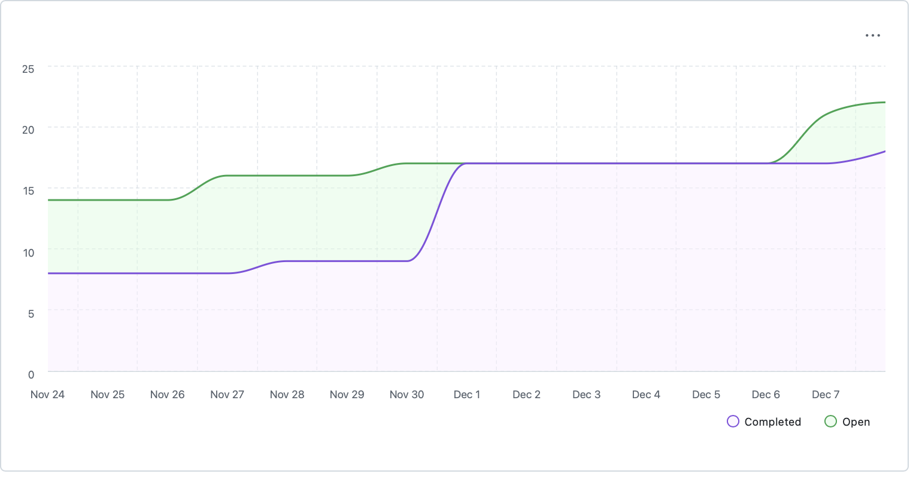

# Capstone Team 1 Log, Dec 1 - 7

## Work Performed

This week the team focused on demo preparation, code cleanup based on PR reviews, and improving repository health monitoring. Major achievements include restructuring the demo package into a modular architecture, adding proper error handling to the API client, implementing a repository health scoring system, and updating project documentation with better diagrams.

Ahmad worked on the demo theme styling (PR #225) and main runner (PR #226), addressing PR review feedback by adding error handling and removing unused code. He also reviewed several PRs and made team logs. Nathan improved the ZIP file handling and directory listing functionality. Evan implemented a health score feature for repository statistics and updated documentation. Stavan made significant improvements to the README with Mermaid diagrams. Shlok and Stavan added the team contract together. Shlok also took initiative in preparing the video demo and added better test coverage for the answers endpoint.

## Milestone Goals

- Restructured demo into modular package (requirements → theme → components → API client → runner)
- Added `raise_for_status()` error handling to all API client methods
- Implemented repository health scoring feature with database migration
- Overhauled README documentation with Mermaid diagrams for architecture and DFD
- Added team contract draft to project documentation
- Improved test coverage for answers endpoint edge cases
- Fixed ZIP file handling to return proper HTTP status codes (422 vs 400)
- Cleaned up unused code based on PR review feedback

## Reflection

The team successfully transitioned from feature development to polish and documentation. PR reviews caught several issues that were promptly addressed. The demo package refactoring will make it easier to showcase our requirements compliance during presentations. Documentation improvements make the project more accessible to new contributors.

## Tracked Issues

1. [Theme styling for demo](https://github.com/COSC-499-W2025/capstone-project-team-1/issues/225)
2. [Main runner for demo](https://github.com/COSC-499-W2025/capstone-project-team-1/issues/226)
3. [Repository health checker](https://github.com/COSC-499-W2025/capstone-project-team-1/issues/230)
4. [Update README](https://github.com/COSC-499-W2025/capstone-project-team-1/issues/234)

## To-Dos for Next Week

1. Will be discussed among team members and will updated eventually.

## Burnup Chart

## Github Username to Student Name

| Username      | Student Name  |
| ------------- | ------------- |
| shahshlok     | Shlok Shah    |
| Brendan-James | Brendan James |
| ahmadmemon    | Ahmad Memon   |
| Whiteknight07 | Stavan Shah   |
| van-cpu       | Evan Crowley  |
| NathanHelm    | Nathan Helm   |
