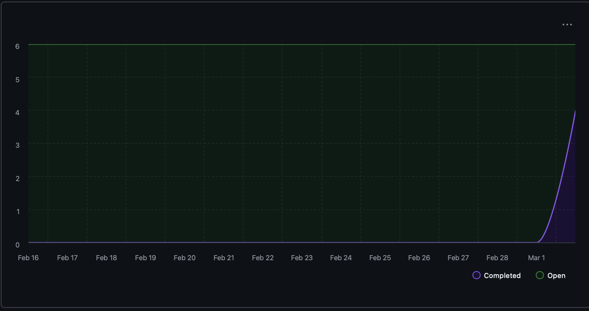

# Capstone Team 1 Log

## Work Performed
- Completed Milestone 2 presentation and finalized post-presentation cleanup.
- Continued local LLM integration work and API test coverage improvements (endpoint refactor + smoke/integration tests in PR #404 tied to Issues #402 and #403).
- Continued portfolio and evidence API flow work, including `POST /portfolio/generate` updates (PR #377).
- Continued `GET /portfolio/{id}` endpoint work and follow-up review fixes (PRs #393 and #406).
- Implemented `POST /portfolio/{id}/edit` (PR #410, Issue #335).
- Restored repo-quality evidence pipeline and completed supporting model refactor work (Issue #333).
- Improved migration reliability by moving API startup flow to Alembic-first migrations (PR #407).
- Added/updated tests across representation preferences and endpoint behavior (including work in PRs #392, #404, and #410).
- Team completed and merged week 7-8 log updates.

## Reflection
Over this period, the team balanced milestone delivery with integration stability. The biggest theme was reducing merge risk while preparing for the end-of-term branch transition: local LLM path cleanup, portfolio endpoint alignment, evidence pipeline fixes, and migration consistency. PR review turnaround remained strong, which helped unblock follow-up fixes quickly.

## Plan for next week
As a team we plan to focus on integrating the experimental local-LLM pipeline into development through smaller PRs, completing remaining portfolio/evidence endpoint polish, and resolving branch migration tasks so the final integration path stays stable.

## Tracked Issues

1. Restore repo-quality evidence pipeline #333
2. POST /portfolio/generate endpoint follow-up #334
3. POST /portfolio/{id}/edit endpoint #335
4. Add local LLM API endpoint tests and cleanup #402
5. Refactor local LLM endpoint naming/flow #403
6. Portfolio endpoint follow-up planning #396

## Burnup Chart

## Github Username to Student Name

| Username      | Student Name  |
| ------------- | ------------- |
| shahshlok     | Shlok Shah    |
| ahmadmemon    | Ahmad Memon   |
| Whiteknight07 | Stavan Shah   |
| van-cpu       | Evan Crowley  |
| NathanHelm    | Nathan Helm   |
