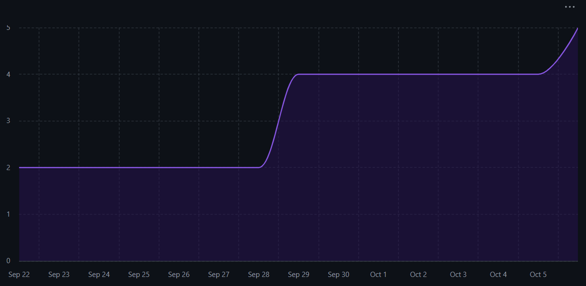

# Capstone Team 1 Log, Sept 29 - Oct 5

## Work Perfomed
Finalized Data flow diagram level 0 and Data flow diagram level 1

## Milestone Goals
1. Everyone worked on the initial Level 0 DFD and level 1 DFD on September 29th, and fully completed and edited level 1 DFD on October 1st.
2. Everyone in the team made pull requests for their individual logs which were reviewed at least by one other team member and merged into the logs branch.
3. Added Data Flow Diagram to the docs branch.

## Reflection
This week, on Monday we started and finished the DFD level 0. We finished DFD level on Wednesday after the feedback we received from the in-class discussion. The discussion made us determine that we needed to update our DFD level 1 to have more details such as the crawler. Everyone that was able to attend both classes this week added to the discussion, and put in equal work to complete the DFD.

## Plan for next week
Next week we plan to review our finalized requirements and make sure all our documents are in order. We are planning on creating tasks on the Kanban Board starting next week in order to begin the coding process.

## Tracked Issues

  a. [Data Flow Diagram](https://github.com/COSC-499-W2025/capstone-project-team-1/issues/17)

## Burnup Chart

## Github Username to Student Name

| Username      | Student Name  |
| ------------- | ------------- |
| shahshlok     | Shlok Shah    |
| Brendan-James | Brendan James |
| ahmadmemon    | Ahmad Memon   |
| Whiteknight07 | Stavan Shah   |
| van-cpu       | Evan Crowley  |
| NathanHelm    | Nathan Helm   |
