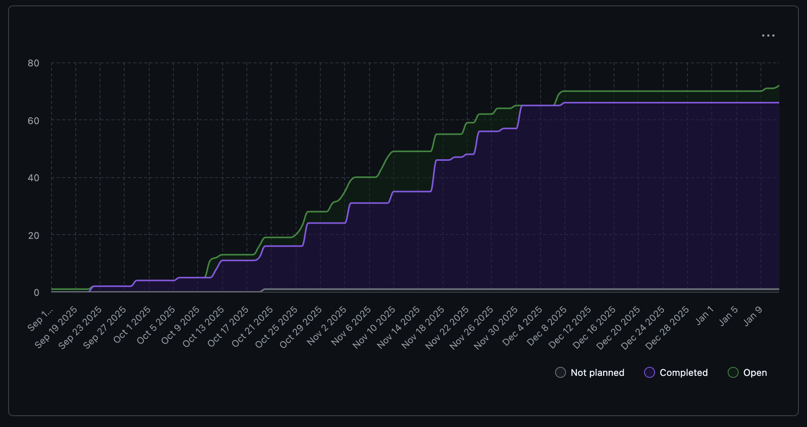

# Capstone Team 1 Log

## Work Perfomed
Achievements for Milestone 2

## Milestone Goals
 This Friday, Our group decided to work on focus of sections 21, 22, 23, and 24 of milestone. Stavan would lead section 21, Evan would take charge or section 25 using ollama, and Nathan worked of section 22 avoiding duplicate values using the crawler system. All other members worked on something else.  

## Reflection
This week members successfully pushed code related to their milestone tasks. This includes adding a improved duplicate file checker for our crawler module, adding a API for portfolio customization, chanign UTC timestamps, and adding a local llm. I'm glad that the team set up call the review tasks for this week. Something that can be improved is that not all members joined the call.

## Plan for next week
Next week we will continue working on remaining milestone. There should also be a transition from an API call application to a fully frontend application which can proceed to make said calls. 

## Tracked Issues

Merge extraction paths when analyzing multi-ZIP portfolios #249

Improved duplicate filechecker #256

representation prefs #259

Add portfolio_id to UploadedZip model for linking multiple ZIPs #252

...
## Burnup Chart

## Github Username to Student Name

| Username      | Student Name  |
| ------------- | ------------- |
| shahshlok     | Shlok Shah    |
| Brendan-James | Brendan James |
| ahmadmemon    | Ahmad Memon   |
| Whiteknight07 | Stavan Shah   |
| van-cpu       | Evan Crowley  |
| NathanHelm    | Nathan Helm   |
