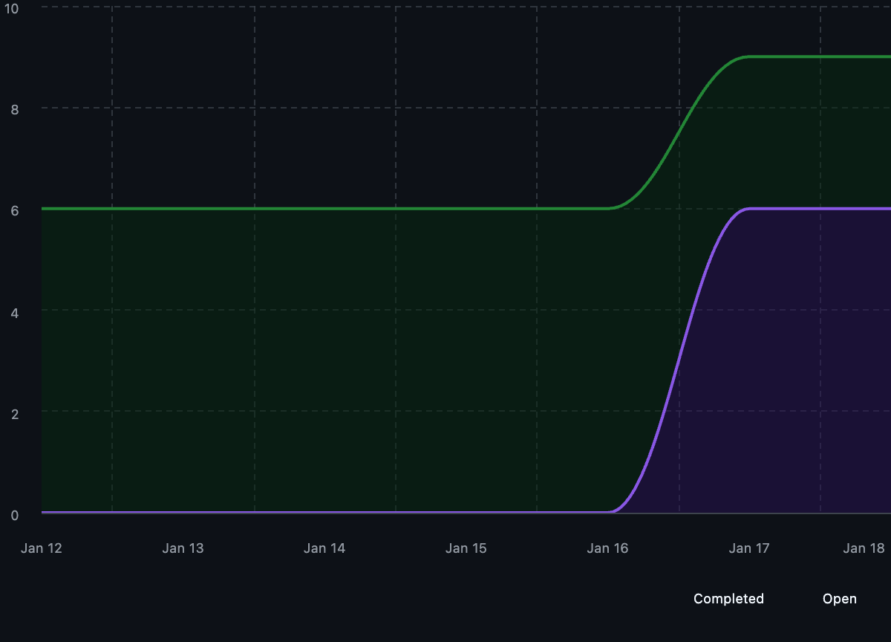

# Capstone Team 1 Log

## Work Perfomed
Preparing for Peer Testing

## Reflection
Between Jan 12 and 18 we merged several changes that move us closer to milestone 2 and peer testing. We improved duplicate file detection in the crawler, added an API to save portfolio display preferences,  We also fixed repo analysis stability, updated the analyze endpoint so it can run on selected folders, fixed email validation and database migrations, and added async OpenAI calls to speed up analysis. We opened follow-up work for saving a user email through the API. On Saturday, the team met to decide who will take on the remaining tasks so we can get the app ready for peer testing.

## Plan for next week
We plan to continue working on the milestone 2 and also make sure that we have our application ready for Peer Testing thats coming up soon. Evan and Shlok will keep researching local LLMs.

## Tracked Issues

1. [TUI] Wire ListContentsScreen to AnalyzingScreen #272
2. [TUI] Add ResumeScreen - View resume items and export #271
3. Add batch calling AI #280
4. [API] GET/POST api user_email from db #276
5. [API] Test out all the api endpoints and see if they work. #277
6. [API] Scope analyze to selected dirs #275
7. While not an issue explicitly as it is still experimental, Shlok opened a PR on his work on local LLMs and Ollama which built on Evans initial work

## Burnup Chart

## Github Username to Student Name

| Username      | Student Name  |
| ------------- | ------------- |
| shahshlok     | Shlok Shah    |
| Brendan-James | Brendan James |
| ahmadmemon    | Ahmad Memon   |
| Whiteknight07 | Stavan Shah   |
| van-cpu       | Evan Crowley  |
| NathanHelm    | Nathan Helm   |
