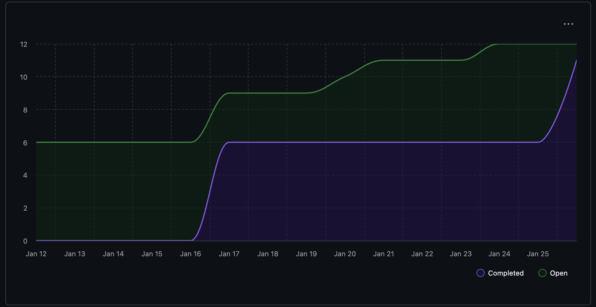

# Capstone Team 1 Log

## Work Performed
CLI Development & API Cleanup

## Reflection
This week we built a full command-line interface for our application. Evan created the basic CLI with input/output handling, email, and consent options (#299), and Stavan extended it with interactive mode that prompts for missing arguments and confirms before overwriting (#301). We also fixed a critical timestamp bug where the datetime module was being assigned instead of an actual datetime value, and standardized all datetime handling to use naive UTC datetimes for SQLite compatibility (#304). Evan added lazy initialization for the OpenAI client so it's only created when needed (#295), and Nathan connected CLI functions to API endpoints for data consistency (#306). Ahmad enhanced the interactive CLI with repo selection and timeline view (#308). We also merged several individual logs and the dev branch into main.

## Plan for next week
We will focus on AI integration—both local LLMs (Ollama) and OpenAI. We'll also explore integrating OpenTUI into our codebase and may close the Textual-based TUI issues (#268-272) if we proceed with OpenTUI.

## Tracked Issues

1. [CLI] Enhance Interactive CLI with Repo Selection and Timeline View #305
2. Convert CLI functions to API functions for data consistency #302
3. Fix Broken Timestamp Assignment #303
4. Interactive CLI mode #300
5. Command Line Interface #298
6. Implement Initialization on OpenAI use #294
7. Add batch calling AI #280

## Burnup Chart

## Github Username to Student Name

| Username      | Student Name  |
| ------------- | ------------- |
| shahshlok     | Shlok Shah    |
| Brendan-James | Brendan James |
| ahmadmemon    | Ahmad Memon   |
| Whiteknight07 | Stavan Shah   |
| van-cpu       | Evan Crowley  |
| NathanHelm    | Nathan Helm   |
