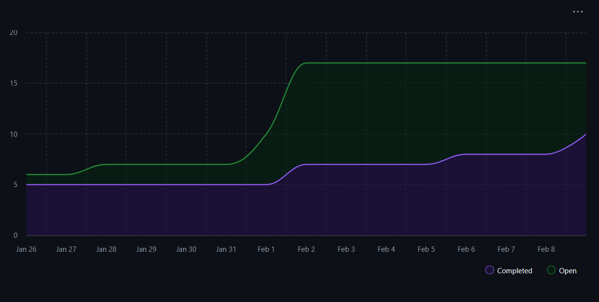

# Capstone Team 1 Log

## Work Performed
- TUI migration
- API endpoint creation
- Bugfixes of the CLI and endpoints
- Testing endpoints

## Reflection
During the two weeks of development a lot of API endpoints were added to meet with the upcoming Milestone 2 deadline and to improve upon the User feedback from the peer review assessment. We migrated the TUI over to the new OpenTUI and integrated the file system parsing. We also made bug fixes on the TUI given some user feedback and continued working on improving the core features.

## Plan for next week
As a team we plan to continue working through the issues on github to meet the Milestone 2 deadline. We plan on continuing work on file AI and non-AI analysis and creating comprehensive tests. We will continue to work on any requirements outlined for Milestone 2 over the next 2 weeks. We will continue to work on the presentation and look at our project as we approach our second in class demonstration.

## Tracked Issues

1. Create API endpoint documentation #340
2. Add GET /skills endpoint #329
3. Add GET /projects/{id} endpoint #328
4. Add GET /projects endpoint #327
5. API Client Layer + Types #318
6. AI analysis fails when using interactive CLI #316

## Burnup Chart

## Github Username to Student Name

| Username      | Student Name  |
| ------------- | ------------- |
| shahshlok     | Shlok Shah    |
| Brendan-James | Brendan James |
| ahmadmemon    | Ahmad Memon   |
| Whiteknight07 | Stavan Shah   |
| van-cpu       | Evan Crowley  |
| NathanHelm    | Nathan Helm   |

