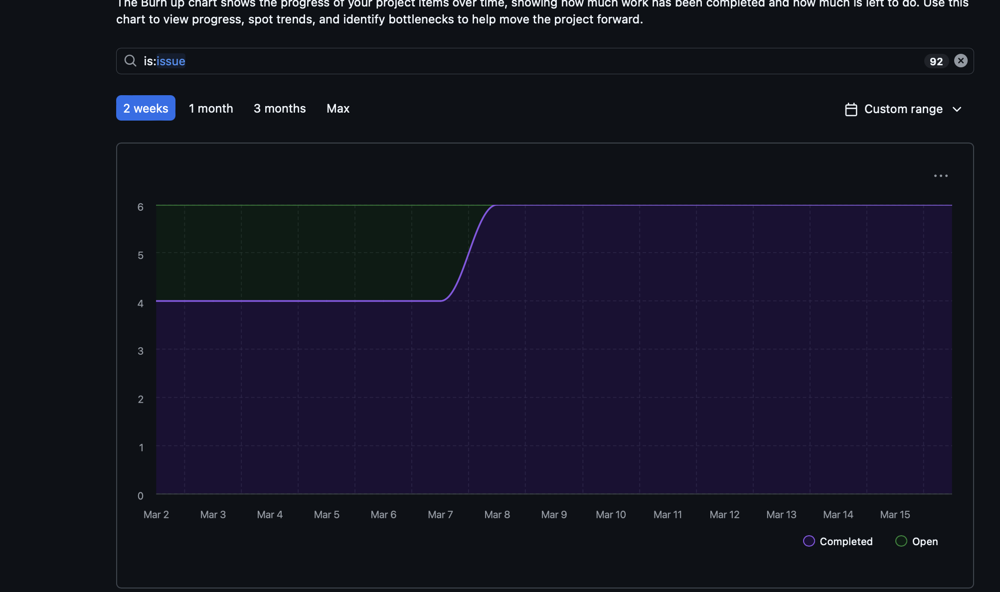
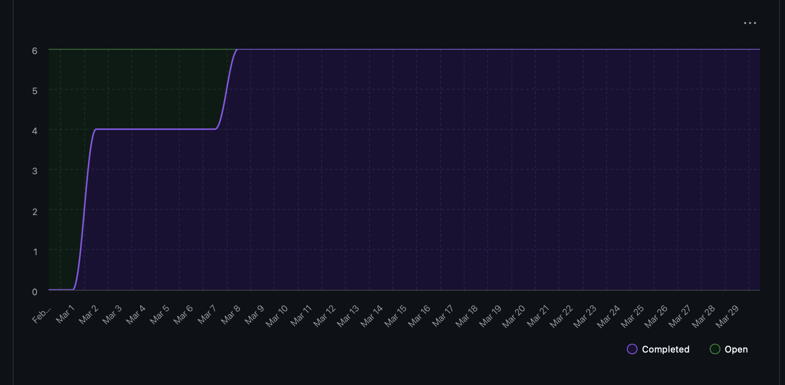

# Capstone Team 1 Log (Mar 9 - Mar 29)

## Work Performed
### Mar 9 - Mar 15
- Shlok continued the Local LLM runtime migration by landing the model registry (PR #473, Issue #451), the llama-server health check (PR #474, Issue #452), and the llama-server process manager (PR #475, Issue #453).
- Stavan pushed the OpenTUI migration forward with pipeline endpoint client methods (PR #472, Issue #423), the pipeline launch screen (PR #476, Issue #427), and the feedback screen (PR #478, Issue #431).
- Ahmad finalized the OpenTUI identity screen migration work (PR #477, Issue #426).
- Nathan added the contributor discovery endpoint (PR #479, Issue #439) and the git repo discovery refactor (PR #481, Issue #480).
- Evan added the local LLM generation start endpoint (PR #482, Issue #440).

### Mar 16 - Mar 29
- Shlok closed out the remaining Local LLM runtime work by adding process reuse and restart handling with runtime status snapshots (PR #493, Issue #454), shared async text inference (PR #495, Issue #455), structured JSON and grammar-constrained inference (PR #501, Issue #456), a stable public client surface (PR #525, Issue #457), repo-intelligence rewiring and legacy path cleanup (PR #526, Issue #458), the full in-process local LLM pipeline integration (PR #528, Issue #459), and a late quality pass upgrading the local pipeline to markdown output with focused calls and Qwen 3.5 (PR #534).
- Ahmad completed key OpenTUI migration and Milestone 3 work by wiring the real analysis polling and cancel flow into the migrated frontend (PR #503, Issue #428), porting the OpenTUI polish and formatting updates for shared navigation and consent components (PR #521, Issue #434), and adding daily commit heatmap aggregation plus persistence for portfolio generation (PR #531, Issue #512).
- Evan finished the remaining Local LLM API hardening work by adding the active generation cancel endpoint (PR #502, Issue #443), normalizing HTTP error contracts for the `/local-llm/*` route family (PR #522, Issue #444), and adding route coverage plus API surface verification tests (PR #524, Issue #445).
- Nathan added the generation polish endpoint so users can revise draft-ready or complete output with feedback (PR #513, Issue #442), removed the remaining OpenAI route surface and updated tests/docs accordingly (PR #527, Issue #446), and added the Milestone 3 education and awards input/storage flow across the backend and OpenTUI (PR #530, Issue #508).
- Stavan continued leading the OpenTUI migration by merging the FileUpload refactor and config fixes (PR #494, Issue #435), writing the Milestone 3 HTML generation plan and issue breakdown (PR #507, Issues #508-#512), adding the analysis screen pipeline status UI (PR #506, Issue #429), re-proposing the ResumePreview migration from the correct base (PR #516, Issue #432), rewriting the root navigation flow (PR #523, Issue #425), and submitting the portfolio HTML generator work (PR #533, Issue #511).
- The team also shipped the cloud-tier PI Agent resume flow across four stacked PRs: backend foundation (PR #517), auth/model selection/consent flow (PR #518), real-time cloud generation flow (PR #519), and the cloud resume preview experience (PR #520).

## Reflection
Across Mar 9 to Mar 29, the team moved from migration groundwork into full feature integration. The Mar 9-15 period focused on bringing the remaining Local LLM runtime pieces and core OpenTUI screens into development. The following period finished the Local LLM runtime and API cleanup work, pushed the OpenTUI migration much closer to feature-complete, and started landing Milestone 3 functionality on top of that foundation. By the end of the combined period, both the local resume-generation path and the cloud PI Agent path were working end to end, while the frontend had gained real analysis polling, improved navigation, better polish, and stronger screen-level testing.

## Plan for next week
Finish the remaining Milestone 3 deliverables and stabilization work. This includes landing the HTML portfolio generator cleanly into the main development flow, continuing the HTML resume generation work, polishing the final OpenTUI resume/portfolio output experience, and addressing any remaining review feedback or integration issues before final project wrap-up.

## Tracked Issues
1. OpenTUI Migration PR2: Pipeline Endpoint Client Methods #423
2. OpenTUI Migration PR5b: Pipeline Launch Screen #427
3. OpenTUI Migration Identity Screen #426
4. OpenTUI Migration PR7b: Feedback Screen #431
5. Contributor Discovery Endpoint #439
6. Generation Start Endpoint #440
7. Local LLM Runtime 01: Add Model Registry #451
8. Local LLM Runtime 02: Add Health Check #452
9. Local LLM Runtime 03: Add Process Manager #453
10. Find Git Repo Refactor #480
11. OpenTUI Migration PR4: Root Navigation Rewrite #425
12. OpenTUI Migration PR6a: Analysis Screen Polling and State Wiring #428
13. OpenTUI Migration PR6b: Analysis Screen Pipeline Status UI #429
14. OpenTUI Migration PR8a: ResumePreview Migration #432
15. OpenTUI Migration PR9b: UI Polish and Formatting #434
16. OpenTUI Migration PR9c: FileUpload Refactor, Utils, and Config Fixes #435
17. Add Generation Polish Endpoint #442
18. Add Generation Cancel Endpoint #443
19. Normalize Local LLM HTTP Error Contracts #444
20. Add Local LLM Route Coverage and API Surface Verification #445
21. Remove OpenAI and Update Surface Docs #446
22. Local LLM Runtime 05: Reuse, Restart, and Status #454
23. Local LLM Runtime 06: Text Inference Layer #455
24. Local LLM Runtime 07: Structured JSON and Grammar Inference #456
25. Stable Local LLM Client Surface #457
26. Rewire Repo Intelligence to Shared Local LLM Runtime #458
27. Remove Legacy Local LLM Path and Finalize Pipeline #459
28. Education and Awards Input + Storage #508
29. Portfolio HTML Generator #511
30. Daily Commit Aggregation for Activity Heatmap #512

## Burnup Charts
### Mar 9 - Mar 15

### Mar 16 - Mar 29

## Github Username to Student Name

| Username      | Student Name  |
| ------------- | ------------- |
| shahshlok     | Shlok Shah    |
| Brendan-James | Brendan James |
| ahmadmemon    | Ahmad Memon   |
| Whiteknight07 | Stavan Shah   |
| van-cpu       | Evan Crowley  |
| NathanHelm    | Nathan Helm   |
