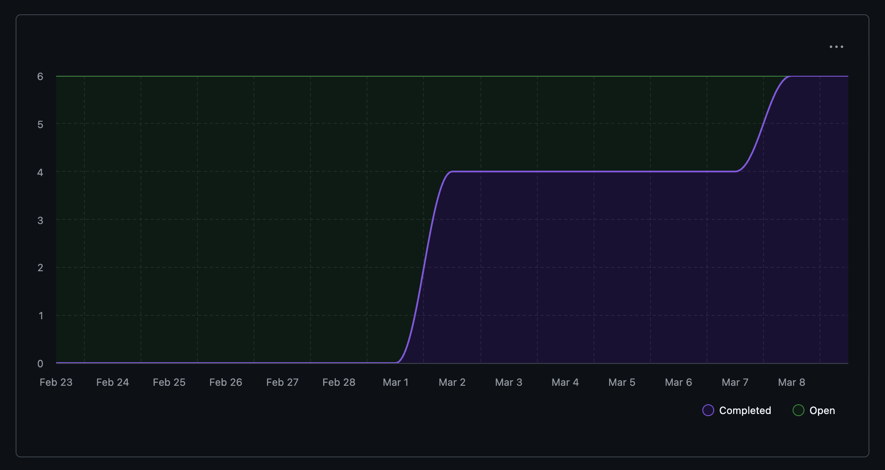

# Capstone Team 1 Log

## Work Performed
- Merged all dev changes into main, closing out the previous sprint (PR #418).
- Extended user representation preferences with additional fields and validation (PR #392, Issue #341).
- Added `GET /portfolio/{id}` endpoint with full test coverage (PR #406, Issue #333).
- Deduplicated `PortfolioEditRequest` via model inheritance and cleaned up related tests (PR #410, Issue #335).
- Improved migration reliability by running Alembic migrations on API startup (PR #407).
- Completed local LLM generation API endpoint testing, renamed API endpoints for consistency, and removed stale tests (PR #404).
- Cleaned up directory crawler whitespace and formatting (PR #411, Issue #395).
- Updated README, DFD, and system architecture documentation (PR #412, Issue #409).
- Added OpenTUI frontend migration plan documenting the full screen-by-screen rewrite strategy (PR #420).
- Added pipeline API types and screen updates for the OpenTUI migration (PR #436, Issue #421).
- Added resume rendering utility helpers for the OpenTUI frontend (PR #463, Issue #422).
- Documented and scoped the Local LLM API migration plan across 10 incremental issues (PR #447, Issues #437–#446).
- Added transport schemas migrating 13 pipeline models from experimental-llamacpp into development (PR #449, Issue #437).
- Added transport schema tests for full model validation coverage (PR #460).
- Added local intake endpoint and registered the local LLM router (PR #461, Issue #438).
- Added runtime primitives for llama-server integration including process management, health checks, and model registry (PR #462, Issue #450).
- Team completed and merged week 8–9 individual and team log updates.

## Reflection
This week began with a stabilization push — merging dev into main, closing out long-standing endpoint and evidence issues (#332–#337, #354, #356), and tidying documentation. With the codebase in a clean state, the team kicked off two major parallel efforts: the OpenTUI frontend migration and the local LLM API/runtime migration. Both were scoped through detailed planning documents and broken into small, reviewable PRs. The team executed well on the first slices of each track — transport schemas and intake endpoint on the LLM side, pipeline types and resume helpers on the frontend side. PR review turnaround stayed fast, which kept both tracks moving without blocking each other.

## Plan for next week
Continue the OpenTUI migration with AppContext rewrite, root navigation, and screen-level PRs (Issues #422–#435). On the local LLM side, land contributor discovery, generation start/status/polish/cancel endpoints (Issues #439–#446), and continue the runtime package build-out (Issues #451–#459). Begin wiring the local LLM runtime into the existing repository intelligence layer.

## Tracked Issues

1. Extend user representation preferences #341
2. Add GET /portfolio/{id} endpoint #333
3. Add POST /portfolio/{id}/edit endpoint #335
4. Clean up directory crawler whitespace and comments #395
5. Update README + DFD + System Architecture #409
6. Local LLM API 01: Add Transport Schemas #437
7. Local LLM API 02: Add Context Intake Endpoint and Register Router #438
8. Local LLM Runtime 01: Create Runtime Package Skeleton #450
9. OpenTUI Migration PR1a: Pipeline & API Types #421
10. OpenTUI Migration PR1b: Resume Rendering Utils & Helpers #422
11. Expand to other extensions in file intelligence system #380
12. Replace Ollama with local_llm wrapper and update consent levels #397

## Burnup Chart

## Github Username to Student Name

| Username      | Student Name  |
| ------------- | ------------- |
| shahshlok     | Shlok Shah    |
| ahmadmemon    | Ahmad Memon   |
| Whiteknight07 | Stavan Shah   |
| van-cpu       | Evan Crowley  |
| NathanHelm    | Nathan Helm   |
