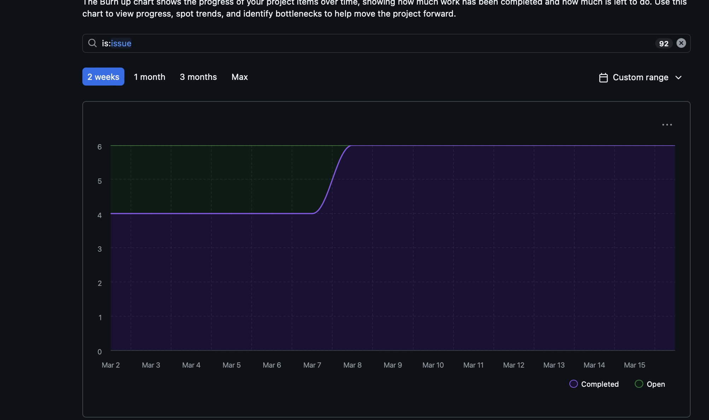

## Work Performed (since creation of this Team Log)

- Add model registry
#473

- feat(opentui): migrate pipeline endpoint client methods
#472

- feat(llama-server): Add llama-server health check #475

- feat(opentui): add pipeline launch screen #476

- 426 open TUI migration identity screen #477

- OpenTUI Migration PR7b: FeedbackScreen #478

- 439, Contributor Discovery Endpoint added. #479

- 480 find git repo refactor #481

- 440 generation start endpoint #440

## Reflection

The migration from Shlok's branch to development is underway. Migration issues 440, 480, and 439 have added endpoint to create at logic for users get projects and user contributions via new endpoints. llama-server has also been added  gives the runtime one small place to answer if the user's local Llama server ready yet to allow local model to make changes. Front end changes have also been added, such as an identity screen, pipeline screen, and feedback screen.

## Plan for next week

Our plan is to continue addressing issues to prepare for milestone 3. This includes, adding generation polish endpoint, normalize local-LLM HTTP error contracts, adding local llm Route coverage and API surface verification,Updated API Surface docs and according UI changes. 

## Burnup Chart

## Tracked issues (since creation of this Team log): 

- #480 In COSC-499-W2025/capstone-project-team-1
- #459 In COSC-499-W2025/capstone-project-team-1
- #458 In COSC-499-W2025/capstone-project-team-1
- #457 In COSC-499-W2025/capstone-project-team-1
- #456 In COSC-499-W2025/capstone-project-team-1
- #455 In COSC-499-W2025/capstone-project-team-1
- #454 In COSC-499-W2025/capstone-project-team-1
- #453 In COSC-499-W2025/capstone-project-team-1 
- #452 In COSC-499-W2025/capstone-project-team-1 
- #451 In COSC-499-W2025/capstone-project-team-1
- #446 In COSC-499-W2025/capstone-project-team-1 
- #445 In COSC-499-W2025/capstone-project-team-1 
- #444 In COSC-499-W2025/capstone-project-team-1
- #443 In COSC-499-W2025/capstone-project-team-1
- #442 In COSC-499-W2025/capstone-project-team-1
- #441 In COSC-499-W2025/capstone-project-team-1
- #440 In COSC-499-W2025/capstone-project-team-1
- #439 In COSC-499-W2025/capstone-project-team-1
- #435 In COSC-499-W2025/capstone-project-team-1
- #434 In COSC-499-W2025/capstone-project-team-1
- #433 In COSC-499-W2025/capstone-project-team-1
- #432 In COSC-499-W2025/capstone-project-team-1
- #431 In COSC-499-W2025/capstone-project-team-1
- #430 In COSC-499-W2025/capstone-project-team-1

| Username      | Student Name  |
| ------------- | ------------- |
| shahshlok     | Shlok Shah    |
| Brendan-James | Brendan James |
| ahmadmemon    | Ahmad Memon   |
| Whiteknight07 | Stavan Shah   |
| van-cpu       | Evan Crowley  |
| NathanHelm    | Nathan Helm   |

