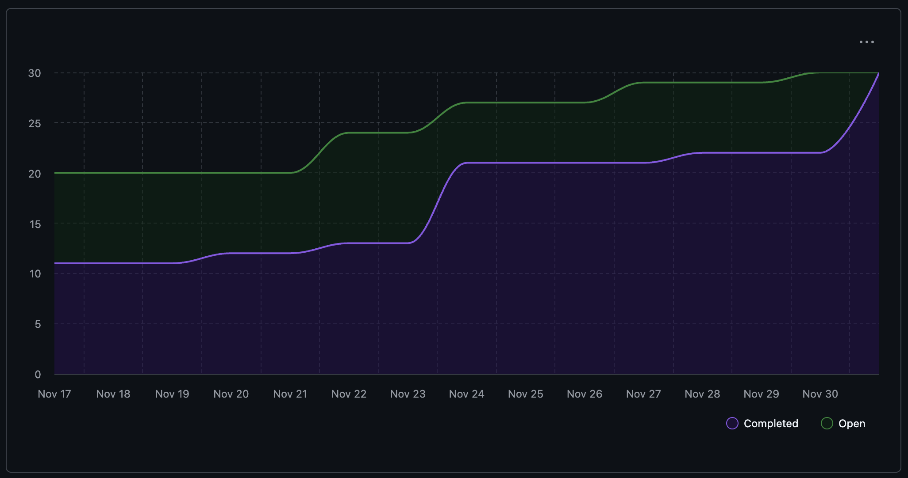

# Capstone Team 1 Log, Nov 23 - 30

## Work Performed
This week the team focused heavily on building out the core analysis pipeline and preparing for milestone presentations. Major achievements include implementing a master analysis endpoint that orchestrates the entire artifact mining pipeline, adding project ranking capabilities, and integrating framework/language detection into repository analysis. The team also added soft-delete functionality for projects, improved skill persistence and retrieval endpoints, and fixed critical bugs in the directory crawler for duplicate file detection.

Additionally, Ahmad worked on implementing a full API demo flow with analysis, summaries, resume generation, skills extraction, and project lifecycle endpoints. Nathan completed crawler API tests and fixed duplicate file detection issues. Evan enhanced the repository intelligence module with LLM-powered summary generation for top-ranked repositories and added multi-line comment detection.

## Milestone Goals
* Implemented master analysis endpoint to orchestrate the full artifact mining pipeline
* Added project ranking API endpoint (`/ranking`) for sorting projects by relevance
* Integrated framework detection and language detection into repository analysis results
* Implemented soft-delete endpoint for projects with updated retrieval APIs
* Added skill persistence module with resume items and improved skill handling
* Created retrieval endpoints for skills, resume items, and summaries
* Fixed duplicate file detection bug in the directory crawler
* Added comprehensive tests for master analyze endpoint and ZIP upload functionality
* Enhanced demo UI to display framework detection and detailed user commit statistics

## Reflection
This was a highly productive week with the team making significant strides toward the milestone. Everyone contributed meaningfully despite end-of-semester pressures. The integration of all components into a cohesive demo flow shows the project is coming together well. Code quality was maintained with ruff formatting/linting and comprehensive test coverage.
We also met on sunday for 2 hours to prepare for our presentation. 

## Tracked Issues
1. [Master endpoint for analysis pipeline](https://github.com/COSC-499-W2025/capstone-project-team-1/issues/213)
2. [Project ranking endpoint](https://github.com/COSC-499-W2025/capstone-project-team-1/issues/209)
3. [Safe delete for projects](https://github.com/COSC-499-W2025/capstone-project-team-1/issues/165)
4. [Retrieval endpoints for skills/resume/summary](https://github.com/COSC-499-W2025/capstone-project-team-1/issues/201)
5. [Skill persistence](https://github.com/COSC-499-W2025/capstone-project-team-1/issues/179)
6. [Skill extraction engine](https://github.com/COSC-499-W2025/capstone-project-team-1/issues/178)
7. [Duplicate directory crawler bug](https://github.com/COSC-499-W2025/capstone-project-team-1/issues/202)
8. [Repo intelligence analysis + top 3 summary generator](https://github.com/COSC-499-W2025/capstone-project-team-1/issues/203)
9. [Enhance repo intelligence](https://github.com/COSC-499-W2025/capstone-project-team-1/issues/127)
10. [Chronological list of projects](https://github.com/COSC-499-W2025/capstone-project-team-1/issues/158)

## To-Dos for Next Week

1. Have our json ouput to a file ready for all key information.
2. Ensure demo flow is polished for video demo.

## Burnup Chart

## Github Username to Student Name

| Username      | Student Name  |
| ------------- | ------------- |
| shahshlok     | Shlok Shah    |
| Brendan-James | Brendan James |
| ahmadmemon    | Ahmad Memon   |
| Whiteknight07 | Stavan Shah   |
| van-cpu       | Evan Crowley  |
| NathanHelm    | Nathan Helm   |
