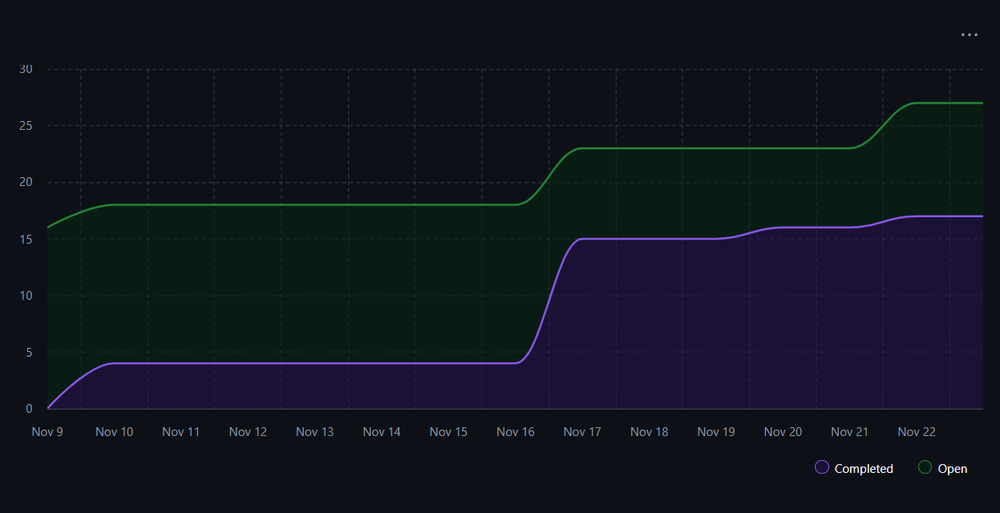

# Capstone Team 1 Log, Nov 9 - 23

## Work Performed
Reading week and this past week everyone worked towards getting ready for milestone 1 presentations. Detecting the framework users use, the type of additions users add to repositories, and AI integration into the repository summaries was added. Other major additions include additions to the TUI, error validation, zip processing, and expanded testing.

Our team is continuing to strive for getting ready for the milestone 1 presentation.

## Milestone Goals
* Extrapolated types of additions to a specific project
* Extracted User coding technique using LLM integration (ie. user use OOP or encapsulation)
* The system now automatically detects frameworks across Python, JavaScript, Java, and Go by analyzing dependency files
* Introduced Alembic for database schema management (eliminates the need to manually delete artifactminer.db on schema changes)

## Reflection
This week was very productive. We got a lot closer to being ready for the milestone this week. We all put in effort to complete tasks despite all the finals and assignments coming up with the end of the semester.

## To-Dos for Next Week

1. Continue going through issues from the Kanban board, and make sure everyone is still on the same page
2. Finalize a demo flow for the presentation on monday
3. Ensure everyone knows what they want to talk about for the presentation

## Burnup Chart

## Github Username to Student Name

| Username      | Student Name  |
| ------------- | ------------- |
| shahshlok     | Shlok Shah    |
| Brendan-James | Brendan James |
| ahmadmemon    | Ahmad Memon   |
| Whiteknight07 | Stavan Shah   |
| van-cpu       | Evan Crowley  |
| NathanHelm    | Nathan Helm   |
