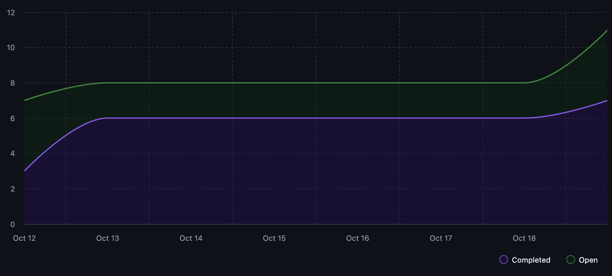

# Capstone Team 1 Log, Oct 13-19

## What We've Done This Week

Added functionality to interact with git repositories.
Implemented FastAPI.
Created basic connection to OpenAI's API.
Designed the planned folder structure for the project.

## Status Update on Last Week's To-Dos

| Task | Status |
|------|--------|
| Continue implementing core features (TUI, file crawler, OpenAI integration) | 🟨 In progress |
| Review each other's code on all PRs before merging | ✅ Done |
| Write tests for all new code we add | ✅ Done |
| Connect the TUI with the backend repo intelligence module | ✅ Done |
| Update individual logs with the new format requirements | ✅ Done |

## To-Dos for Next Week

1. Implement file crawler
2. Basic metadata analysis of files
3. Allow simple interactivity via TUI

## Burnup Chart

## Github Username to Student Name

| Username      | Student Name  |
| ------------- | ------------- |
| shahshlok     | Shlok Shah    |
| Brendan-James | Brendan James |
| ahmadmemon    | Ahmad Memon   |
| Whiteknight07 | Stavan Shah   |
| van-cpu       | Evan Crowley  |
| NathanHelm    | Nathan Helm   |
