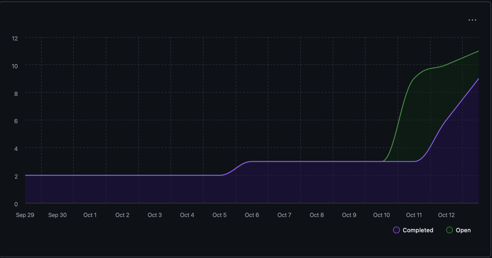

# Capstone Team 1 Log, Oct 5-12

## What We've Done This Week

This week we transitioned from planning to actual development. Ahmad worked on building the TUI (Terminal User Interface) with basic path persistence and added tests for it. Evan set up the development branch and created the RepoStats class along with the main repo intelligence module. Shlok integrated OpenAI's API with a helper class and wrote tests for it.

We also updated our README with the revised System Architecture diagram, DFD Level 1, and WBS based on the feedback we received on our proposal. Everyone completed their individual logs, and we merged several PRs including the documentation updates and individual log submissions.

## Status Update on Last Week's To-Dos

| Task | Status | Notes |
|------|--------|-------|
| Review finalized requirements and ensure all documents are in order | ✅ Done | Updated README with System Architecture, DFD, and WBS |
| Create tasks on Kanban Board to begin coding process | ✅ Done | Development branches created and initial features started |

## To-Dos for Next Week

1. Continue implementing core features (TUI, file crawler, OpenAI integration)
2. Review each other's code on all PRs before merging
3. Write tests for all new code we add
4. Connect the TUI with the backend repo intelligence module
5. Update individual logs with the new format requirements

## Burnup Chart

## Github Username to Student Name

| Username      | Student Name  |
| ------------- | ------------- |
| shahshlok     | Shlok Shah    |
| Brendan-James | Brendan James |
| ahmadmemon    | Ahmad Memon   |
| Whiteknight07 | Stavan Shah   |
| van-cpu       | Evan Crowley  |
| NathanHelm    | Nathan Helm   |
