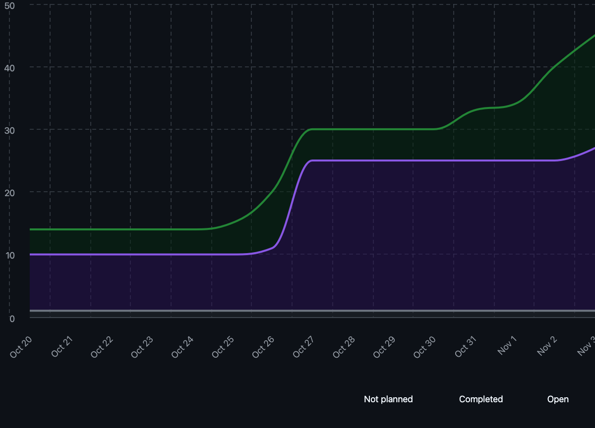

# Capstone Team 1 Log, Oct 27- Nov 2

## Work Perfomed
This week the team made more progress on the application as we get closer to Milestone 1. We now have a user flow from the start to be able to upload the zip file that they want to be used to create their resume

## Milestone Goals
- Zip upload → browse files end‑to‑end with a new screen.
- User config and consent stored in DB and validated.
- TUI fixes for a smooth demo path

## Reflection
Good week. We got zip → file browsing working, worked on the  user config/consent, and started saving user preferences to the DB. There are a few UI bugs to squash but overall the team is making great progress.

## Tracked Issues
1. [Make the user config questions dynamic](https://github.com/COSC-499-W2025/capstone-project-team-1/issues/104)
2. [UI fixes](https://github.com/COSC-499-W2025/capstone-project-team-1/issues/103)
3. [Debug bugs from last week](https://github.com/COSC-499-W2025/capstone-project-team-1/issues/102)
4. [Allow user to browse and pick a zip](https://github.com/COSC-499-W2025/capstone-project-team-1/issues/99)

## Burnup Chart

## Github Username to Student Name

| Username      | Student Name  |
| ------------- | ------------- |
| shahshlok     | Shlok Shah    |
| Brendan-James | Brendan James |
| ahmadmemon    | Ahmad Memon   |
| Whiteknight07 | Stavan Shah   |
| van-cpu       | Evan Crowley  |
| NathanHelm    | Nathan Helm   |
