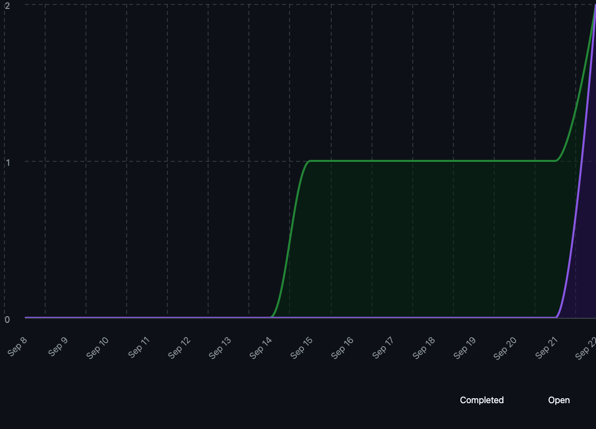

# Capstone Team 1 Log, Sept 15- 21

- Work Perfomed: Finalized Requirements

- Milestone Goals: Everyone agrees on a set of functional and non-functional requirements and we outline a work-breakdown structure

- Issues from the project board: 
    
    a. Finalize Project Requirements: https://github.com/COSC-499-W2025/capstone-project-team-1/issues/2 

- Burnup Chart:

- Username -> Student Name:

| Username | Student Name |
| -------- | ------------ |
| shahshlok | Shlok Shah |
| Brendan-James | Brendan James |
| ahmadmemon | Ahmad Memon |
| Whiteknight07 | Stavan Shah |
| van-cpu | Evan Crowley |
| NathanHelm | Nathan Helm | 