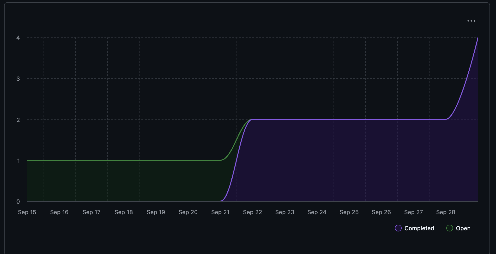

# Capstone Team 1 Log, Sept 15- 21

## Work Perfomed
Finalized Architecture Diagram and Project Proposal

## Milestone Goals
1. Everyone worked on the initial Architecture Diagram on 22nd September and completed the project proposal on 28th September. 
2. Everyone in the team made pull requests for their individual logs which were reviewed at atleast by one other team member and merged into the logs branch.
3. Added project proposal to the "docs" branch.

## Tracked Issues

  a. [System Architecture](https://github.com/COSC-499-W2025/capstone-project-team-1/issues/8)
  
  b. [Project Proposal](https://github.com/COSC-499-W2025/capstone-project-team-1/issues/9)

## Burnup Chart

## Github Username to Student Name

| Username      | Student Name  |
| ------------- | ------------- |
| shahshlok     | Shlok Shah    |
| Brendan-James | Brendan James |
| ahmadmemon    | Ahmad Memon   |
| Whiteknight07 | Stavan Shah   |
| van-cpu       | Evan Crowley  |
| NathanHelm    | Nathan Helm   |
