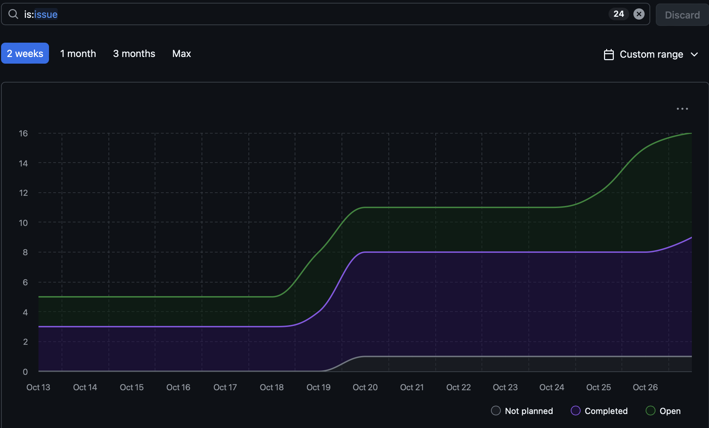

# Capstone Team 1 Log, Oct 19-26
## Work Performed
This week our team focus on communicating, reviewing, and building our given tasks.

## Milestone Goals
- This week, our team continued early stage development and followed weekly procedures.
- We continued resolving issues in our project tracked by the Kanban board and github issues.
- Some news task components added include Updated UI, Zip component, and the open AI helper function are among a few systems that had been contributed this week. Each "system" aids in developing milestone #1.
## Tracked/Resolved Issues
- User configuration screen
- Create user consent screen
- Zip feature
- Revise WBS
- SQL lite

## Reflection
This week, we continued our individual tasks and peer reviewed code. For next week we will continue communicating and building out our system in preperation for milestone #1. 

## Burnup Chart 

- Username -> Student Name:

| Username | Student Name |
| -------- | ------------ |
| shahshlok | Shlok Shah |
| Brendan-James | Brendan James |
| ahmadmemon | Ahmad Memon |
| Whiteknight07 | Stavan Shah |
| van-cpu | Evan Crowley |
| NathanHelm | Nathan Helm | 