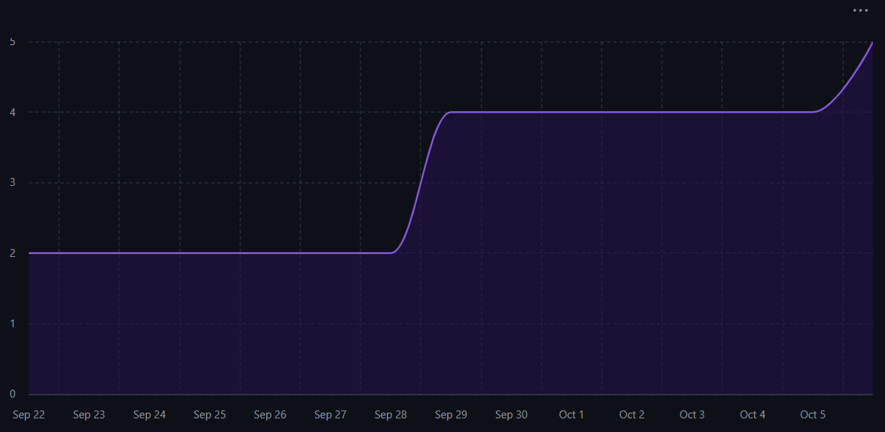

# Capstone Team 1 Log, Sept 29 - Oct 5

## Work Perfomed
Finalized Data flow diagram level 0 and Data flow diagram level 1

## Milestone Goals
1. Everyone worked on the initial Level 0 DFD and level 1 DFD on September 29th, and fully completed and edited level 1 DFD on October 1st.
2. Everyone in the team made pull requests for their individual logs which were reviewed at least by one other team member and merged into the logs branch.
3. Added Data Flow Diagram to the docs branch.

## Tracked Issues

  a. [Data Flow Diagram](https://github.com/COSC-499-W2025/capstone-project-team-1/issues/17)

## Burnup Chart

## Github Username to Student Name

| Username      | Student Name  |
| ------------- | ------------- |
| shahshlok     | Shlok Shah    |
| Brendan-James | Brendan James |
| ahmadmemon    | Ahmad Memon   |
| Whiteknight07 | Stavan Shah   |
| van-cpu       | Evan Crowley  |
| NathanHelm    | Nathan Helm   |
