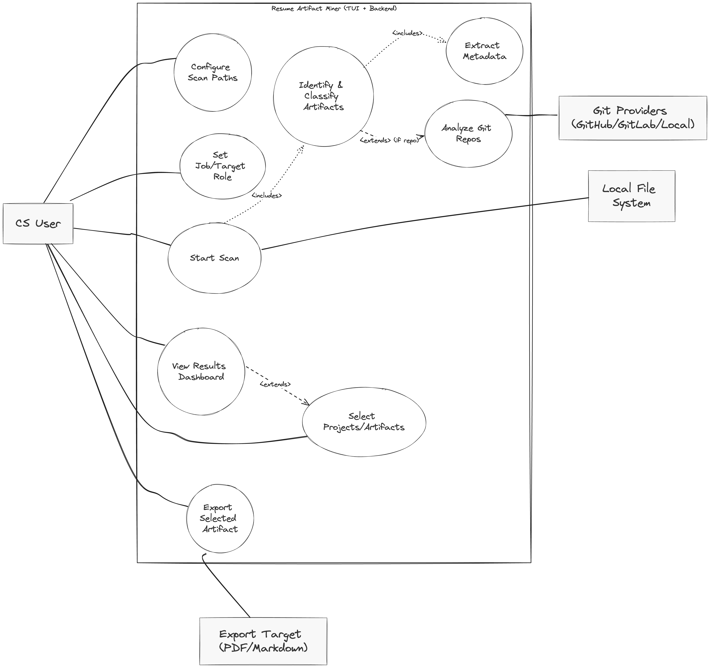

# **Features proposal for Project**  
Team Number: 1  
Team Members: Shlok Shah SN:50732213, Brendan James SN:31927486, Ahmad Memon SN: 61846432, Stavan Shah SN 43960608:, Evan Crowley SN:82710823, Nathan Helm 68837038:

## **1\.** **Project Scope and usage Scenario**  

The purpose of this project is to have an automated process to create a work portfolio or resume with the user's past work. The process will be able to parse through the user's computer or specified folder and analyze any information deemed important or “resume-worthy”. 

Primary users: CS students, TAs or career advisors

Typical scenario: The user launches the TUI then selects the folder/s they wish to parse. The user can set their preferences, then hit scan. The system will crawl the selected folder and once the process is complete it will bundle a summary resume or portfolio.

## **2\.** **Proposed Solution**  
Our solution will incorporate AI, artifacts, and image detection to scrape “resume” files on the user’s system to showcase their experience in tech. The software to achieve our solution comes in many forms. First, our Textual framework uses input parameters via user interaction for a more accurate result.  The core solution to this problem however is harnessing AI softwares such as OpenAI and Anthropic to judge whether the scraped artifacts are “resume adjacent.” 

“Building a Resume sucks. Let us do it for you. We believe that everyone deserves the right to be seen. Leveraging AI, our system analyzes your digital and real world experience, education, and skills to tailor a resume archive that will make you stand out from the competition.”

 The solution to this problem stands out for several reasons. First:

- Our code will be stored in the package resource, Pypi, allowing python users to install and use our project via a command.   
- package offers a more robust system compared to a website or a local application as developers can build from a package without the challenge of reinventing themselves or adding complexity and detail.   
- Publishing our package will inspire our team to build a compact software solution that is both reliable, tested, and credible.  
-  It also opens the door for contributions that are outside of a group, allowing for a more optimized and accurate solution.   
- Our project will also use AI across the system to produce returned file results in ways that a non-AI system cannot as it will analyze file metadata to determine whether a file is applicable for a resume. The AI will determine the result.   
- Users will help narrow results.  

## **3\. Use Cases**  

**Use Case 1: Start Scan**

* **Primary Actor:** CS students  
* **Description:** The process of making a new resume/portfolio  
* **Precondition:** The user should have some past work stored on their computer in order to be parsed. The program should have read and write permissions on paths specified.  
* **Postcondition:** A new portfolio or resume is created for the user  
* **Main Scenario:**  
  1. User clicks on browse button to select folder for choosing which folder to parse  
  2. User can set their preferences such as language and recency  
  3. User clicks analyze files button to begin parsing process.  
  4. Once the program completes parsing the user can click the save results button and specify where the information will be outputted to.  
* **Extensions:**  
  1. Stores the results of file by file analysis to make future uses more efficient.

**Use Case 2: Running crawl**

* **Primary Actor:** Program Crawler  
* **Description**: the process of crawling through the selected folder, and selecting the metadata  
* **Precondition:** User has selected a folder path  
* **Postcondition:** Metadata is passed to the local DB and analysis program  
* **Goal:** traverse the selected folder and collect any metadata 

* **Main Scenario:** 

  1. Program parses through folder selected by user  
  2. Selects metadata following users preferences (date, user who created file)  
  3. Crawler passes metadata to the next step in the program (local DB, analysis program)

**Use Case 3: Viewing Dashboard Results**

* **Primary Actor:** CS students  
* **Description:** The process of viewing, filtering, and selecting discovered work artifacts  
* **Precondition:** At least one scan has completed and results are available  
* **Postcondition:** The user sees filtered results and an updated list of selected artifacts for possible export  
* **Main Scenario:**  
  1. User opens the dashboard to view results  
  2. User opens the dashboard to view results  
  3. Program loads the latest results and shows summary metrics (counts, top projects, recency)  
  4. User applies filters such as file type, language, project, or date range  
  5. Program updates the results list immediately to reflect filters  
  6. User selects an artifact to view details and preview (e.g., first lines, thumbnail)  
  7. User clicks add/remove to selection to stage artifacts for the resume/portfolio  
  8. Program saves the current selection so it can be exported later  
* **Extensions:**  
  1. If no results exist, program prompts the user to run a scan

**Use Case 4: Export selected artifacts**

* **Primary Actor:** CS students  
* **Description:** The process of exporting staged artifacts into shareable outputs  
* **Precondition:** The user has one or more artifacts selected; the program has write permission to the chosen export location  
* **Postcondition:** An export file is created at the target location (Markdown/PDF/JSON)  
* **Main Scenario:**  
  1. User clicks the export selected button from the dashboard  
  2. Program opens an export dialog with format and template options  
  3. User chooses format (Markdown/PDF/JSON) and output folder  
  4. Program validates the output path and checks for filename conflicts  
  5. Program generates summaries and writes the export file(s) to the chosen folder  
* **Extensions:**  
  1. If no items are selected, program offers to return to the dashboard to select items  
  2. If a filename already exists, program offers overwrite or create a timestamped filename

**Use Case 5: Set Job Target/Role**

* **Primary Actor:** CS students  
* **Description:** Select a role preset (e.g., Backend, Data/ML) or a custom profile to tailor detection, classification, and ranking.  
* **Precondition:** App running; at least one role preset available; user has permission to save settings (if persistence enabled), and scan path selected.   
* **Postcondition:** An active role is set (session or persisted); current results are re-ranked and future scans use the role profile.  
* **Main Scenario:**  
1. The program shows available presets and a **Custom…** option.  
2.  User selects a preset.  
3.  The program validates the selection/profile.  
4. The program activates the role, re-ranks work artifacts, and saves if persistence is on.  
* **Extensions:**  
1. No presets available → program loads **General CS** default.  
2. Validation error → show error; do not save.  
3.  Save failure or persistence off → apply for current session only and warn.  
   

 **Use Case 6: Configure Scan Paths**

* **Primary Actor**: CS User  
* **Description**: Allows the user to specify which local directories and file paths the system should scan to discover and analyze work artifacts. This focuses the discovery process on relevant locations, such as project folders or a main code directory.  
* **Precondition**:  
1. The application is running.  
2. The user has read permissions for the directories they intend to add.  
3. The user interface for path configuration is accessible.  
* **Postcondition**:  
1. The list of scan paths is updated and saved (either for the current session or persistently).  
2. Subsequent "Start Scan" actions will only operate within these specified paths.  
* **Main Scenario**:  
1. The user initiates the action to configure scan paths.  
2. The system presents an interface displaying the current list of scan paths (which may be empty or contain defaults).  
3. The user selects an option to add a new path.  
4. The user provides a directory path, either by typing it or using a file system browser.  
5. The system validates that the path exists and is a readable directory.  
6. The system adds the valid path to the configuration list.  
7. The user confirms the changes.  
* **Extensions:**  
1. If the user enters a path that does not exist or is not a directory, the system shows an error message and does not add the path.  
2. If the application lacks the necessary permissions to read the selected directory, the system displays a warning and does not add the path.  
3. If the configuration cannot be saved persistently, the system notifies the user and applies the new paths for the current session only.  
4. If the user cancels the operation, the system discards any changes and retains the previously saved scan path configuration.

****

## **4\. Requirements, Testing, Requirement Verification**

**Technology Stack:**

- **Backend:** Python 3.9+ with FastAPI for API layer  
- **Frontend:** Textual framework for Terminal User Interface (TUI)  
- **Database:** SQLite for local storage  
- **Analysis Libraries:** GitPython (repository analysis), NLTK/spaCy (text processing)  
- **LLM Integration:** OpenAI API / Anthropic API for analyzing artifacts and resume generation  
- **Code Quality:** Black (formatter), Ruff (linter), mypy (type checking), SonarQube (static linting/code analysis)

**Test Framework:**

- pytest for unit and integration testing  
- pytest-asyncio for async component testing  
- pytest-mock for mocking external services  
- pytest-cov for code coverage reporting

| Requirement | Description | Test Cases | Who | H/M/E |
| :---- | :---- | :---- | :---- | :---- |
| **Configure Scan Paths** | User can add/remove local directory paths for system scanning through the TUI interface. Paths persist across sessions in local config | • Test adding valid directory path • Test adding non-existent path (should fail) • Test removing path from list • Test duplicate path prevention • Test path persistence after restart • Test relative vs absolute paths | Nathan | Easy |
| **Set Job/Target Role** | User specifies what position they're applying for (Frontend, Backend, Data Science, etc.) to customize analysis | • Test role selection from predefined list • Test custom role input • Test role persistence • Test role modification • Test empty role handling (generic analysis) | Ahmad Memon | Easy |
| **Start Scan** | Initiate filesystem scan from configured paths with progress indication and cancellation support | • Test scan initiation with valid paths • Test scan with no configured paths (error) • Test scan cancellation mid-process • Test progress bar accuracy • Test scan resume after interruption | Stavan Shah | Medium |
| **Identify & Classify Artifacts** | System identifies and categorizes files into types (code, docs, config, data, media) based on extensions and content | • Test code file identification (.py, .js, .java) • Test documentation detection (.md, .txt, .pdf) • Test config file recognition (.json, .yml, .env) • Test files without extensions • Test binary vs text classification • Test nested archive contents | Evan | Medium |
| **Extract Metadata** | Extract comprehensive metadata from all artifacts including name, type, size, dates, and file-specific attributes | • Test basic metadata extraction (name, size, dates) • Test Unicode filename handling • Test metadata for 0-byte files • Test files \>1GB • Test permission-restricted files • Test broken symlinks | Shlok | Easy |
| **Analyze Git Repositories** | For Git repos, extract commit history, contribution frequency, languages used, and collaboration patterns | • Test valid Git repository analysis • Test corrupted .git folder • Test bare repositories • Test repos with submodules • Test repos with 10,000+ commits • Test multi-branch analysis • Test contributor statistics | Stavan | Hard |
| **View Results Dashboard** | Display analysis results in TUI dashboard with navigation, filtering, and sorting capabilities | • Test dashboard initial load • Test keyboard navigation (arrow keys) • Test sorting by different metrics • Test filtering by file type • Test dashboard refresh • Test responsive layout on resize | Ahmad | Medium |
| **Select Projects/Artifacts** | User can select specific artifacts for portfolio inclusion with multi-select and preview capabilities | • Test single artifact selection • Test multi-select with Shift/Ctrl • Test select all/none operations • Test selection persistence • Test preview of selected items • Test deselection | Brendan | Medium |
| **Export Selected Artifacts** | Export curated artifacts list to various formats (JSON, Markdown, PDF) at user-specified location | • Test JSON export validity • Test Markdown formatting • Test PDF generation • Test export path validation • Test overwrite protection • Test special character handling | Nathan | Easy |
| **LLM Resume Generation** | Call LLM API to generate tailored resume based on selected artifacts and target role | • Test API connection • Test with valid artifacts data • Test API timeout handling • Test rate limit handling • Test response parsing • Test offline fallback • Mock API for testing | Shlok  | Hard |
| **Local Database Operations** | Store scan results, metadata, and analysis in local database for persistence and quick retrieval | • Test database initialization • Test CRUD operations • Test concurrent access • Test transaction rollback • Test database migration • Test backup/restore • Test query performance | Evan | Medium |
| **User Preferences Storage** | Save and load user preferences including scan paths, role selection, and UI settings | • Test preference saving • Test preference loading on startup • Test corrupt config file handling • Test default values • Test preference reset • Test version compatibility | Brendan | Easy |
---

